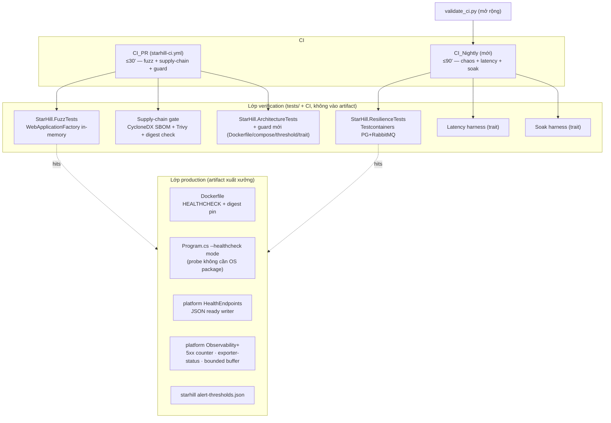

# Design Document

## Overview

Tài liệu thiết kế cho gói **military-grade-hardening** của sản phẩm StarHill QR. Đầu vào là `requirements.md` (9 requirement EARS, ngưỡng đã chốt). Nguyên tắc chi phối toàn bộ thiết kế:

1. **Dùng lại, không xây lại.** Base Bedrock (`platform/`) đã có OpenTelemetry 3 trụ, health `/health/live` + `/health/ready` tách liveness/readiness, gauge `bedrock.outbox.pending`, PathMasker chống rò log. Thiết kế này **bọc và mở rộng** các seam đó, không dựng song song.
2. **Sửa tận gốc, đúng tầng.** Sửa đổi domain-agnostic (JSON health writer, exporter-status, health probe mode) đặt ở `platform/` để mọi sản phẩm hưởng. Sửa đổi mang nghiệp vụ QR (ngưỡng SLO, danh sách endpoint, ngưỡng cảnh báo) đặt ở `starhill/`.
3. **Mọi cổng phải đo được và có guard chống trôi.** Mỗi quyết định hardening được triển khai → 1 mục `QR-AD` + guard test (INV_6), để 6 tháng sau không ai tháo cổng mà CI vẫn xanh.
4. **Không chạm nghiệp vụ 8 module.** Chỉ thêm cổng kiểm chứng và cấu hình quan sát; không đổi use case, entity, hay hợp đồng API.

---

## Ground Truth — Sự thật nền đã kiểm chứng

Bảng này là neo chống bịa. Mọi mục trong thiết kế phải trỏ về một dòng ở đây hoặc khai rõ là **thành phần mới**.

| # | Sự thật | Vị trí file (đã đọc) | Hệ quả cho thiết kế |
|---|---------|----------------------|---------------------|
| G1 | `AddBedrockApi(configuration)` gọi `AddBedrockObservability` | `platform/src/Bedrock.Api/BedrockApiExtensions.cs:38`; `starhill/src/Host/StarHill.Api/Program.cs:54` | OTel đã bật sẵn ở Host. R8.1 (trace) coi như đạt; chỉ mở rộng metric/exporter-status. |
| G2 | Công tắc OTLP = **sự hiện diện** của `Observability:Otlp:Endpoint` (không có cờ boolean) | `BedrockObservabilityExtensions.cs` (`hasOtlp = !string.IsNullOrWhiteSpace(otlpEndpoint)`) | R8.3 "false" = key vắng/rỗng; R8.4 "true" = key có giá trị. Không thêm boolean thừa. |
| G3 | Nguồn telemetry chung: `BedrockTelemetry.Name = "Bedrock"` (ActivitySource + Meter) | `platform/src/Bedrock.Application/Observability/BedrockTelemetry.cs` | Metric mới của hardening phát dưới **cùng Meter `Bedrock`** để `AddMeter("Bedrock")` gom sẵn. |
| G4 | `/health/live` = `Predicate _ => false` (luôn 200 khi process sống); `/health/ready` = check tag `ready` | `platform/src/Bedrock.Api/Health/HealthEndpoints.cs` | R1.8/R8 (liveness độc lập DB) đạt. `/health/ready` dùng **writer mặc định plain-text** → R1.6 JSON body là GAP. |
| G5 | DB health check tag `ready`; RabbitMQ health check tag `ready` | `BedrockPersistenceExtensions.cs:247`; `RabbitMqMessagingExtensions.cs:33` | R1.6/R1.7 (503 khi mất DB/broker) đạt ở tầng cơ chế; chỉ cần JSON body + guard + đo chaos. |
| G6 | Gauge `bedrock.outbox.pending` (tag `module`), + counter published/dead_lettered/lease_lost, histogram publish.lag | `platform/src/Bedrock.Infrastructure/Persistence/Messaging/OutboxMetrics.cs` | R8.2 phần "gauge outbox chưa gửi" đạt. R7.9/R8.11 dùng lại gauge này. |
| G7 | ASP.NET Core instrumentation đã add (traces + metrics) | `BedrockObservabilityExtensions.cs` (`AddAspNetCoreInstrumentation`) | R8.2 histogram thời lượng HTTP đạt qua `http.server.request.duration`. Chỉ **5xx counter** là GAP. |
| G8 | Dockerfile runtime = `mcr.microsoft.com/dotnet/aspnet:10.0` (không digest), `USER $APP_UID`, không HEALTHCHECK, không curl/wget | `starhill/src/Host/StarHill.Api/Dockerfile` | R1 (HEALTHCHECK) + R3.5 (digest) là GAP. Probe **không được cài package OS** → chạy bằng `dotnet`. |
| G9 | compose service `host` không có `healthcheck`; `postgres` có | `starhill/docker-compose.yml` | R1.9 là GAP. |
| G10 | `starhill-ci.yml`: 4 job (build-test/frontend/docker-image/migration-bundle), trigger push+PR, không có `schedule` | `.github/workflows/starhill-ci.yml` | R4 (CI_Nightly) là workflow **mới**; CI_PR chỉ thêm fuzz+supply-chain vào job `build-test`. |
| G11 | `validate_ci.py` kiểm push-branches/concurrency/permissions/jobs+timeouts + nhắm starhill/ | `starhill/tests/validate_ci.py` | R9.7 mở rộng file NÀY để kiểm CI_Nightly, không viết validator mới. |
| G12 | Test pattern: `WebApplicationFactory<Program>` + `SecretInjectingHostFactory`; `JwtTestTokens.Issue(role)`; Testcontainers.PostgreSql/RabbitMq 4.13.0; `Xunit.SkippableFact` đã pin | `HostSmokeTests.cs`, `JwtTestTokens.cs`, `Directory.Packages.props`, `RulesPostgresConstraintTests.cs` | Fuzz dùng WebApplicationFactory in-memory (R2.9); chaos/latency/soak dùng Testcontainers + SkippableFact (R4.12). |
| G13 | Guest auth = cookie `__Host-starhill_guest` (AllowAnonymous); admin = JWT `RequireAdmin`/`RequireStaff` | `requirements.md` Glossary (đã verify route ở `*EndpointModule.cs`) | Fuzz phải resolve lấy cookie trước (R2.13) + gắn JWT role đúng (R2.11). |

**Chưa kiểm chứng được (assumption, phải spike lúc triển khai):**
- OTel 1.16 có seam công khai để đọc `ExportResult` của OTLP exporter cho chỉ báo connected/disconnected (thiết kế C8.2 nêu 2 phương án + fallback).
- Digest `sha256:` cụ thể của `sdk:10.0`/`aspnet:10.0` — tra lúc triển khai bằng `docker buildx imagetools inspect`.

---

## Architecture

Gói hardening chia thành hai lớp vật lý theo nguyên tắc "đúng tầng":

- **Lớp production code** (chạy trong artifact xuất xưởng): sửa `Dockerfile`, `docker-compose.yml`, mở rộng `platform/` (JSON health writer, health probe mode, exporter-status, 5xx counter, bounded buffer), thêm cấu hình `starhill/` (ngưỡng cảnh báo). Đây là phần **duy nhất** ảnh hưởng runtime khách.
- **Lớp verification code** (chỉ chạy trong test/CI, không vào artifact): fuzz/chaos/latency/soak harness dưới `starhill/tests/`, guard test, workflow CI_Nightly, script supply-chain. R9.5 chốt: harness KHÔNG được nằm dưới `starhill/src/`.



**Bản đồ Requirement → thành phần thiết kế:**

| Requirement | Thành phần | Loại |
|---|---|---|
| R1 Health probe | C1 (Dockerfile HEALTHCHECK + probe-mode + compose + JSON ready writer) | prod + guard |
| R2 Fuzz | C2 (`StarHill.FuzzTests`) | verify |
| R3 Supply chain | C3 (SBOM + Trivy gate + digest pin + exemption) | verify + prod(Dockerfile) |
| R4 CI phân tầng | C4 (CI_Nightly + traits + validate_ci.py) | verify |
| R5 Chaos | C5 (`StarHill.ResilienceTests`) | verify |
| R6 SLO p99 | C6 (Latency harness) | verify |
| R7 Soak | C7 (Soak harness) | verify |
| R8 Observability | C8 (5xx counter · exporter-status · bounded buffer · structured log · thresholds) | prod |
| R9 Anti-drift | C9 (journal QR-AD + guard tests + architecture guards) | verify |

---

## Components and Interfaces

Chín thành phần C1–C9, mỗi thành phần ánh xạ 1 requirement (bảng bản đồ ở mục Architecture). Mỗi thành phần nêu vị trí file thật, seam base tái dùng, và phần mới.

## C1 — Health probe cấp container (R1)

### C1.1 Health probe không cần package OS (R1.1–1.5)

Runtime image `.NET aspnet` **không có** curl/wget (G8), và R1.5 cấm cài package OS. Gốc vấn đề: cần một client HTTP có sẵn trong container. Thứ duy nhất chắc chắn có là **`dotnet` muxer + chính DLL của app**. Vì vậy probe chạy bằng chế độ đối số của chính `StarHill.Api.dll`.

`Program.cs` chặn đầu, TRƯỚC khi dựng web host:

```csharp
// Đầu Program.cs, trước var builder = WebApplication.CreateBuilder(args);
if (args is ["--healthcheck", ..])
{
    return await HealthProbe.RunAsync(args); // exit 0 nếu /health/live == 200, ngược lại 1
}
```

`HealthProbe` (mới, đặt cùng Host `starhill/src/Host/StarHill.Api/HealthProbe.cs` — production code, không phải harness nên KHÔNG vi phạm R9.5): `HttpClient` GET `http://localhost:8080/health/live`, timeout 3s (khớp `--timeout=3s`), trả `Environment.ExitCode` 0/1 theo R1.2/R1.3. Đọc port từ `ASPNETCORE_HTTP_PORTS` (mặc định 8080, khớp Dockerfile G8).

Dockerfile thêm ở stage `runtime`:

```dockerfile
HEALTHCHECK --interval=10s --timeout=3s --retries=3 --start-period=20s \
  CMD ["dotnet", "StarHill.Api.dll", "--healthcheck"]
```

**Math kiểm chứng R1.4 (unhealthy ≤ 40s):** sau `start-period`, lần fail đầu → cần đủ `retries=3` lần fail liên tiếp cách nhau `interval=10s`, mỗi lần tối đa `timeout=3s`. Cận trên ≈ 3×10s = 30s (Docker tính unhealthy sau đúng `retries` lần liên tiếp) < 40s. Đạt, có biên an toàn 10s.

R1.5 (0 lệnh cài package OS): thiết kế không thêm bất kỳ `apt-get/apk/yum` nào; probe dùng runtime .NET có sẵn → tự động thoả. Guard C9 quét stage runtime.

### C1.2 JSON body cho /health/ready (R1.6, R1.7) — sửa ở base

GAP G4: `/health/ready` trả plain-text. R1.6 đòi `application/json` liệt kê tên check thất bại. Sửa tận gốc ở `platform/src/Bedrock.Api/Health/HealthEndpoints.cs` — thêm `ResponseWriter` domain-agnostic (không chứa định danh QR nên không vi phạm R9.4):

```csharp
private static Task WriteReadyJson(HttpContext ctx, HealthReport report)
{
    ctx.Response.ContentType = "application/json";
    var payload = new
    {
        status = report.Status.ToString(),
        checks = report.Entries.Select(e => new { name = e.Key, status = e.Value.Status.ToString() }),
        failed = report.Entries.Where(e => e.Value.Status != HealthStatus.Healthy).Select(e => e.Key),
    };
    return ctx.Response.WriteAsJsonAsync(payload);
}
```

Gán vào `HealthCheckOptions.ResponseWriter` cho map `/health/ready`. `StatusCodes`: `AddDbContextCheck`/RabbitMQ dùng `HealthStatus.Unhealthy` → framework tự trả 503 (G5), giữ nguyên. Không áp khoảng ân hạn (R1.6): `AddDbContextCheck` chạy query thật mỗi lần probe → mất DB là fail ngay lần readiness kế tiếp.

**Đánh đổi (ghi C-DECISIONS):** sửa base đổi hợp đồng phản hồi của `/health/live` + `/health/ready` cho MỌI sản phẩm dùng Bedrock. Rủi ro: test base hiện có có thể assert body plain-text. Giảm thiểu: chạy full suite base ở CI base (`ci.yml`) sau khi sửa; nếu có test base vỡ, đó là tín hiệu đúng (hợp đồng đổi có chủ đích) và sẽ cập nhật cùng slice. Phương án B nếu không muốn chạm base: remap ở Host StarHill — nhưng đó là fix ngọn (mỗi sản phẩm tự lặp lại), nên chọn base.

### C1.3 compose healthcheck (R1.9)

`docker-compose.yml` service `host` thêm khối `healthcheck` cùng tham số C1.1:

```yaml
    healthcheck:
      test: ["CMD", "dotnet", "StarHill.Api.dll", "--healthcheck"]
      interval: 10s
      timeout: 3s
      retries: 3
      start_period: 20s
```

### C1.4 Guard test Dockerfile/compose (R1.10)

`DockerfileHardeningGuardTests` (mới, `starhill/tests/StarHill.ArchitectureTests/`): đọc text `Dockerfile` + `docker-compose.yml`, assert:
- Dockerfile chứa chỉ thị `HEALTHCHECK` với cả 4 tham số.
- compose `host` có `healthcheck` với 4 tham số.
- stage `runtime` (từ dòng `FROM ... AS runtime` tới hết) KHÔNG chứa `apt-get install`/`apk add`/`yum install`.

Chạy trong `build-test` (CI_PR) → thoả R1.10, không cần Docker (chỉ đọc file text).

---

## C2 — Fuzz biên HTTP (R2)

### C2.1 Vị trí và cơ chế

Project mới `starhill/tests/StarHill.FuzzTests/StarHill.FuzzTests.csproj`, `ProjectReference` → `StarHill.Api.csproj`, dùng `WebApplicationFactory<Program>` in-memory (R2.9 — không Docker). Tái dùng `SecretInjectingHostFactory` (G12) để boot Host với secret hợp lệ nhưng KHÔNG chạm DB thật cho các endpoint validate-trước-DB; với endpoint chạm DB, factory override repository/DbContext bằng in-memory fake hoặc SQLite để phản hồi phản ánh **kết quả validate biên** chứ không phải lỗi kết nối DB.

Vì phần lớn biến dạng bị chặn ở tầng model-binding/validation (short-circuit trước DB, xem `HostSmokeTests` refresh rỗng → 400 không chạm DB), rủi ro DB thật là thấp. Thiết kế chốt: **fuzz chạy với DB fake in-memory** để cô lập đúng biên HTTP (R2 nói về biên HTTP, không phải tầng bền vững).

### C2.2 Sinh dữ liệu quyết định-luận theo seed (R2.8)

Bộ sinh có seed cố định mỗi ca (deterministic PRNG, ví dụ `Random(seed)`), in seed khi fail (R2.8). Không dùng framework property-based nặng (FsCheck) để giữ thời gian ≤180s (R2.10) và phụ thuộc tối thiểu; tự cài generator biến dạng theo bảng lớp biến dạng.

**Lớp biến dạng cho endpoint có body JSON (R2.2, ≥6 lớp):** JSON sai cú pháp · sai kiểu trường · thiếu trường bắt buộc · trường phụ không khai · chuỗi vượt maxlength · body > 1 KiB.
**Lớp biến dạng cho endpoint GET (R2.3, ≥4 lớp):** query sai kiểu · query vượt độ dài · path param `{...}` sai định dạng · cookie `__Host-starhill_guest` sai định dạng.

Tối thiểu 500 payload/endpoint (R2.1) trải đều các lớp.

### C2.3 Xác thực và cookie (R2.11–2.13)

- Endpoint Admin `RequireStaff`/`RequireAdmin`: gắn `Authorization: Bearer` bằng `JwtTestTokens.Issue("staff"|"admin")` (G12) khớp role policy. Factory phải cấu hình cùng key-ring `JwtTestTokens.BuildConfig()`. Nếu Host trả 401 (R2.12) → fail + in role token đã dùng (nghĩa là token/policy sai cấu hình, không phải lỗi biên).
- Endpoint Guest ≠ `POST /v1/guest/resolve`: gọi `resolve` thành công trước → lấy cookie `__Host-starhill_guest` → đính kèm (R2.13), trừ chính lớp biến dạng cookie-sai-định-dạng.

### C2.4 Bất biến (R2.4–2.7)

Với mỗi phản hồi: assert `400 ≤ status ≤ 499` (R2.4); nếu 4xx → `Content-Type` bắt đầu `application/problem+json` (R2.5); nếu 5xx → fail, in status+endpoint+payload (R2.6). Assert body không chứa `Exception`, `StackTrace`, `at Bedrock.`, `at StarHill.`, `Password=`, `Username=`, và giá trị secret JWT đang cấu hình (R2.7). Base đã có exception handler → ProblemDetails + PathMasker; fuzz là bằng chứng hồi quy cho lớp đó.

---

## C3 — Chuỗi cung ứng và build tái lập (R3)

### C3.1 SBOM (R3.1, R3.2)

- .NET: `dotnet CycloneDX starhill/Platform.slnx -j -o <out>` (tool CycloneDX, thêm vào `starhill/.config/dotnet-tools.json` — pin version). Xuất CycloneDX JSON.
- web: `pnpm dlx @cyclonedx/cyclonedx-npm --output-format JSON` cho workspace `starhill/web` (2 SPA). Pin qua `pnpm dlx` với version tường minh.
- Upload cả hai SBOM làm artifact (R3.2, `actions/upload-artifact@v4`).

### C3.2 Quét lỗ hổng + cổng severity (R3.3, R3.4)

Dùng **Trivy** (bộ quét được duy trì tốt, đọc được SBOM CycloneDX) quét cả hai SBOM: `trivy sbom <file> --severity HIGH,CRITICAL --exit-code 1`. Có High/Critical → exit 1 → fail job (R3.3, căn cứ severity do bộ quét công bố, không đánh giá khả năng khai thác). Medium trở xuống → ghi log + pass (R3.4): chạy thêm lần `--severity MEDIUM,LOW --exit-code 0`.

### C3.3 Danh sách miễn trừ có hạn (R3.8, R3.9)

File `starhill/security/vuln-exemptions.yaml`, mỗi mục `{ id, reason, expires: YYYY-MM-DD }`. **Không** dựa vào cơ chế native của Trivy (không chắc chắn hỗ trợ expiry) — viết bước gate riêng (script python đặt cạnh `validate_ci.py`, ví dụ `starhill/tests/validate_exemptions.py`) đọc file: mọi mục `expires < today` → exit 1 → fail (R3.9). Trivy nhận danh sách id miễn trừ hiện hành (`--ignorefile`) sinh ra từ các mục còn hạn.

### C3.4 Ghim digest image base (R3.5)

Cả hai `FROM` trong Dockerfile ghim `@sha256:`:

```dockerfile
FROM mcr.microsoft.com/dotnet/sdk:10.0@sha256:<digest-sdk> AS build
FROM mcr.microsoft.com/dotnet/aspnet:10.0@sha256:<digest-aspnet> AS runtime
```

Digest cụ thể tra lúc triển khai: `docker buildx imagetools inspect mcr.microsoft.com/dotnet/aspnet:10.0`. Giữ tag đọc-được cạnh digest (tag + `@sha256:` để người đọc biết version, digest để tái lập).

### C3.5 Guard test digest (R3.6, R3.7)

`DockerfileHardeningGuardTests` (chung C1.4) thêm assert: mọi dòng `FROM` chứa `@sha256:`. Fail → fail job chứa guard (R3.7); các job không `needs` guard vẫn chạy tới hết (mặc định GitHub Actions: job độc lập không hủy nhau; đảm bảo không thêm `needs` chéo).

R3.10 (≤10 phút): SBOM + Trivy trên repo cỡ này thường < vài phút; đặt `timeout-minutes` cho step/job phù hợp.

---

## C4 — Phân tầng CI (R4)

### C4.1 CI_PR (starhill-ci.yml) — bổ sung, không tái cấu trúc

Job `build-test` hiện có (`timeout-minutes: 30`, G10) thêm step:
- Chạy `StarHill.FuzzTests` (in-memory, không Docker) — nằm trong `dotnet test Platform.slnx` sẵn có nếu project được thêm vào solution; đảm bảo fuzz KHÔNG mang trait nặng nên không bị lọc bỏ.
- Supply-chain gate (C3): thêm vào `build-test` HOẶC tách job `supply-chain` mới cùng `starhill-ci.yml` (`timeout-minutes ≤ 30`, R4.7). Chọn **job riêng `supply-chain`** để không kéo dài `build-test` và tách tín hiệu fail rõ ràng.

CI_PR **loại trừ** soak/latency/chaos (R4.5): các harness này mang trait (C4.3) và `dotnet test` trong `build-test` thêm `--filter` loại chúng.

### C4.2 CI_Nightly — workflow mới

File mới `.github/workflows/starhill-nightly.yml`:

```yaml
name: StarHill Nightly
on:
  schedule:
    - cron: "0 18 * * *"   # 1 lần/ngày (R4.1)
  workflow_dispatch: {}     # kích hoạt tay (R4.1)
permissions:
  contents: read            # R4.3
concurrency:
  group: nightly-${{ github.workflow }}-${{ github.ref }}
  cancel-in-progress: true
jobs:
  resilience:
    runs-on: ubuntu-latest
    timeout-minutes: 90      # R4.2 (≤90)
    steps: [...]             # dotnet test --filter "Category=Chaos|Category=Latency|Category=Soak"
```

Chạy chaos + latency + soak (R4.6) với Testcontainers thật (runner ubuntu-latest có Docker, như CI hiện tại). Cuối job upload artifact báo cáo mỗi harness (R4.8) qua `upload-artifact@v4`.

Có thể tách 3 job (chaos/latency/soak) để mỗi job ≤90' độc lập; hoặc 1 job tuần tự nếu tổng < 90' (chaos ≤15' + latency ≤20' + soak ~35' = ~70' < 90'). Chốt **3 job riêng** để cô lập tín hiệu fail + song song hoá + mỗi job có `timeout-minutes` riêng (R4.2, và điều kiện validate_ci R9.7).

### C4.3 Trait phân loại (R4.9–4.11)

Mỗi harness nặng đánh `[Trait("Category", "Chaos"|"Latency"|"Soak")]` (xUnit). Lọc bằng một biểu thức duy nhất:
- CI_PR loại bỏ: `--filter "Category!=Chaos&Category!=Latency&Category!=Soak"`.
- Nightly/local chạy: `--filter "Category=Chaos|Category=Latency|Category=Soak"`.

Ghi lệnh `--filter` local vào `starhill/README` (R4.11). Skip-when-no-Docker (R4.12): dùng `Xunit.SkippableFact` (G12) — `Skip.IfNot(dockerAvailable, "Docker không khả dụng")`, giống `RulesPostgresConstraintTests`.

### C4.4 Guard trait (R4.10)

`HeavyTestTraitGuardTests` (mới): reflection quét assembly `StarHill.ResilienceTests` (và mọi assembly chứa harness nặng), assert mọi test method trong namespace harness mang trait `Category` thuộc {Chaos, Latency, Soak}. Thiếu trait → fail (R4.10). Chạy ở CI_PR (build-test).

---

## C5 — Chaos hạ tầng fail-closed (R5)

### C5.1 Vị trí và cơ chế

Project `starhill/tests/StarHill.ResilienceTests/` (chứa chaos + latency + soak, phân biệt bằng trait). Dùng Testcontainers PostgreSQL + RabbitMQ (G12) + `WebApplicationFactory<Program>` trỏ connection string vào container. Chaos thao tác vòng đời container bằng API Testcontainers `StopAsync()`/`StartAsync()` giữa kịch bản.

### C5.2 Ba kịch bản (R5.8)

1. **PostgreSQL chết giữa request ghi (R5.1–5.3):** khởi động ghi → `StopAsync()` PG → assert phản hồi 5xx + body `application/problem+json` không chứa chuỗi kết nối/stack (R5.1; base exception handler + PathMasker đảm nhiệm, chaos là bằng chứng). `StartAsync()` lại → cùng request ghi thành công ≤30s không restart process (R5.2). Dữ liệu đã commit trước khi PG chết → đọc lại đúng sau khi PG lên (R5.3).
2. **Broker chết khi outbox tồn đọng (R5.4, R5.5):** bật overlay messaging → tạo event vào outbox → `StopAsync()` RabbitMQ → assert số bản ghi outbox chưa gửi giữ nguyên trong DB (R5.4, đọc trực tiếp bảng outbox). `StartAsync()` lại → dispatcher gửi hết ≤60s, pending về 0 (R5.5), đo qua gauge `bedrock.outbox.pending` (G6) hoặc query bảng.
3. **Consumer chết giữa transaction (R5.6, R5.7):** dừng consumer giữa xử lý message đã nhận → chạy lại → assert số dòng tác dụng phụ = 1 (exactly-once hiệu lực qua inbox/outbox base). Gửi lại cùng message-id 5 lần → vẫn 1 dòng (R5.7, idempotent inbox).

### C5.3 Ràng buộc

`[Trait("Category","Chaos")]`, SkippableFact khi thiếu Docker. Hoàn tất ≤15 phút (R5.10) — 3 kịch bản, mỗi kịch bản 1 chu kỳ stop/start; thời gian chờ ≤60s/kịch bản → tổng < 15'. CI_Nightly chạy với Testcontainers thật (R5.9).

---

## C6 — Cổng SLO độ trễ p99 (R6)

### C6.1 Cơ chế đo

Harness `[Trait("Category","Latency")]` trong `StarHill.ResilienceTests`. Stack: `WebApplicationFactory<Program>` in-process + PostgreSQL Testcontainers (R6.4). Seed 60 phòng + 60 phiên khách (khớp biên vật lý R7) trước khi đo.

Đo đúng 5 endpoint (R6.1): `POST /v1/guest/resolve`, `GET /v1/guest/rules`, `GET /v1/guest/conversation`, `GET /v1/guest/housekeeping`, `POST /v1/guest/messages`.

### C6.2 Giao thức đo

- Warm-up 200 request/endpoint, loại khỏi mẫu (R6.2).
- Thu ≥2000 mẫu/endpoint sau warm-up (R6.3), ghi `Stopwatch`/`TimeProvider` mỗi request.
- Tính p50, p99 từ mẫu đã sắp (nearest-rank). Ghi báo cáo đúng 5 dòng (R6.5) + commit sha, runner name, số mẫu (R6.10).
- Cổng: p50 > 80ms → fail + in tên endpoint + p50 (R6.6, `=80ms` là đạt); p99 > 400ms → fail + in p99 (R6.7, `=400ms` đạt).

CI_Nightly coi fail latency = fail job (R6.8). Hoàn tất ≤20' (R6.9).

**Rủi ro đo (premortem):** đo trong cùng process (in-process TestServer) loại bỏ chi phí mạng thật → p99 đo được lạc quan hơn production sau reverse-proxy. Chấp nhận có chủ đích: cổng này bắt **hồi quy tương đối** (số tăng đột biến giữa các commit), không phải SLA tuyệt đối end-to-end. Ghi rõ trong báo cáo để không hiểu nhầm.

---

## C7 — Soak độ bền chạy dài (R7)

### C7.1 Cơ chế phát tải

Harness `[Trait("Category","Soak")]`. Stack in-process + PostgreSQL Testcontainers, seed 60 phòng + 60 phiên, mỗi phiên 1 cookie `__Host-starhill_guest` riêng (R7.3). Bộ phát tải điều nhịp (rate-limited scheduler) tổng 30 rps phân bổ tường minh (R7.1): 15 rps `GET /v1/guest/conversation`, 12 rps `GET /v1/guest/housekeeping`, 1 rps mỗi `GET /v1/guest/rules`, `GET /v1/guest/faq`, `POST /v1/guest/messages`.

Báo cáo ghi công thức suy ra thông lượng (R7.2): `tải poll = số phiên ÷ chu kỳ` → 60÷4=15, 60÷5=12, tổng poll 27 + 3 biên = 30 rps; tổng dự kiến 30'×30 = 54.000 request.

### C7.2 Lấy mẫu và cổng (R7.4–7.11)

Mỗi 60s lấy mẫu (R7.4): managed heap sau `GC.Collect()` cưỡng bức, process handle count, số kết nối PG đang mở, 5xx tích luỹ, outbox pending (dùng gauge G6). Cổng:
- heap phút 30 > heap phút 10 quá 10% → fail (R7.5).
- handle tăng đơn điệu qua 5 mẫu liên tiếp → fail (R7.6).
- kết nối PG phút 30 > phút 10 → fail (R7.7).
- 5xx tích luỹ > 0 tại bất kỳ mẫu → fail + endpoint + status của 5xx đầu tiên (R7.8).
- outbox pending phút 30 > 10 → fail (R7.9).
- thông lượng thực trung bình < 30 rps quá 10% → fail + in thông lượng thực/endpoint (R7.11, cổng chống test-xanh-vì-tải-yếu).

Ghi 30 mẫu dạng bảng + thông lượng thực/endpoint (R7.10). CI_Nightly coi fail = fail job (R7.12). Thời lượng rút được qua env var, mặc định 30' (R7.13) → local chạy nhanh bằng `SOAK_DURATION_MINUTES`.

---

## C8 — Quan sát được tối thiểu (R8)

### C8.1 Metric mới dưới Meter "Bedrock" (R8.2)

Đã có: histogram thời lượng HTTP (G7), gauge outbox pending (G6). **Thiếu:** counter 5xx có nhãn route. Thêm middleware/ hoặc `IHttpMetricsTagsFeature` để đếm. Thiết kế chốt: một `Counter<long>` tên `bedrock.http.responses.5xx` (nhãn `route`, `status`) phát từ một middleware mỏng đặt ở tầng Host/base Api, tăng khi `StatusCode >= 500`. Đặt ở base (`Bedrock.Api`) dưới Meter `BedrockTelemetry.Meter` (G3) → `AddMeter("Bedrock")` gom sẵn, không cần đăng ký thêm.

### C8.2 Chỉ báo trạng thái exporter + fail-open (R8.4, R8.5, R8.7)

Gốc: `AddOtlpExporter` mặc định (G1/G2) dùng batch processor **không chặn** và **không ném lúc khởi động** khi endpoint không tới được (kết nối lazy) → R8.4 (fail-open startup + runtime) đã đạt về hành vi. R8.7 (readiness không phụ thuộc exporter) đạt vì exporter KHÔNG là health check tag `ready` (G5). **GAP:** chỉ báo `connected`/`disconnected` (R8.5) + log Warning khi mất kết nối.

Hai phương án cho chỉ báo (cần spike xác minh API OTel 1.16):
- **Phương án A (ưu tiên):** exporter bọc — một `BaseExporter<Activity>`/decorator gói OTLP exporter thật, đọc `ExportResult` mỗi lần `Export()`: `Success` → set gauge `bedrock.telemetry.exporter.up = 1`; `Failure` → `= 0` + log Warning (kèm tên khoá config + endpoint đã thử). Đây là seam sạch nhất nếu OTel cho phép chèn processor/exporter tuỳ biến trước OTLP.
- **Phương án B (fallback):** đăng ký `OpenTelemetry` self-diagnostic `EventListener` bắt `OpenTelemetry-Exporter-OpenTelemetryProtocol` EventSource (sự kiện export failed) → cập nhật cùng gauge + log. Không cần bọc exporter.

Gauge `bedrock.telemetry.exporter.up` (0/1) phát dưới Meter `Bedrock`. Đặt ở base `BedrockObservabilityExtensions` vì thuần cơ chế. Nếu cả A và B đều không khả thi với API công khai → hạ xuống một health-styled background check ping endpoint OTLP định kỳ cập nhật gauge (phương án C, chi phí cao hơn). Chốt phương án tại spike đầu C8.

### C8.3 Bounded buffer + drop counter (R8.6)

OTLP batch processor có `MaxQueueSize` (mặc định 2048) và **bỏ** bản ghi khi đầy (không chặn) — đúng tinh thần R8.6. Thiết kế: đặt `MaxQueueSize` tường minh qua config `Observability:Otlp:MaxQueueSize` (mặc định giá trị hiện hành) để "số bản ghi tối đa tường minh trong cấu hình" (R8.6). Counter số bản ghi bị bỏ (`bedrock.telemetry.dropped`) đọc từ cùng cơ chế phương án A/B ở C8.2 (khi export fail hoặc queue đầy). Drop-not-block là mặc định của batch processor → không backpressure hot path (khớp quyết định telemetry fail-open đã chốt trong requirements).

### C8.4 Structured log + trace correlation (R8.8, R8.9)

Base đã bật OTel logging `IncludeScopes + IncludeFormattedMessage` (G1). R8.8 đòi mỗi dòng log chứa `traceId`, `spanId`, `level`, `message`; R8.9 đòi cùng `traceId` cho mọi log của một request. `Activity.Current.TraceId/SpanId` được ASP.NET set per-request (W3C) → cấu hình console logger JSON (`AddJsonConsole` với `IncludeScopes`) hoặc formatter phát các trường này. Đặt cấu hình ở Host/base (R8.13 — không ở tầng Application module). Guard C9 assert log không rò secret (R8.10) cho ≥5 luồng Guest — mở rộng `GuestAccessResolveLogRedactionTests` pattern sẵn có.

### C8.5 Ngưỡng cảnh báo versioned (R8.11, R8.12)

File `starhill/ops/alert-thresholds.json` (kiểm soát phiên bản), 4 ngưỡng (R8.11): readiness ≠200 liên tục >2', 5xx >1% trong 5', outbox pending >100 trong 10', exporter `disconnected` >10'. Guard `AlertThresholdConfigGuardTests` (mới) assert file tồn tại + đủ 4 khoá → fail nếu thiếu (R8.12). Chạy CI_PR.

### C8.6 Đặt đúng tầng (R8.13, R9.6)

Toàn bộ mã observability ở `Bedrock.Api`/`Bedrock.Application`(shared telemetry)/`Bedrock.Infrastructure` hoặc Host — KHÔNG ở tầng Application của module QR. Architecture test module-boundary hiện có (các `*BoundaryTests`) đã chặn module Application ref ASP.NET/EF/SignalR (R9.6) — dùng lại, không viết mới.

---

## C9 — Anti-drift, journal, guard test (R9)

### C9.1 Journal QR-AD cho mỗi quyết định (R9.1, R9.2, R9.3)

Khi TRIỂN KHAI (tasks phase, không phải bây giờ), mỗi quyết định hardening thêm 1 mục `QR-AD` vào `.kiro/specs/starhill-qr/journal/01-decisions.md` với dòng `- Guard-Tests:` trỏ test class thật. Dự kiến các QR-AD mới (đánh số tiếp từ QR-AD-058):
- QR-AD-059 Health probe mode + HEALTHCHECK → Guard `DockerfileHardeningGuardTests`.
- QR-AD-060 JSON `/health/ready` writer (base) → Guard `DockerfileHardeningGuardTests`/health integration.
- QR-AD-061 Fuzz harness bất biến no-5xx/no-leak → Guard `StarHill.FuzzTests`.
- QR-AD-062 Supply-chain gate + digest pin → Guard `DockerfileHardeningGuardTests` (digest) + step CI.
- QR-AD-063 CI phân tầng + trait → Guard `HeavyTestTraitGuardTests` + `validate_ci.py`.
- QR-AD-064 Chaos fail-closed → Guard `StarHill.ResilienceTests` (Chaos).
- QR-AD-065 SLO p99 → Guard latency harness.
- QR-AD-066 Soak → Guard soak harness.
- QR-AD-067 Observability exporter-status/5xx/bounded-buffer/thresholds → Guard `AlertThresholdConfigGuardTests` + observability tests.

INV_6 giữ xanh (R9.2): mọi QR-AD "Implemented" có `- Guard-Tests:` + class tồn tại thật (R9.3, đã là bất biến `StarHillJournalConsistencyTests`). **Quan trọng:** chỉ thêm QR-AD ở trạng thái Implemented KHI test class đã tồn tại trong cùng slice commit — tránh vỡ INV_6 (bẫy đã biết).

### C9.2 Guard cô lập tầng (R9.4, R9.5, R9.6)

- R9.4: `platform/` không chứa định danh nghiệp vụ QR — guard hiện có (journal/boundary) đã bao; bổ sung nếu cần một test quét `platform/src/**` cho định danh QR sinh từ tài liệu này (dự kiến 0 — hardening ở base là domain-agnostic).
- R9.5: mã harness (fuzz/chaos/latency/soak) chỉ dưới `starhill/tests/`, không dưới `starhill/src/`. Guard `HarnessLocationGuardTests` (mới) hoặc mở rộng boundary test: assert không assembly `src` nào ref harness. Lưu ý `HealthProbe.cs` là **production code** (đặt ở `src/Host`) — không phải harness, không vi phạm.
- R9.6: dùng `*BoundaryTests` sẵn có.

### C9.3 validate_ci.py mở rộng cho CI_Nightly (R9.7)

Mở rộng `starhill/tests/validate_ci.py` (G11): thêm hằng `NIGHTLY_PATH = REPO_ROOT/.github/workflows/starhill-nightly.yml` và kiểm khi file tồn tại: mọi job có `timeout-minutes`, có `permissions: contents: read` cấp workflow. Tái dùng đúng `validate_without_yaml`/`validate` hiện có, thêm nhánh cho file nightly. Giữ exit-code hợp đồng (0/1/2).

---

## Data Models

### Mô hình cấu hình mới (config keys)

| Khoá | Tầng | Mặc định | Requirement |
|---|---|---|---|
| `Observability:Otlp:Endpoint` (đã có) | Host env | vắng = OTLP tắt | R8.3/8.4 (công tắc) |
| `Observability:Otlp:MaxQueueSize` (mới) | Host/base | 2048 | R8.6 |
| `ASPNETCORE_HTTP_PORTS` (đã có, =8080) | Dockerfile | 8080 | C1 probe |
| `SOAK_DURATION_MINUTES` (mới, test-only) | env | 30 | R7.13 |

File mới versioned: `starhill/ops/alert-thresholds.json` (R8.11), `starhill/security/vuln-exemptions.yaml` (R3.8).

---

## Correctness Properties

Các bất biến phải đúng cho mọi lần chạy, là mục tiêu mà harness/guard chứng minh:

### Property 1: No-5xx ở biên
Với mọi dữ liệu vào biến dạng ở biên HTTP, phản hồi ∈ [400,499]; số 5xx do dữ liệu biến dạng = 0. Đo bởi Fuzz (C2) và Soak (C7).
**Validates: Requirements 2.4, 2.6, 7.8**

### Property 2: No-leak
Không phản hồi hay dòng log nào chứa stack trace, chuỗi kết nối, secret JWT, token khách, hay mã QR đầy đủ. Đo bởi Fuzz + Chaos + guard redaction.
**Validates: Requirements 2.7, 5.1, 8.10**

### Property 3: Fail-closed hạ tầng
Mất PostgreSQL → `/health/ready`=503 tức thì + ghi trả 5xx; mất broker → outbox pending giữ nguyên (không mất, không nhân đôi).
**Validates: Requirements 1.6, 5.1, 5.4**

### Property 4: Exactly-once
Một message xử lý đúng 1 lần hiệu lực, đo bằng số dòng tác dụng phụ = 1 kể cả khi gửi lại 5 lần.
**Validates: Requirements 5.6, 5.7**

### Property 5: Telemetry fail-open
Mất OTLP collector KHÔNG bao giờ làm `/health/ready` fail, KHÔNG chặn hot path; mất telemetry luôn quan sát được (gauge disconnected + counter dropped), không im lặng.
**Validates: Requirements 8.4, 8.6, 8.7**

### Property 6: Recover không cần restart
PostgreSQL/broker lên lại → Host tự phục vụ/gửi hết tồn đọng trong ngưỡng thời gian, không restart process.
**Validates: Requirements 5.2, 5.5**

### Property 7: Anti-drift
Mọi QR-AD Implemented có Guard-Tests trỏ class tồn tại thật (INV_6) → không thể tháo cổng mà CI xanh.
**Validates: Requirements 9.2, 9.3**

## Error Handling

- **Biên HTTP:** giữ nguyên base exception handler → ProblemDetails + PathMasker. Fuzz (C2) và Chaos (C5) là bằng chứng hồi quy, không thêm handler mới. Bất biến: mọi lỗi biên → 4xx problem+json; mọi lỗi hạ tầng (DB chết) → 5xx problem+json không rò nội bộ.
- **Telemetry:** fail-open tuyệt đối (C8) — mọi lỗi exporter → log Warning + gauge disconnected + drop, KHÔNG ném, KHÔNG ảnh hưởng readiness/hot path.
- **Probe:** `HealthProbe` bắt mọi exception → exit 1 (unhealthy), không ném ra ngoài container.
- **Supply-chain/CI:** lỗi là **fail-closed** (High/Critical vuln, thiếu digest, exemption hết hạn → fail job) — nhóm ảnh hưởng tính đúng đắn/an toàn artifact.

---

## Testing Strategy

| Thành phần | Project | Chạy ở | Docker |
|---|---|---|---|
| Fuzz (R2) | `StarHill.FuzzTests` (mới) | CI_PR build-test | Không (WebAppFactory in-memory) |
| Guard Dockerfile/compose/digest/threshold/trait/harness-location (R1.10/R3.6/R4.10/R8.12/R9.5) | `StarHill.ArchitectureTests` (mở rộng) | CI_PR | Không (đọc file/reflection) |
| Chaos (R5) | `StarHill.ResilienceTests` (mới) trait Chaos | CI_Nightly | Có (Testcontainers) |
| Latency (R6) | `StarHill.ResilienceTests` trait Latency | CI_Nightly | Có |
| Soak (R7) | `StarHill.ResilienceTests` trait Soak | CI_Nightly | Có |
| Observability (R8) | tests Host/observability (mở rộng) | CI_PR | Không |
| Supply-chain (R3) | step CI + `validate_exemptions.py` | CI_PR job supply-chain | Không |
| CI_Nightly shape (R9.7) | `validate_ci.py` (mở rộng) | CI_PR build-test | Không |

Nguyên tắc: nặng (Docker/thời gian dài) → nightly có trait; nhẹ (file/in-memory) → PR. Skip mềm CHỈ cho nhóm nặng khi thiếu Docker (R4.12), KHÔNG skip mềm ở PR.

---

## Quyết định thiết kế của AI (không có trong requirements) và đánh đổi

Ghi lại để phiên sau kiểm chứng. Đây là các lựa chọn AI tự ra ở tầng thiết kế mà requirements không chỉ định cụ thể.

| ID | Quyết định | Vì sao (chính xác) | Đánh đổi / khi nào KHÔNG dùng |
|---|---|---|---|
| DD-1 | Health probe chạy bằng `dotnet StarHill.Api.dll --healthcheck`, KHÔNG cài curl/wget | R1.5 cấm package OS; runtime .NET không có curl (G8). Thứ chắc chắn có là muxer `dotnet` + DLL app | Nếu sau này chuyển sang image chứa curl thì probe curl đơn giản hơn; nhưng cài curl vi phạm R1.5 → giữ probe dotnet |
| DD-2 | JSON `/health/ready` writer sửa ở **base** (`platform`), không ở Host | Fix tận gốc: mọi sản phẩm Bedrock hưởng; writer domain-agnostic (không định danh QR → không vỡ R9.4) | Đổi hợp đồng phản hồi base → test base có thể vỡ; nếu tổ chức cấm chạm base thì fallback remap ở Host (fix ngọn) |
| DD-3 | Không thêm cờ boolean OTLP; dùng sự hiện diện `Observability:Otlp:Endpoint` làm công tắc | G2: base đã dùng cơ chế này; thêm boolean = 2 nguồn sự thật, dễ lệch | Nếu cần bật OTel nhưng chưa biết endpoint (hiếm) thì boolean linh hoạt hơn; quy mô 1 resort không cần |
| DD-4 | Chỉ báo exporter-status bằng exporter-wrapper (A) / EventListener (B), chốt ở spike | OTel không có API công khai "connection status"; phải suy từ `ExportResult`. Chưa kiểm chứng seam 1.16 → 2 phương án + fallback C | Wrapper có thể vỡ khi nâng OTel; EventListener phụ thuộc tên EventSource nội bộ (kém bền). Spike quyết định cái bền hơn |
| DD-5 | Dùng Trivy cho cổng severity thay vì `dotnet list package --vulnerable` | Trivy quét thống nhất cả .NET + npm qua SBOM, gate severity rõ; `dotnet list` không gate npm | Trivy thêm phụ thuộc CI + DB advisory tải mạng; nếu offline-CI thì cần cache DB |
| DD-6 | Exemption expiry tự-gate bằng script riêng, không dựa native tool | Không chắc Trivy hỗ trợ expiry (không bịa) → viết gate mình kiểm soát được (R3.9) | Trùng chức năng nếu sau này tool hỗ trợ native; chấp nhận để chắc chắn đúng R3.9 |
| DD-7 | 3 harness nặng gộp 1 project `StarHill.ResilienceTests`, tách bằng trait | Chia sẻ fixture Testcontainers + WebAppFactory; 1 project dễ quản `--filter` | Project lớn hơn; nếu cần cô lập build-time từng harness thì tách project. Quy mô này chưa cần |
| DD-8 | CI_Nightly tách 3 job (chaos/latency/soak) | Cô lập tín hiệu fail + song song + mỗi job có `timeout-minutes` riêng (R9.7 kiểm điều này) | Nhiều job = nhiều lần checkout/setup (chi phí runner). Chấp nhận đổi lấy tín hiệu rõ |
| DD-9 | Fuzz chạy với DB fake in-memory, không Testcontainers | R2 nói về **biên HTTP**; phần lớn biến dạng short-circuit trước DB (bằng chứng: HostSmoke refresh rỗng→400 không chạm DB); giữ ≤180s + không Docker (R2.9/R2.10) | Không phủ lỗi tầng bền vững; đó là việc của Chaos (C5), không phải fuzz |
| DD-10 | 5xx counter là counter riêng `bedrock.http.responses.5xx`, không suy từ histogram | R8.2 đòi "bộ đếm phản hồi 5xx" tường minh; suy từ histogram bucket kém tin cậy | Trùng một phần với histogram status; chi phí 1 counter là không đáng kể |

---

## Premortem — giả định thiết kế đã thất bại, truy ngược

1. **Sửa base health writer làm vỡ test base ở `ci.yml`.** Xác suất trung bình. Chặn: chạy full suite base sau khi sửa; nếu vỡ → đó là hợp đồng đổi có chủ đích, cập nhật test base cùng slice. Không merge nếu `ci.yml` đỏ.
2. **Chỉ báo exporter-status không có seam API (DD-4).** Xác suất trung-cao. Chặn: spike đầu tiên của C8 xác minh A/B/C trước khi cam kết; nếu cả ba đắt → hạ R8.5 xuống "log Warning + counter export-failed" (vẫn quan sát được, bỏ gauge up/down) và ghi deviation.
3. **Soak in-process che rò rỉ chỉ xuất hiện dưới tải mạng thật.** Xác suất thấp-trung. Chặn: cổng thông lượng thực R7.11 + đo handle/kết nối PG (rò tài nguyên hệ điều hành vẫn lộ dù in-process).
4. **Trivy DB advisory thay đổi → build đỏ đột ngột không do code.** Xác suất trung. Chặn: exemption file có expiry (R3.8/3.9) cho phép hoãn có kiểm soát; nightly (không phải PR) có thể gánh phần quét chậm/không ổn định nếu cần tách.
5. **Digest pin làm build đỏ khi Microsoft đẩy digest mới cho tag 10.0.** Xác suất trung. Chặn: tag + digest song song; cập nhật digest là thao tác có chủ đích (Dependabot digest hoặc thủ công), không auto-drift.
6. **HEALTHCHECK probe làm chậm boot/tốn CPU nếu app nặng.** Xác suất thấp: `start-period=20s` bỏ qua giai đoạn khởi động; probe chỉ GET /health/live (predicate false → không chạm DB).

---

## Requirement → Design Traceability

| Req | Tiêu chí phủ | Thành phần |
|---|---|---|
| R1 | 1–5 C1.1 · 6–8 C1.2/G4/G5 · 9 C1.3 · 10 C1.4 · 11 C5.2(1) | C1, C5 |
| R2 | 1–3 C2.2 · 4–7 C2.4 · 8 C2.2 · 9–10 C2.1 · 11–13 C2.3 | C2 |
| R3 | 1–2 C3.1 · 3–4 C3.2 · 5 C3.4 · 6–7 C3.5 · 8–9 C3.3 · 10 C3 timeout | C3 |
| R4 | 1–3 C4.2 · 4 C4.1 · 5 C4.1/C4.3 · 6 C4.2 · 7 C4.1 · 8 C4.2 · 9 C4.3 · 10 C4.4 · 11 C4.3 · 12 C4.3 | C4 |
| R5 | 1–3 C5.2(1) · 4–5 C5.2(2) · 6–7 C5.2(3) · 8 C5.2 · 9 C5.3 · 10 C5.3 | C5 |
| R6 | 1 C6.1 · 2–3 C6.2 · 4 C6.1 · 5–7 C6.2 · 8–10 C6.2 | C6 |
| R7 | 1–3 C7.1 · 4–11 C7.2 · 12–13 C7.2 | C7 |
| R8 | 1 G1 · 2 C8.1/G6/G7 · 3–4 G2/C8.2 · 5 C8.2 · 6 C8.3 · 7 C8.2/G5 · 8–9 C8.4 · 10 C8.4 · 11–12 C8.5 · 13 C8.6 | C8 |
| R9 | 1–3 C9.1 · 4–6 C9.2 · 7 C9.3 | C9 |

Mọi tiêu chí acceptance của 9 requirement đều có thành phần thiết kế trỏ tới. Không tiêu chí nào chưa phủ.
