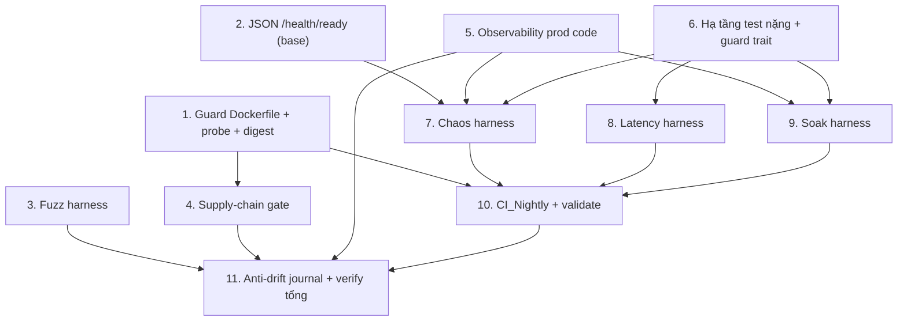

# Implementation Plan

## Overview

Kế hoạch triển khai 9 requirement của gói `military-grade-hardening`. Thứ tự thực thi theo ưu tiên đã chốt: health → fuzz → chuỗi cung ứng → observability(prod) → hạ tầng test → chaos → SLO → soak → CI nightly → anti-drift. Nguyên tắc: guard-test/harness viết ĐỎ trước, code cho XANH sau; mỗi slice giữ build Release 0-warning; QR-AD chỉ thêm ở trạng thái Implemented KHI test class đã tồn tại thật (giữ INV_6).

## Task Dependency Graph



```json
{
  "waves": [
    { "wave": 1, "tasks": ["1", "2", "3", "5", "6"], "dependsOn": [] },
    { "wave": 2, "tasks": ["4", "7", "8", "9"], "dependsOn": ["1", "2", "5", "6"] },
    { "wave": 3, "tasks": ["10"], "dependsOn": ["1", "7", "8", "9"] },
    { "wave": 4, "tasks": ["11"], "dependsOn": ["3", "4", "5", "10"] }
  ]
}
```

## Tasks

- [x] 1. Cổng hạ tầng build: guard Dockerfile/compose + health probe + digest pin
- [x] 1.1 Viết `DockerfileHardeningGuardTests` (đỏ trước) trong `starhill/tests/StarHill.ArchitectureTests/`
  - Assert `Dockerfile` chứa `HEALTHCHECK` với đủ `--interval=10s --timeout=3s --retries=3 --start-period=20s`
  - Assert `docker-compose.yml` service `host` có `healthcheck` cùng bộ tham số
  - Assert stage `runtime` (từ `FROM ... AS runtime` tới hết file) không chứa `apt-get install`/`apk add`/`yum install`
  - Assert mọi dòng `FROM` trong `Dockerfile` chứa `@sha256:`
  - Chỉ đọc file text (không cần Docker) → chạy được ở CI_PR job `build-test`
  - _Requirements: 1.10, 3.6_
- [x] 1.2 Thêm chế độ probe cho Host: `HealthProbe.cs` + nhánh `--healthcheck` đầu `Program.cs`
  - `HealthProbe.RunAsync`: `HttpClient` GET `http://localhost:{ASPNETCORE_HTTP_PORTS|8080}/health/live`, timeout 3s, exit 0 nếu 200 ngược lại 1, bắt mọi exception → exit 1
  - `Program.cs`: `if (args is ["--healthcheck", ..]) return await HealthProbe.RunAsync(args);` TRƯỚC khi dựng web host
  - Đặt ở `starhill/src/Host/StarHill.Api/` (production code, không phải harness → không vi phạm 9.5)
  - _Requirements: 1.1, 1.2, 1.3, 1.5_
- [x] 1.3 Sửa `Dockerfile`: thêm `HEALTHCHECK` + ghim digest cả hai `FROM`; sửa `docker-compose.yml` service `host`
  - Ghim `sdk:10.0@sha256:<digest>` và `aspnet:10.0@sha256:<digest>` (tra digest thật bằng `docker buildx imagetools inspect`, giữ tag cạnh digest)
  - Thêm `HEALTHCHECK ... CMD ["dotnet","StarHill.Api.dll","--healthcheck"]`
  - Thêm khối `healthcheck` (test dotnet probe + 4 tham số) cho service `host` trong compose
  - _Requirements: 1.1, 1.9, 3.5_
- [x] 1.4 Verify: `DockerfileHardeningGuardTests` xanh; `docker build -f starhill/src/Host/StarHill.Api/Dockerfile .` thành công; container đạt `healthy` (probe 200) và `unhealthy` ≤40s khi kill process
  - _Requirements: 1.4, 1.10, 3.6_

- [ ] 2. JSON body cho `/health/ready` (sửa tận gốc ở base)
- [ ] 2.1 Thêm `ResponseWriter` JSON domain-agnostic vào `platform/src/Bedrock.Api/Health/HealthEndpoints.cs`
  - Body `application/json` gồm `status`, `checks[]` (name+status), `failed[]` (tên check khác Healthy)
  - Gán cho map `/health/ready`; giữ nguyên predicate tag `ready`, không thêm khoảng ân hạn
  - _Requirements: 1.6, 1.7_
- [ ] 2.2 Integration test `/health/ready` trả 503 + JSON liệt kê check lỗi khi DB không mở được; test `/health/live` trả 200 độc lập trạng thái DB
  - Dùng fake failing health check (tag `ready`) hoặc Testcontainers PG stop; assert 503 + body chứa tên check thất bại + `Content-Type: application/json`
  - Assert `/health/live` vẫn 200 khi check readiness (DB) đang fail → xác nhận liveness không phụ thuộc DB, không kiểm deadlock nghiệp vụ
  - _Requirements: 1.6, 1.8_
- [ ] 2.3 Chạy full suite base (`platform`) xác nhận không vỡ hợp đồng health; sửa test base nếu hợp đồng đổi có chủ đích
  - _Requirements: 1.6, 1.7_

- [ ] 3. Fuzz harness biên HTTP (không 5xx, không rò)
- [ ] 3.1 Tạo project `starhill/tests/StarHill.FuzzTests/` + đăng ký vào `Platform.slnx`, ProjectReference `StarHill.Api.csproj`
  - Tái dùng `SecretInjectingHostFactory` (WebApplicationFactory in-memory), DB fake in-memory để cô lập biên HTTP
  - _Requirements: 2.9_
- [ ] 3.2 Bộ sinh biến dạng theo seed quyết định-luận (in seed khi fail)
  - JSON endpoint (POST/PUT): ≥6 lớp (sai cú pháp, sai kiểu, thiếu trường bắt buộc, trường phụ, chuỗi quá dài, body >1 KiB)
  - GET endpoint: ≥4 lớp (query sai kiểu, query quá dài, path `{...}` sai định dạng, cookie `__Host-starhill_guest` sai định dạng)
  - ≥500 payload/endpoint cho mọi Guest_Endpoints + Admin_Endpoints
  - _Requirements: 2.1, 2.2, 2.3, 2.8_
- [ ] 3.3 Xác thực và phiên: JWT role + cookie thiết bị
  - Admin `RequireStaff`/`RequireAdmin`: gắn Bearer bằng `JwtTestTokens.Issue("staff"|"admin")`; nếu 401 → fail + in role token
  - Guest ≠ resolve: gọi `POST /v1/guest/resolve` lấy cookie `__Host-starhill_guest` rồi đính kèm (trừ lớp biến dạng cookie)
  - _Requirements: 2.11, 2.12, 2.13_
- [ ] 3.4 Bất biến phản hồi + hoàn tất ≤180s
  - Mọi payload biến dạng → 400–499; 4xx → `Content-Type` bắt đầu `application/problem+json`; 5xx → fail + in status/endpoint/payload
  - Body không chứa `Exception`,`StackTrace`,`at Bedrock.`,`at StarHill.`,`Password=`,`Username=`, giá trị secret JWT
  - _Requirements: 2.4, 2.5, 2.6, 2.7, 2.10_
- [ ] 3.5 Nối `StarHill.FuzzTests` vào CI_PR job `build-test` (nằm trong `dotnet test Platform.slnx`, không mang trait nặng)
  - _Requirements: 2.9_

- [ ] 4. Supply_Chain_Gate (SBOM + quét + miễn trừ)
- [ ] 4.1 SBOM .NET: thêm tool CycloneDX vào `starhill/.config/dotnet-tools.json` (pin version), sinh CycloneDX JSON cho `Platform.slnx`
  - _Requirements: 3.1_
- [ ] 4.2 SBOM web: sinh CycloneDX JSON cho workspace `starhill/web` bằng `@cyclonedx/cyclonedx-npm` (version tường minh)
  - _Requirements: 3.1_
- [ ] 4.3 Quét severity bằng Trivy trên cả hai SBOM: High/Critical → fail; Medium trở xuống → ghi log + pass
  - _Requirements: 3.3, 3.4_
- [ ] 4.4 Tệp miễn trừ `starhill/security/vuln-exemptions.yaml` (id, reason, expires) + `validate_exemptions.py` fail khi có mục hết hạn; sinh `--ignorefile` cho Trivy từ mục còn hạn
  - _Requirements: 3.8, 3.9_
- [ ] 4.5 Job `supply-chain` mới trong `starhill-ci.yml` (`timeout-minutes ≤ 30`): chạy 4.1–4.4, upload hai SBOM làm artifact; không khai `needs` chéo để job khác vẫn chạy tới hết
  - _Requirements: 3.2, 3.7, 3.10, 4.4, 4.7_

- [ ] 5. Observability prod code (R8)
- [ ] 5.1 Counter 5xx `bedrock.http.responses.5xx` (nhãn route, status) phát dưới Meter `Bedrock` từ middleware mỏng ở `Bedrock.Api`
  - _Requirements: 8.2_
- [ ] 5.2 Spike + triển khai chỉ báo exporter-status: gauge `bedrock.telemetry.exporter.up` (0/1) + log `Warning` (tên khoá config + endpoint) khi mất kết nối OTLP
  - Spike xác minh seam OTel 1.16: phương án A (exporter-wrapper đọc `ExportResult`) → B (EventListener EventSource) → C (background ping); chốt cái bền nhất và ghi vào design nếu lệch
  - _Requirements: 8.4, 8.5_
- [ ] 5.3 Bounded buffer: config `Observability:Otlp:MaxQueueSize` (mặc định 2048) + counter `bedrock.telemetry.dropped`; drop-not-block (không backpressure hot path)
  - _Requirements: 8.6_
- [ ] 5.4 Structured log JSON chứa `traceId`,`spanId`,`level`,`message`; cùng `traceId` cho mọi log của một request; cấu hình ở Host/base (không ở Application module)
  - _Requirements: 8.8, 8.9, 8.13_
- [ ] 5.5 Tệp `starhill/ops/alert-thresholds.json` (4 ngưỡng) + `AlertThresholdConfigGuardTests` fail nếu thiếu ngưỡng
  - _Requirements: 8.11, 8.12_
- [ ] 5.6 Guard log không rò secret cho ≥5 luồng Guest (mở rộng pattern `GuestAccessResolveLogRedactionTests`)
  - _Requirements: 8.10_
- [ ] 5.7 Integration test observability: OTLP tắt mặc định vẫn boot+phục vụ (endpoint vắng); OTLP bật nhưng collector chết → vẫn boot + `/health/ready`=200 khi DB lành; metric bắt buộc được phát
  - _Requirements: 8.1, 8.2, 8.3, 8.7_

- [ ] 6. Hạ tầng test nặng + guard phân loại
- [ ] 6.1 Tạo project `starhill/tests/StarHill.ResilienceTests/` + đăng ký `Platform.slnx`; fixture dùng chung Testcontainers (PG+RabbitMQ) + `WebApplicationFactory<Program>` + `Xunit.SkippableFact` (skip khi thiếu Docker)
  - _Requirements: 4.12_
- [ ] 6.2 `HeavyTestTraitGuardTests` (mọi test harness nặng mang trait `Category`∈{Chaos,Latency,Soak}) + `HarnessLocationGuardTests` (harness chỉ dưới `starhill/tests/`, không dưới `src/`)
  - _Requirements: 4.10, 9.5_

- [ ] 7. Chaos harness fail-closed (trait Chaos)
- [ ] 7.1 Kịch bản PostgreSQL chết giữa request ghi + phục hồi
  - PG stop giữa ghi → 5xx + `application/problem+json` không rò chuỗi kết nối/stack; PG start lại → cùng request thành công ≤30s không restart process; dữ liệu đã commit đọc lại đúng; `/health/ready`=503 ≤15s khi PG dừng
  - _Requirements: 5.1, 5.2, 5.3, 1.11_
- [ ] 7.2 Kịch bản broker chết khi outbox tồn đọng (overlay messaging)
  - RabbitMQ stop → outbox pending giữ nguyên trong DB; start lại → gửi hết ≤60s, pending về 0
  - _Requirements: 5.4, 5.5_
- [ ] 7.3 Kịch bản consumer chết giữa transaction + replay
  - Consumer dừng giữa xử lý → chạy lại → số dòng tác dụng phụ = 1; gửi lại cùng message-id 5 lần → vẫn = 1
  - _Requirements: 5.6, 5.7_
- [ ] 7.4 Báo cáo chaos + đảm bảo ≥3 kịch bản, hoàn tất ≤15 phút, trait `Chaos`
  - _Requirements: 5.8, 5.9, 5.10_

- [ ] 8. Latency harness SLO p99 (trait Latency)
- [ ] 8.1 Stack in-process + PG Testcontainers, seed 60 phòng + 60 phiên khách
  - _Requirements: 6.4_
- [ ] 8.2 Warm-up 200/endpoint (loại khỏi mẫu) + thu ≥2000 mẫu/endpoint cho đúng 5 endpoint
  - _Requirements: 6.1, 6.2, 6.3_
- [ ] 8.3 Tính p50/p99 + cổng (p50>80ms fail, p99>400ms fail) + báo cáo 5 dòng kèm commit/runner/số mẫu
  - _Requirements: 6.5, 6.6, 6.7, 6.10_
- [ ] 8.4 Trait `Latency`, hoàn tất ≤20 phút, fail = fail job nightly
  - _Requirements: 6.8, 6.9_

- [ ] 9. Soak harness độ bền (trait Soak)
- [ ] 9.1 Bộ phát tải 30 rps phân bổ tường minh + 60 phiên khách (mỗi phiên cookie riêng) + ghi công thức suy ra thông lượng
  - _Requirements: 7.1, 7.2, 7.3_
- [ ] 9.2 Lấy mẫu mỗi 60s: heap sau GC, handle, kết nối PG, 5xx tích luỹ, outbox pending
  - _Requirements: 7.4_
- [ ] 9.3 Cổng: heap+10%, handle đơn điệu 5 mẫu, kết nối PG tăng, 5xx>0, outbox>10, thông lượng thực <30rps quá 10%
  - _Requirements: 7.5, 7.6, 7.7, 7.8, 7.9, 7.11_
- [ ] 9.4 Báo cáo 30 mẫu dạng bảng + thông lượng thực/endpoint; thời lượng qua env `SOAK_DURATION_MINUTES` mặc định 30; trait `Soak`; fail = fail job
  - _Requirements: 7.10, 7.12, 7.13_

- [ ] 10. CI_Nightly + phân tầng + validate
- [ ] 10.1 Tạo `.github/workflows/starhill-nightly.yml`: `schedule` 1 lần/ngày + `workflow_dispatch`, `permissions: contents: read`, 3 job (chaos/latency/soak) mỗi job `timeout-minutes ≤ 90`, chạy `--filter "Category=..."` với Testcontainers thật
  - _Requirements: 4.1, 4.2, 4.3, 4.6, 5.9_
- [ ] 10.2 Upload artifact báo cáo mỗi harness (chỉ số + ngưỡng đối chiếu)
  - _Requirements: 4.8_
- [ ] 10.3 CI_PR loại trừ harness nặng bằng `--filter "Category!=Chaos&Category!=Latency&Category!=Soak"`; giữ mọi job PR `timeout-minutes ≤ 30`; ghi lệnh `--filter` local vào `starhill/README`
  - _Requirements: 4.5, 4.7, 4.9, 4.11_
- [ ] 10.4 Mở rộng `starhill/tests/validate_ci.py`: khi `starhill-nightly.yml` tồn tại → kiểm mọi job có `timeout-minutes` + `permissions: contents: read` cấp workflow
  - _Requirements: 9.7_

- [ ] 11. Anti-drift: journal QR-AD + verify tổng
- [ ] 11.1 Thêm QR-AD-059..067 vào `journal/01-decisions.md` (mỗi mục 1 dòng `- Guard-Tests:` trỏ test class đã tồn tại thật ở các task trên)
  - _Requirements: 9.1_
- [ ] 11.2 Chạy `StarHillJournalConsistencyTests` giữ INV_6 xanh; mọi test class khai trong `- Guard-Tests:` tồn tại thật
  - _Requirements: 9.2, 9.3_
- [ ] 11.3 Xác nhận `platform/` không chứa định danh nghiệp vụ QR sinh từ tài liệu này; architecture module-boundary (Application ⊥ ASP.NET/EF/SignalR) xanh
  - _Requirements: 9.4, 9.6_
- [ ] 11.4 Verify tổng: build Release 0-warning; `StarHill.ArchitectureTests` + `StarHill.FuzzTests` xanh trên CI_PR; `docker build` xanh; nightly filter chọn đúng harness nặng
  - _Requirements: 2.9, 3.6, 4.5, 9.2_

## Notes

- **Guard-first:** với mỗi cổng, viết guard test/harness ĐỎ trước rồi mới sửa code/artifact cho XANH — để chứng minh cổng thật sự bắt được vi phạm.
- **INV_6:** task 11.1 (thêm QR-AD) phải chạy SAU khi mọi test class guard đã tồn tại thật; thêm sớm sẽ vỡ `StarHillJournalConsistencyTests`.
- **Docker:** chaos/latency/soak (task 7–9) yêu cầu Docker; local chạy bằng `--filter "Category=..."`, thiếu Docker → skip mềm (SkippableFact). PR KHÔNG skip mềm.
- **Chạm base:** task 2 (JSON health writer) + task 5.1/5.2/5.3 (metric/exporter-status ở `Bedrock.Api`) sửa `platform/` → phải chạy full suite base (`ci.yml`) sau khi sửa.
- **Điểm rủi ro cao:** task 5.2 (exporter-status) có spike vì API OTel 1.16 chưa kiểm chứng seam công khai; nếu cả A/B/C đắt → hạ ngưỡng R8.5 xuống log+counter và ghi deviation vào journal.
- **Digest pin:** task 1.3 tra digest thật lúc triển khai (`docker buildx imagetools inspect`), không bịa `sha256:`.
- **Baseline verify mỗi slice:** BE `cd starhill; dotnet build Platform.slnx -c Release` (0-warning) + `dotnet test tests/StarHill.ArchitectureTests/...`; guard/fuzz nằm trong CI_PR.
