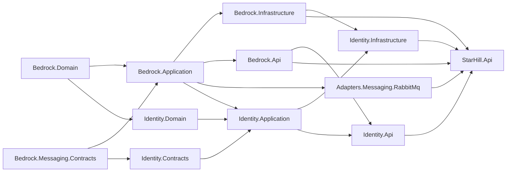
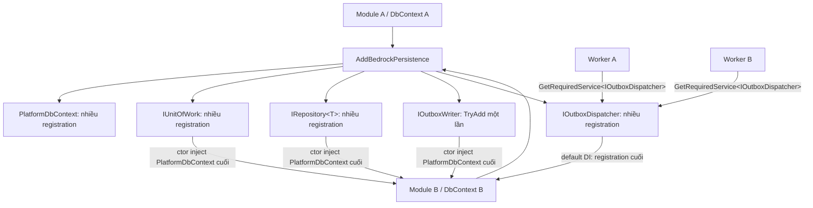

# Đánh giá kiến trúc chuyên sâu — `platform-base` / `platform`

> Ngày đánh giá: 2026-07-12  
> Phạm vi: `.kiro/specs/platform-base/**`, `platform/src/**`, `platform/tests/**`, `platform/Platform.slnx`, cấu hình build/CI/Docker liên quan.  
> Loại đánh giá: architecture, pattern, dependency direction, module boundary, persistence/UoW, messaging, security, HTTP, observability, testing, source-control hygiene và độ lệch giữa spec với code.  
> Đây là báo cáo read-only về thiết kế. Không có source code sản phẩm nào được sửa trong đợt audit này.

## 1. Kết luận điều hành

`platform` có **ý định kiến trúc tốt và kỷ luật compile-time khá mạnh**, đặc biệt ở project dependency, phân biệt Domain/Application/Infrastructure/Api, outbox/inbox, transaction, kiến trúc test và quality gate 0 warning. Code nhỏ, tên tương đối rõ, phần lớn component có test và các quyết định quan trọng được giải thích.

Tuy nhiên, trạng thái hiện tại phù hợp với một **platform skeleton/prototype chất lượng tốt cho một module**, chưa đạt mức “modular-monolith-ready cho nhiều module” hay “production-ready event backbone”. Bốn nguyên nhân chính:

1. Các service persistence quan trọng không mang identity của module/DbContext. Khi có module thứ hai, `IUnitOfWork`, `IRepository<>`, `IOutboxWriter`, `IInboxStore`, `IOutboxDispatcher` và `PlatformDbContext` có thể resolve về context đăng ký cuối cùng.
2. Inbox hiện chưa ngăn handler chạy hai lần trong race đồng thời; unique key chỉ phân thắng thua lúc commit, sau khi cả hai handler có thể đã chạy.
3. Consume-side “dead-letter” có thể thực chất là ACK/drop; publisher cũng có cửa mất message khi unroutable và không serialize toàn bộ thao tác trên shared RabbitMQ channel.
4. Spec, test và journal tạo cảm giác bảo đảm cao hơn thực tế: nhiều guard hardcode riêng Identity/RabbitMQ; Testcontainers bắt mọi exception rồi skip; canonical spec vẫn nói `platform/` chưa tồn tại.

### 1.1 Điểm số hiện trạng

| Mặt đánh giá | Điểm / 10 | Nhận định ngắn |
|---|---:|---|
| Ý tưởng kiến trúc và dependency direction | 8.0 | Project graph sạch, vai trò layer rõ |
| Encapsulation ở compile time | 7.0 | Core boundary tốt; module internals vẫn public và guard hardcode |
| Khả năng chạy nhiều module | 3.5 | Blocker do non-generic/non-keyed persistence services |
| Transaction/persistence correctness | 6.0 | Rotation/outbox producer tốt; domain-event và inbox còn lỗ race/transaction |
| Messaging reliability | 4.0 | Có nền outbox/confirm/backoff nhưng consume/DLQ/channel/trace chưa chắc chắn |
| Security design | 6.0 | JWT/Argon2/forwarded headers tốt; CSRF/options/hash bounds còn thiếu |
| Observability/operability | 5.0 | Có OTel và metrics cơ bản; trace bus, backlog gauge, replay/DLQ còn thiếu |
| Test strategy | 7.0 | Nhiều tầng test; discovery và CI skip policy làm giảm độ tin cậy |
| Spec/documentation governance | 4.0 | Rất nhiều rationale nhưng canonical docs đã drift và quá nặng lịch sử |
| Repository hygiene/reproducibility | 2.5 | 2.125 file `bin/obj`, khoảng 235 MB, đang được Git track |

**Đánh giá tổng thể: 6/10.** Nền tốt để tiếp tục, nhưng nên sửa các P0/P1 dưới đây trước khi phát triển Rooms/Guest/QR hoặc triển khai messaging với yêu cầu không mất event.

## 2. Cách audit và bằng chứng chạy thật

Đợt đánh giá đã:

- đọc dependency graph của 15 project source/test và toàn bộ project references;
- đối chiếu requirements R1–R34, design invariants I1–I10, CP1–CP15 và decision/deviation journal;
- đọc các luồng DI, pipeline decorator, `PlatformDbContext`, `EfUnitOfWork`, refresh rotation, outbox/inbox, RabbitMQ publisher/consumer, HTTP middleware, JWT/Argon2 và Host composition;
- rà test names/coverage, architecture tests, contract snapshots, migration test, CI, Dockerfile/compose;
- chạy quality gate chính thức `platform/scripts/vp.cmd all`;
- chạy `dotnet list Platform.slnx package --vulnerable --include-transitive` và kiểm tra package outdated;
- kiểm tra file build artifact đang được Git track.

Kết quả tại thời điểm audit:

- Build: **0 error, 0 warning**.
- CI policy validator: **pass**.
- Test: **230 pass, 17 skip, 0 fail**. Toàn bộ test cần Docker/PostgreSQL/RabbitMQ bị skip trên máy hiện tại.
- NuGet vulnerability scan: **không phát hiện package vulnerable** từ source hiện hành.
- Package đáng xem xét nâng: `Microsoft.IdentityModel.JsonWebTokens` 8.0.1 → 8.19.1; Npgsql EF provider 10.0.2 → 10.0.3. Không nên auto-upgrade nếu chưa chạy lại full integration suite.
- Git đang track **2.125 file `platform/**/bin/**` và `platform/**/obj/**`, khoảng 235.361.068 byte**.

`test xanh` ở đây chỉ chứng minh các case hiện có. Nó không phủ các lỗi cấu trúc multi-context, concurrent handler invocation, broker unroutable, DLX absence hoặc semantic drift trong tài liệu.

## 3. Kiến trúc hiện tại



Hướng dependency cấp project nhìn chung đúng: Domain và Messaging.Contracts zero-dependency; Application không kéo EF/ASP.NET; Api không kéo Infrastructure; adapter RabbitMQ chỉ reference Application; Host là nơi duy nhất ráp hai phía.

Vấn đề nằm ở **runtime composition bên trong graph**, không phải mũi tên project reference. Cụ thể, nhiều module cùng dùng một service type không mang module key:



Đây là lý do project-boundary test vẫn xanh nhưng modular runtime vẫn sai.

## 4. Những điểm thiết kế tốt nên giữ

### 4.1 Project dependency direction rõ và có negative control

- `Bedrock.Domain` và `Bedrock.Messaging.Contracts` không có package/project dependency.
- `Bedrock.Application` chỉ reference hai kernel assembly.
- `Bedrock.Api` không reference Infrastructure/EF/Npgsql.
- RabbitMQ adapter không reference module hay Infrastructure.
- Architecture tests có negative controls, tốt hơn kiểu test “luôn xanh” nhưng không chứng minh engine bắt được vi phạm.

Nên giữ triết lý này, nhưng chuyển discovery từ danh sách hardcode sang scan toàn solution/output như đề xuất ở A-11.

### 4.2 Outbox producer và refresh rotation có tư duy atomicity đúng

- `EfOutboxWriter` chỉ stage row, không tự commit.
- `OutboxMessage.Id = IntegrationEvent.Id` tạo identity xuyên producer/bus/inbox.
- Refresh token lưu hash, token mới dùng CSPRNG, consume bằng set-based atomic update.
- Rotation bọc consume + insert token mới + enqueue outbox trong transaction tường minh.
- Unique constraint được dịch sang exception trung lập ở Infrastructure.

Đây là nền đúng. Các chỉnh sửa cần tập trung vào module-scoping và consume-side race, không cần bỏ toàn bộ pattern.

### 4.3 HTTP boundary có nhiều lựa chọn hợp lý

- Correlation middleware đứng trước exception handler.
- Request log và exception log dùng chung `PathMasker`.
- Forwarded headers đứng trước rate limit.
- Api trả ProblemDetails và không kéo EF exception types.
- Liveness/readiness được tách.
- Role/permission nghiệp vụ không hardcode trong Bedrock.

### 4.4 Build discipline tốt

- Central Package Management.
- Nullable/analyzers/TreatWarningsAsErrors.
- Unit, architecture, contract, SQLite, Postgres/Rabbit Testcontainers, Host smoke tests.
- CI build Release, tạo Docker image và migration bundle.

Điểm cần sửa là độ tin cậy của skip/discovery, không phải bỏ quality gate.

## 5. Findings ưu tiên P0 — phải sửa trước module thứ hai hoặc production event flow

### A-01 — Persistence registration không module-scoped, phá modular monolith khi có ≥2 DbContext

**Mức độ: P0 / Architectural blocker. Trạng thái: confirmed từ DI registration.**

Evidence:

- `BedrockPersistenceExtensions.cs:42-57`: `IOutboxWriter`/`IRefreshTokenStore` dùng `TryAdd`, còn `PlatformDbContext`, `IUnitOfWork`, `IRepository<>` dùng service type chung.
- `OutboxDispatcherExtensions.cs:31-32`: dispatcher/inbox store cũng dùng interface chung.
- `OutboxDispatcherHostedService.cs:64-66`: worker generic theo `TContext` nhưng lại resolve **non-generic** `IOutboxDispatcher`.
- `MultiModulePersistenceTests.cs` chỉ kiểm hai health-check name; không resolve UoW/repository/writer/dispatcher và không ghi vào hai database.

Tác động:

- `GetRequiredService<T>` của Microsoft DI trả registration cuối cho service type có nhiều registration.
- `EfUnitOfWork`/`EfRepository<>`/`EfOutboxWriter` inject `PlatformDbContext`; khi có hai alias, context cuối có thể thắng.
- Hai hosted worker generic khác nhau có thể cùng resolve dispatcher của module đăng ký cuối; module trước không được poll, module cuối bị poll hai lần.
- Consumer/inbox của queue module A có thể ghi vào schema module B.
- `TryAdd` làm outbox writer/refresh store chỉ có một registration toàn Host, trái với per-module data ownership.
- Duplicate guard bỏ qua open generic, nên chính lỗi `IRepository<>` này không bị báo.

Hướng sửa khuyến nghị:

1. Không dùng `PlatformDbContext` alias toàn Host làm module selector.
2. Tạo typed infrastructure service: `EfUnitOfWork<TContext>`, `EfRepository<TContext,TEntity>`, `EfOutboxWriter<TContext>`, `IOutboxDispatcher<TContext>` hoặc keyed services theo module.
3. Ở Application module, dùng port gắn module marker, ví dụ `IUnitOfWork<TModule>` / `IRepository<TModule,T>`; hoặc để mỗi module khai `IIdentityUnitOfWork`, `IRoomsUnitOfWork` và adapter EF thực thi.
4. Hosted worker phải resolve `IOutboxDispatcher<TContext>` hoặc concrete `EfOutboxDispatcher<TContext>`, tuyệt đối không resolve interface không có context key.
5. Consumer registration phải gắn queue/consumer với đúng module session/DbContext.
6. Thêm integration test thật với hai DbContext/database: resolve UoW/repository/outbox/dispatcher của từng module, ghi hai row khác nhau, xác nhận không cross-write và mỗi worker chỉ poll context của nó.

Không nên thêm module Rooms trước khi đóng finding này.

### A-02 — Inbox idempotency không bảo đảm handler chỉ chạy một lần trong race

**Mức độ: P0 / Correctness. Trạng thái: confirmed từ thứ tự thao tác.**

Evidence:

- `EfInboxStore.cs:24-38`: query `AnyAsync`, sau đó chỉ `Add` row vào ChangeTracker; chưa flush/claim DB.
- `EfIntegrationEventDispatcher.cs:60-86`: sau `TryMarkProcessedAsync` là deserialize và gọi mọi handler; chỉ cuối cùng mới `SaveChangesAsync`.
- PK `(message_id, consumer)` chỉ phân thắng/thua lúc commit.

Race hiện tại:

1. Consumer A và B cùng `AnyAsync` → đều chưa thấy row.
2. Cả hai stage inbox row và **cả hai chạy handler**.
3. A commit thắng; B lỗi unique và rollback.

Nếu handler chỉ stage DB state cùng transaction, kết quả DB cuối có thể đúng. Nhưng CP8/R9 nói handler chạy đúng một lần; điều đó sai. Nếu handler gửi email, gọi API hoặc ghi side effect ngoài DB, side effect có thể chạy hai lần dù transaction B rollback.

Hướng sửa:

- Thực hiện claim nguyên tử **trước handler**, trong cùng transaction: `INSERT ... ON CONFLICT DO NOTHING`, hoặc add + flush ngay và dịch unique thành Duplicate.
- Transaction vẫn chưa commit; nếu handler lỗi, claim rollback để delivery sau có thể xử lý.
- Chỉ process handler khi insert/claim trả 1 row.
- Đổi tên `TryMarkProcessedAsync` thành `TryClaimAsync`/`TryBeginProcessingAsync`; `ProcessedAt` chỉ đúng khi transaction hoàn tất.
- Cấm integration handler gọi external side effect trực tiếp; side effect tiếp theo phải qua outbox. Thêm architecture/convention test hoặc tài liệu bắt buộc.
- Thêm Postgres test hai dispatcher đồng thời và assert invocation counter/observable external fake chỉ bằng 1, không chỉ assert DB row cuối.

### A-03 — Consume “dead-letter” có thể là ACK/drop; handler lỗi không có retry bền vững

**Mức độ: P0 nếu event không được phép mất; P1 nếu sample-only. Trạng thái: confirmed.**

Evidence:

- `RabbitMqConsumer.cs:19-23`: `DeadLettered` → ACK; handler exception → `BasicNack(... requeue:false)`.
- `RabbitMqConsumer.cs:86-100`: envelope hỏng → ACK/drop.
- `RabbitMqConsumer.cs:112-123`: unknown type được log rồi ACK; handler lỗi NACK không requeue.
- `Program.cs:66-70`: sample queue không cấu hình `x-dead-letter-exchange`.
- `InboxDispatchOutcome.cs:16-17` gọi outcome là DeadLettered nhưng không có persistence/DLX guarantee.

Hệ quả:

- Unknown event, malformed envelope và handler failure có thể biến mất vĩnh viễn.
- Outbox producer đã mark `processed_at`, nên phía producer không thể phát lại tự nhiên.
- “At-least-once + inbox” chỉ đúng đến broker; không đúng đến business handler nếu queue không có DLX/retry topology.

Hướng sửa:

- Production mode phải **require** DLX/DLQ configuration và fail startup nếu thiếu; không chỉ ghi “NÊN”.
- Tách retry queue (TTL + dead-letter-back) hoặc delayed exchange; có max attempts và poison DLQ.
- Unknown schema/type và malformed envelope phải publish/route vào quarantine queue kèm reason, headers và raw payload giới hạn kích thước.
- ACK chỉ sau khi quarantine publish được confirm; nếu quarantine thất bại thì NACK/requeue theo policy.
- Thêm admin/replay path có audit; dead-letter không chỉ là log.
- E2E test handler fail N lần → retry → DLQ; unknown event → DLQ; DLQ unavailable → không ACK mất message.

### A-04 — RabbitMQ publisher shared channel không được khóa quanh publish và connection đóng không được tái tạo đúng

**Mức độ: P0 khi có nhiều outbox worker/module; P1 với một worker. Trạng thái: confirmed.**

Evidence:

- `RabbitMqEventBusPublisher.cs:19` có semaphore.
- `RabbitMqEventBusPublisher.cs:40-50` gọi `BasicPublishAsync` **ngoài semaphore**.
- Semaphore ở `GetOrCreateChannelAsync` chỉ bảo vệ tạo channel (`:62-83`), trái comment “truy cập channel serialize”.
- `:70` dùng `_connection ??=`; nếu connection object tồn tại nhưng đã đóng, code không tạo connection mới.

RabbitMQ .NET client yêu cầu serialize concurrent publishing trên shared `IChannel`; tài liệu chính thức cảnh báo concurrent publish có thể gây frame interleaving/protocol error. Xem [RabbitMQ .NET/C# Client API Guide](https://www.rabbitmq.com/client-libraries/dotnet-api-guide).

Hướng sửa:

- Giữ semaphore từ trước `GetOrCreateChannelAsync` đến sau `BasicPublishAsync`/confirm hoàn tất, hoặc dùng channel pool đúng chuẩn.
- Nếu `_connection is not { IsOpen: true }`, dispose object cũ và tạo mới; tương tự channel.
- Hook shutdown/recovery và test broker restart/channel closure.
- Thêm test hai publisher calls đồng thời trên cùng singleton.

### A-05 — Publisher có thể đánh dấu processed dù event không route vào queue nào

**Mức độ: P0 nếu yêu cầu không mất event. Trạng thái: confirmed.**

Evidence:

- `RabbitMqEventBusPublisher.cs:47` publish với `mandatory:false`.
- Publisher confirm chỉ chứng minh broker/exchange nhận trách nhiệm, không chứng minh có queue route.
- Dispatcher sau publish thành công set `ProcessedAt`.

RabbitMQ ghi rõ non-mandatory unroutable message bị discard; xem [RabbitMQ Publishers](https://www.rabbitmq.com/docs/4.2/publishers) và [Reliability Guide](https://www.rabbitmq.com/docs/reliability).

Hướng sửa:

- Dùng `mandatory:true`, subscribe/await `BasicReturn`, coi unroutable là publish failure.
- Hoặc cấu hình alternate exchange bắt buộc và health/boot check topology.
- Queue/binding nên được provision trước publisher rollout; không để mỗi consumer tự tạo quá muộn nếu event có thể phát trước.
- E2E test publish khi không có binding: outbox phải còn pending/backoff hoặc message phải ở alternate exchange, không được processed giả.

### A-06 — Migration history chưa thực sự per-module schema

**Mức độ: P0 trước module thứ hai. Trạng thái: confirmed từ thiếu cấu hình; comment/test assertion gây hiểu nhầm.**

Evidence:

- `IdentityDbContextFactory.cs:15-17` khẳng định `HasDefaultSchema` làm `__EFMigrationsHistory` vào schema identity.
- Không có bất kỳ call `MigrationsHistoryTable(...)` trong source.
- Runtime `Program.cs:46` và design-time factory `:25` chỉ gọi `UseNpgsql` không có provider options callback.
- `IdentityMigrationTests.cs:79-81` dùng `GetAppliedMigrationsAsync`; test này không assert schema vật lý của history table.

Theo tài liệu EF Core, muốn đổi schema của history table phải cấu hình `MigrationsHistoryTable()`; xem [Custom Migrations History Table](https://learn.microsoft.com/en-us/ef/core/managing-schemas/migrations/history-table).

Hướng sửa:

```csharp
options.UseNpgsql(connectionString,
    npgsql => npgsql.MigrationsHistoryTable("__EFMigrationsHistory", IdentityDbContext.SchemaName));
```

- Dùng cùng helper cho runtime, design-time factory, test và migration bundle để tránh drift.
- Test trực tiếp `information_schema.tables`/`pg_catalog` rằng history table nằm trong schema module và không nằm ở `public`.
- Với nhiều module, mỗi bundle/job phải dùng đúng project/context/history schema.

### A-07 — Testcontainers catch mọi lỗi rồi skip, CI có thể xanh giả

**Mức độ: P0 cho quality gate. Trạng thái: confirmed.**

Ít nhất bảy fixture bắt `catch (Exception)` quanh Build/Start container và chuyển mọi lỗi thành `_available=false`. Điều này không chỉ skip khi Docker daemon không tồn tại; nó còn skip khi:

- image/tag sai hoặc registry lỗi;
- port/network/certificate lỗi;
- container boot regression;
- fixture code/config sai;
- resource exhaustion trên CI.

CI comment nói GitHub runner có Docker nên Testcontainers “chạy thật”, nhưng không có gate `skipped == 0`. Vì vậy một regression hạ tầng có thể biến test bắt buộc thành skip và vẫn pass.

Hướng sửa:

- Local: chỉ skip khi probe Docker rõ ràng xác nhận daemon unavailable.
- CI: nếu `CI=true`, mọi lỗi Start container phải fail test, không skip.
- Tách collection trait/category `RequiresDocker`; pipeline CI chạy category này và assert không có skip.
- Ghi exception reason khi local skip; hiện tại catch bỏ toàn bộ lý do.
- Có thể dùng workflow services hoặc Testcontainers, nhưng policy phải fail-closed trong CI.

## 6. Findings ưu tiên P1 — cần sửa trước production/before scale

### A-08 — Outbox giữ transaction/row lock trong lúc gọi broker

`EfOutboxDispatcher` mở DB transaction, `SELECT ... FOR UPDATE SKIP LOCKED`, rồi publish từng message và cuối batch mới Save/Commit. Với batch 100 và timeout broker 10 giây/message, transaction/connection/row locks có thể bị giữ rất lâu. Broker chậm sẽ kéo DB pool và tăng lock duration; nhiều module nhân vấn đề lên.

Thiết kế an toàn hơn:

1. transaction ngắn claim row bằng `status/lease_owner/lease_until`, commit claim;
2. publish ngoài DB transaction;
3. transaction ngắn mark processed/failure nếu vẫn sở hữu lease;
4. lease hết hạn cho phép recovery sau crash.

At-least-once vẫn giữ nguyên. Nếu tiếp tục row-lock pattern, giảm batch mạnh, đặt timeout tổng batch và đo transaction duration; nhưng lease pattern phù hợp production hơn.

### A-09 — Không có ordering theo aggregate/partition

Query order theo `OccurredAt`, nhưng nhiều dispatcher dùng `SKIP LOCKED` có thể publish event sau của cùng aggregate trước event trước. Sau failure, code còn cho message sau trong batch thành công trong khi message trước backoff.

Nếu business cần ordering, thêm `PartitionKey/AggregateId` + sequence, claim một head message mỗi partition hoặc dùng broker partition/single-active-consumer phù hợp. Nếu không bảo đảm ordering, phải ghi rõ contract là unordered; không nên chỉ nói “theo occurred_at”.

### A-10 — Message envelope thiếu schema version, trace context và integrity validation ở consume

`RabbitMqMessageMapper` ghi schema version/correlation, nhưng `RabbitMqConsumer` chỉ đọc MessageId và event-type. `IncomingIntegrationMessage` không chứa `SchemaVersion`, `ContentType`, `CorrelationId/traceparent`. Consumer không:

- kiểm schema version được hỗ trợ;
- khôi phục parent `Activity`/W3C trace context;
- kiểm `payload.Id == envelope.MessageId`;
- kiểm event type/schema metadata trong payload;
- kiểm content type/encoding/body size.

Kết quả: R22/R24 mới đúng ở producer half, chưa xuyên bus. Cần một immutable envelope contract chứa id, event type, schema version, occurred-at, traceparent/tracestate, content type và payload. Dispatcher validate envelope trước handler; mismatch đi quarantine. Tạo producer/consumer spans và set parent từ trace context.

### A-11 — Architecture/contract guard hardcode Identity và RabbitMQ, không tự mở rộng

`CoreAssemblies`, `ModuleAssemblies`, `AdapterAssemblies`, error snapshot và event snapshot đều liệt kê assembly bằng marker type cụ thể. Khi thêm Rooms hoặc adapter mới:

- nếu developer quên add project reference vào ArchitectureTests/ContractTests, project mới nằm ngoài lưới;
- cross-module rule hiện chỉ kiểm một module nên chưa hề thử cặp A ≠ B thật;
- forbidden adapter dependency hardcode chuỗi `Identity`, không phải mọi `Modules.*`;
- CI migration bundle hardcode Identity.

Hướng sửa:

- Đọc `Platform.slnx`/MSBuild project graph hoặc scan output/project files theo convention `src/Modules/*`, `src/Adapters/*`.
- Fail nếu project source không nằm trong solution hoặc không được architecture test discover.
- Xây dependency matrix từ assembly references bằng Mono.Cecil, không cần test project compile-reference từng module.
- Contract snapshot discover mọi `*.Contracts`/`*.Domain` assembly đã build.
- Thêm fixture hai module thật hoặc test-only module pair để chứng minh cross-module rule.

### A-12 — DI duplicate guard có nhiều blind spot và pipeline phụ thuộc thứ tự gọi

Các vấn đề:

- `ValidateSingleImplementationPorts` bỏ qua open generic, nên duplicate `IRepository<>` không bị bắt.
- Factory/instance registration không có marker và không required có thể trùng mà bị bỏ qua.
- `AddBedrockCore` chỉ decorate service đã đăng ký trước; module add sau sẽ chạy không validation/auth/log/idempotency/transaction.
- Gọi `AddBedrockCore` hai lần có nguy cơ duplicate validator và double-decoration.
- `AddBedrockCore(params Assembly[])` chỉ scan validator, không scan use case; tên/comment tạo kỳ vọng khác.
- Marker scan đăng ký mọi interface, có thể đăng ký cả base marker `IUseCase` và gây duplicate khi có nhiều use case marked.

Hướng sửa:

- Tạo explicit composition finalization: `services.AddBedrock(...); services.AddModule(...); services.FinalizeBedrock()` và guard không cho add module sau finalize.
- Hoặc dùng mediator/pipeline registration không phụ thuộc descriptor tồn tại tại thời điểm gọi.
- Duplicate guard áp mọi service type có policy single, kể cả open generic/factory; multi service phải whitelist rõ.
- Tách API `AddBedrockValidatorsFrom`, `AddBedrockUseCasesFrom` để tên phản ánh đúng hành vi.
- Test late registration, double registration, two modules, two open-generic repositories.

### A-13 — Idempotency behavior là “claim rồi quên”, không phải idempotency hoàn chỉnh

`IIdempotencyStore` chỉ có `TryBeginAsync`. Decorator claim key trước transaction rồi không Complete/Fail/Release. Hệ quả:

- inner trả Failure vẫn giữ key 24 giờ;
- exception/crash sau claim nhưng trước commit làm retry hợp lệ bị chặn;
- không replay response, duplicate trả conflict;
- key không namespace theo use-case/user/tenant, nên hai command khác cùng raw key có thể va chạm;
- claim không atomic với business DB transaction.

Nếu đây chỉ là gate best-effort, cần đổi tên để không hứa quá mức. Nếu cần idempotency chuẩn, dùng state machine `InProgress/Completed/Failed`, operation namespace, owner/lease, response/result hash và release/expiry policy. Với HTTP, cân nhắc Idempotency-Key middleware + durable store; với command DB, record idempotency cùng transaction nếu có thể.

### A-14 — Domain event không luôn chạy bên trong explicit transaction và event bị clear trước khi dispatch thành công

`PlatformDbContext.SaveChangesAsync` dispatch event trước `base.SaveChangesAsync`. EF implicit transaction của SaveChanges bắt đầu bên trong base call, tức handler chạy trước thời điểm đó nếu caller không bọc `ExecuteInTransactionAsync`. Handler chỉ stage entity/outbox thì cuối cùng vẫn được save chung; nhưng handler dùng `ExecuteUpdate`, raw SQL hoặc external side effect sẽ nằm ngoài atomic boundary mà comment/CP14 tuyên bố.

Ngoài ra entity events được clear trước khi gọi dispatcher. Handler ném thì context còn sống nhưng event đã mất; retry `SaveChangesAsync` trên cùng context không dispatch lại.

Hướng sửa:

- UoW `SaveChangesAsync` tự mở explicit transaction nếu chưa có, rồi mới gọi context SaveChanges/dispatch.
- Hoặc chuyển domain-event orchestration vào UoW và kiểm soát transaction rõ ràng.
- Chỉ clear event sau khi dispatch thành công, hoặc snapshot + restore khi lỗi.
- Quy định handler chỉ stage DB/outbox; cấm direct I/O.
- Test handler dùng set-based DB operation, test retry cùng DbContext sau failure.

### A-15 — Cross-site cookie/CSRF requirement chưa được implement

R15 yêu cầu:

- same-site dùng Strict/Lax;
- cross-site dùng SameSite=None + CSRF strategy + CORS siết.

Code hiện chỉ dùng `CookieSameSiteMode` để quyết định có mở CORS hay không. Không có cookie builder, `Secure`, `HttpOnly`, SameSite assignment, `AddAntiforgery`, antiforgery middleware/double-submit validation. Vì refresh token đang truyền trong JSON body, option “CookieSameSiteMode” còn không điều khiển một cookie cụ thể nào.

Cần quyết định một trong hai:

1. Token-in-body/header only: bỏ requirement/cookie mode khỏi base, ghi rõ CSRF không áp dụng như cookie auth; tập trung XSS/secure storage.
2. Refresh token in HttpOnly cookie: implement cookie policy, Secure, SameSite, domain/path, rotation Set-Cookie, CSRF cho cross-site và CORS exact origins.

Không nên giữ option nửa vời vì tạo cảm giác bảo mật giả.

### A-16 — Fail-fast options mới phủ một phần

JWT có `ValidateOnStart`; RabbitMQ validate eager khi registration. Các options sau chưa có validator đầy đủ:

- `HttpSecurityOptions`: limit/window/queue/forward limit, CIDR/IP invalid đang bị bỏ qua im lặng, CrossSite nhưng origin rỗng không fail;
- `PasswordHashingOptions`: memory/iterations/parallelism/salt/hash size;
- `OutboxDispatcherOptions`: batch/max attempts/base/max delay;
- `OutboxDispatcherWorkerOptions`: poll interval;
- `OutboxRetentionOptions`: TTL âm/zero;
- `ObservabilityOptions`: placeholder/prefix/OTLP endpoint policy.

Điều này lệch R13.3/R25.2. Dùng `IValidateOptions<T>` + `ValidateOnStart`, named-options validators theo context và tests invalid config boot-fail.

### A-17 — Argon2 verify tin tham số trong PHC string mà không có upper bound

`Argon2idPasswordHasher.Verify` parse memory/iterations/parallelism/hash size từ stored hash rồi cấp phát/tính trực tiếp. Parser không enforce version `v=19` và không chặn thông số cực lớn. DB corruption/tampering có thể gây CPU/memory DoS. Options tạo hash cũng không validate.

Cần:

- min/max cho memory, iterations, parallelism, salt/hash length;
- parse/enforce version;
- reject trước allocation nếu vượt policy;
- giới hạn password input hợp lý;
- port trả thêm `NeedsRehash`/`VerifyResult` để thực hiện nâng cost thật, thay vì comment “rehash-on-login” nhưng API không hỗ trợ.

### A-18 — JWT contract làm Application phụ thuộc công nghệ và key-ring verify/sign có thể drift

`Bedrock.Application` chứa `IJwtTokenService`, `JwtKeyRingOptions`, `JwtSigningKey.Secret`; Identity.Application dựng `ClaimsIdentity`. Đây là concrete JWT/HS256 vocabulary trong layer được mô tả là technology-agnostic.

Ngoài ra Api bind một snapshot `JwtKeyRingOptions` riêng ngay lúc registration, còn Infrastructure dùng Options/ValidateOnStart. Nếu configuration reload hoặc nguồn config thay đổi sau registration, signer/verifier có thể dùng hai object khác nhau. Validator chưa chặn duplicate `kid`; verifier không restrict algorithm rõ; token thiếu kid thử toàn bộ keys.

Hướng sửa:

- Đổi Application port thành `IAccessTokenIssuer` với DTO subject/claims trung lập, hoặc chuyển toàn bộ JWT capability sang package riêng `Bedrock.Security.Jwt`.
- Configure JwtBearer qua DI/options monitor từ cùng validated key-ring material.
- Validate unique kid, active key, allowed algorithms; quyết định rõ có cho kidless legacy token hay không.
- Precompute security keys thay vì base64 decode mỗi request.

### A-19 — `Bedrock.Infrastructure` và `Bedrock.Api` đang thành dependency magnet

Infrastructure gom EF, Npgsql, outbox/inbox, refresh store, Argon2, token generator, JWT và extension defaults. Api gom auth JWT, versioning, OpenAPI, OTel exporter, security và health. Host chỉ muốn một capability vẫn kéo hầu hết dependency.

Điều này mâu thuẫn một phần với triết lý “thêm/bỏ công nghệ bằng adapter”. Nếu dự định publish NuGet/reuse rộng, nên tách:

- `Bedrock.Persistence.Abstractions` / `Bedrock.Persistence.EFCore` / provider Npgsql;
- `Bedrock.Messaging.Abstractions` / `Bedrock.Messaging.EFCore`;
- `Bedrock.Security.Abstractions` / `Bedrock.Security.Jwt` / `Bedrock.Security.Argon2`;
- `Bedrock.Api.Core` / `Bedrock.Api.Jwt` / `Bedrock.Observability.OpenTelemetry`.

Nếu solution chỉ dùng nội bộ StarHill, có thể giữ ít project hơn; nhưng lúc đó không nên mô tả Bedrock như platform package hoàn toàn swappable.

### A-20 — Application-facing messaging model lộ persistence shape

`IEventBusPublisher` nhận `OutboxMessage`, trong đó có `ProcessedAt`, `ErrorCount`, `NextAttemptAt`, `DeadLetteredAt`. Adapter transport không cần và không nên biết retry columns của EF outbox. `OutboxMessage` nằm trong Application dù bản chất là persistence model mutable.

Tách thành:

- Infrastructure internal `OutboxRecord` chứa trạng thái DB/retry;
- Application/transport immutable `OutgoingIntegrationMessage` chỉ chứa id/type/version/payload/headers/trace;
- mapper ở dispatcher chuyển record → outgoing envelope.

`InboxMessage` cũng nên internal; test có thể dùng query helper hoặc `InternalsVisibleTo`.

### A-21 — Integration type registry dùng object chưa khởi tạo, contract metadata quá brittle

Registry và snapshot test dùng `RuntimeHelpers.GetUninitializedObject` rồi gọi virtual `EventType/SchemaVersion`. Cách này chỉ an toàn khi getter là literal không phụ thuộc field; compiler không enforce. Một event hợp lệ về mặt type nhưng getter dùng constructor-initialized field sẽ làm boot/test lỗi khó hiểu.

Dùng một trong:

- attribute `[IntegrationEvent("identity...", Version=1)]`;
- registry explicit `Register<T>(eventType, version)`;
- static abstract metadata trên interface/base generic.

Đồng thời registry key nên là `(EventType, SchemaVersion)` hoặc có policy version compatibility, không chỉ EventType.

### A-22 — Contract snapshot chưa đủ mạnh cho compatibility

Event snapshot dùng `Type.Name`; các kiểu `List<string>` và `List<int>` đều có thể chỉ hiện `List\`1`. Nó không ghi:

- generic arguments đầy đủ;
- nullable reference annotations;
- required/optional semantics;
- JSON property name/ignore/converter;
- enum values;
- default values.

Error snapshot hardcode assembly và chỉ reflect public static field/method optional; inline/dynamic/property error codes có thể lọt.

Nên snapshot canonical JSON Schema/OpenAPI schema hoặc serialize metadata đầy đủ; discover toàn contract assemblies; dùng golden files thay const dài trong test; review backward/forward compatibility có tool chuyên dụng.

### A-23 — Module internals chưa được compiler encapsulate

Design nói chỉ `*.Contracts` public, nhưng `RefreshAccessTokenUseCase`, command/result, `IdentityDbContext`, endpoint DTO/module và DI types phần lớn public. Project khác có thể add reference rồi gọi nội bộ Identity; architecture test chỉ bắt nếu project đó được discover.

Nên để Domain/Application/Infrastructure implementation internal, chỉ public:

- Contracts;
- module registration facade cần cho Host;
- endpoint module facade nếu DI cần.

Test dùng `InternalsVisibleTo`. Compiler boundary mạnh hơn convention/review.

### A-24 — Identity sample chưa chứng minh bounded context hoàn chỉnh

Identity.Domain hiện gần như chỉ có `AuthErrors`; refresh flow chủ yếu là Application điều khiển storage-shaped `RefreshTokenSnapshot`. Nó chứng minh project graph và rotation, nhưng chưa chứng minh aggregate, repository module-specific, domain event → outbox, read model, cross-module integration hoặc policy ownership.

Trước khi lấy Identity làm template cho Rooms, nên tạo một module test/sample thứ hai nhỏ nhưng thật, qua đó ép lộ và sửa A-01/A-11/A-23.

### A-25 — Soft-delete/audit convention có khả năng ghi đè filter hoặc bị filter module ghi đè

`PlatformDbContext.OnModelCreating` gọi `HasQueryFilter` một lần cho soft delete. Module sau đó thêm tenant filter có thể overwrite soft-delete filter; nếu module config trước base thì ngược lại. EF Core 10 hỗ trợ named filters; nên dùng named soft-delete filter và test composition với tenant filter.

Audit fields có public setter; caller có thể sửa `CreatedAt/CreatedBy`. `ApplyAudit` không đánh dấu created fields `IsModified=false` trên update. Nên bảo vệ field do infrastructure sở hữu hoặc dùng interceptor/shadow/private setter, và test caller cố sửa created metadata.

### A-26 — Error/Result contract có footgun

- `Error` public positional record không validate code/message rỗng.
- `Error.None` chỉ là record có empty fields + `Failure`; một Error khác cùng value bằng `None`.
- `CommonErrors.RateLimited` mang `ErrorType.Failure`, nên nếu đi qua mapper sẽ thành 500 dù tên là rate-limited; edge hiện bypass mapper và tự ghi 429.
- `Result<T>.Success` reject null nhưng generic type không constrain `notnull`, gây bất ngờ với `Result<string?>`.
- 429 response tự dựng JSON, không dùng ProblemDetailsBuilder và thiếu traceId, làm “một error shape” không còn tuyệt đối.

Nên enforce Error invariants trong constructor/factory, quyết định RateLimited là HTTP-edge-only và bỏ CommonErrors tương ứng hoặc thêm type mapping nhất quán, constrain/document nullable result, và dùng một problem writer cho 429.

### A-27 — Exception middleware xử lý cancellation như lỗi 500

Catch-all bắt cả request-aborted `OperationCanceledException`/`TaskCanceledException`, log Error và cố ghi 500. Điều này tạo noise, sai status và có thể ghi lên connection đã đóng. Thêm branch cancellation khi `RequestAborted.IsCancellationRequested`; không log error/không ghi body. Khi response đã started, preserve/rethrow original exception thay vì tạo exception mới làm mất context.

### A-28 — Outbox/Inbox operability thiếu dữ liệu chẩn đoán và replay

Outbox chỉ lưu error count/next attempt, không lưu `last_error`, `last_attempt_at`, lease/owner hoặc replay audit. Dead-letter giữ vô thời hạn nhưng không có query/admin/requeue contract. Inbox không có status/error/duration. Khi production lỗi, operator khó trả lời “vì sao, event nào, retry nào, replay ra sao”.

Thêm metadata đã sanitize, metrics oldest-pending age, dashboard/alert, admin query/replay có quyền và audit. Publish-lag histogram chỉ ghi khi message đã publish, không đo backlog hiện tại; chưa đáp ứng đầy đủ “pending age”.

### A-29 — Telemetry chưa đạt trace xuyên bus và minimum metric đã tuyên bố

- Outbox lưu `Activity.Current.Id`, nhưng consumer bỏ qua `BasicProperties.CorrelationId` và không start child Activity.
- Không có producer/consumer/handler spans rõ ràng.
- Outbox metric là lag-at-publish, không phải oldest-pending gauge.
- External-auth success/fail chưa có.
- Chỉ gọi `AddMeter("Microsoft.EntityFrameworkCore")` không tự chứng minh EF query time thực sự phát ra.

Cần OTel messaging semantic conventions, inject/extract W3C context qua headers, ActivitySource spans, observable gauge query backlog có caching/throttle, và integration test ActivityListener chứng minh parent-child xuyên RabbitMQ.

### A-30 — Repository/source-control hygiene rất kém

Mặc dù `platform/.gitignore` đã có `bin/obj`, các artifact đã track nên ignore không có tác dụng. 2.125 file/235 MB gây:

- clone/status/diff chậm;
- merge conflict và dirty worktree sau mỗi build;
- binary noise che source change thật;
- nguy cơ commit output chứa config/source path cũ.

Hành động riêng, cần review trước khi chạy:

1. bảo đảm root `.gitignore` hoặc nested rules đúng;
2. remove artifact khỏi Git index (`git rm --cached` theo danh sách path đã verify), không xóa source;
3. commit cleanup riêng;
4. CI check fail nếu tracked path match `**/bin/**|**/obj/**`.

Không thực hiện cleanup trong audit vì worktree hiện có rất nhiều thay đổi của người dùng.

## 7. Findings P2 — cải tiến maintainability và delivery

### A-31 — Spec/journal đã drift và có quá nhiều nguồn trạng thái

Canonical files vẫn khẳng định `platform/` chưa tồn tại:

- `README.md:40`;
- `requirements.md:13`;
- `tasks.md:5`;
- `design.md:948`.

Trong khi 54 checkbox tasks đều done và code đã tồn tại. `design.md` còn nói Serilog dù DV-016 đổi sang ILogger/OTel, dùng cả `MapBedrockApi` và implementation `UseBedrockApi`, DoD ghi 200 tests/chờ Docker trong khi journal sau đó nói hoàn tất với Docker.

Journal rất lớn và giữ nhiều trạng thái trung gian “còn lại/chờ”, làm semantic consistency khó hơn heading consistency. `JournalConsistencyTests` kiểm format/ID, không thể phát hiện mâu thuẫn nội dung như trên.

Khuyến nghị:

- Canonical design luôn phản ánh **current state**; lịch sử chuyển vào ADR immutable.
- Mỗi ADR có Status `Proposed/Accepted/Superseded`, link ADR thay thế.
- Archive implementation diary; không dùng nó như source of truth ngang design.
- Tạo machine-readable capability matrix sinh ra README/DoD, tránh đếm test thủ công.
- Sau mỗi feature, update spec cùng PR; CI có check các claim dễ kiểm như project tồn tại/task status/test count không hardcode.

### A-32 — Comment quá dài và mang lịch sử task vào code

Nhiều file có comment dài hơn implementation, chứa F#/AD#/N#/task chronology và đôi khi đã sai so với code. Comment nên giải thích invariant/why mà code không nói được; lịch sử “trước đây, task nào, đã verify ngày nào” nên ở ADR/commit.

Giảm comment sẽ làm code dễ review và giảm drift. Giữ các comment quan trọng về transaction, at-least-once, security boundary; bỏ narrative triển khai.

### A-33 — “Thêm module một dòng” chưa đúng về delivery system

Thêm module hiện cần ít nhất:

- 5 project + tests;
- add vào `.slnx`;
- add Host project references và hai registration halves;
- add architecture/contract assembly hardcode;
- add connection/config/migration factory/migrations;
- add CI migration bundle job;
- add outbox worker/consumer registry/topology;
- có thể add compose settings.

Nên tạo `dotnet new starhill-module` template hoặc source generator/scaffolder, manifest module dùng chung cho Host/tests/CI tooling, và một architecture check xác nhận module đầy đủ năm project/boundaries.

### A-34 — Reproducibility/supply-chain còn có thể cứng hơn

- Không có NuGet lock files/locked restore.
- `global.json` dùng `latestFeature`, có thể roll sang feature band mới.
- Docker base/image tags không pin digest.
- GitHub Actions dùng mutable major tag (`@v4`) thay commit SHA.
- Local `vp all` build Debug trong khi CI build Release.
- Không có coverage threshold/public API compatibility check.

Đây không phải blocker hiện tại, nhưng với platform dùng lại nên cân nhắc lock mode, renovate/dependabot, action SHA pin, image digest policy, local verify Release và public API analyzer.

### A-35 — Một số port mới chỉ là placeholder contract, chưa đủ production semantics

- External auth nói PKCE/nonce/replay/return URL whitelist nhưng chưa có implementation/store contract chứng minh multi-node.
- Storage trả `Stream` nhưng chưa nói ownership/disposal/range/size/checksum.
- Email không có message id/idempotency/delivery result.
- Cache generic chưa định nghĩa serialization/versioning/key namespace.
- Search chưa có poison projection/dead-letter implementation như design hứa.

Nên ghi capability nào là “contract only” để người dùng platform không hiểu nhầm là đã production-ready.

## 8. Ma trận tuân thủ Requirements R1–R34

Ký hiệu: ✅ đạt phần lõi; 🟡 đạt một phần/có residual; ❌ chưa đạt hoặc claim hiện sai.

| Requirement | Trạng thái | Nhận xét audit |
|---|:---:|---|
| R1 Domain-agnostic core | 🟡 | Blacklist test pass; Application vẫn chứa JWT/refresh vocabulary, blacklist chỉ 5 token |
| R2 Host tách khỏi core | ✅ | Program/composition ở Host |
| R3 Mask sensitive path | ✅ | Hai log site chính dùng chung masker; nên validate options |
| R4 Api không phụ thuộc Infrastructure | ✅ | Project/architecture test tốt |
| R5 Adapter isolation | 🟡 | Rabbit adapter đúng; guard không auto-discover adapter mới |
| R6 Module boundary | 🟡 | Identity đúng project graph; chưa có A≠B thật, internals public, guard hardcode |
| R7 Single write point/UoW | 🟡 | Đúng một module; multi-context DI phá binding; infra jobs gọi context trực tiếp có chủ đích |
| R8 Transactional outbox | 🟡 | Producer atomicity tốt; long transaction, ordering/unroutable/operability còn lỗi |
| R9 Inbox idempotency | ❌ | Concurrent deliveries có thể chạy handler hai lần trước PK conflict |
| R10 Refresh rotation | 🟡 | Thuật toán tốt; Postgres race test bị skip hiện tại; expiry boundary/policy cần rà |
| R11 Provider-neutral concurrency | 🟡 | Tên neutral nhưng `uint`/xmin opinionated; chưa thấy E2E production entity conflict mạnh |
| R12 DI convention | ❌ | Duplicate/open-generic/factory blind spots; non-keyed multi-context; order-sensitive decoration |
| R13 Fail-fast config/ports | 🟡 | JWT/3 security ports tốt; nhiều required options chưa validate-on-start |
| R14 Forwarded headers | 🟡 | Pipeline đúng; invalid proxy/CIDR bị bỏ qua thay vì fail |
| R15 Cookie/CORS/CSRF | ❌ | Mới có CORS toggle, chưa có cookie/antiforgery |
| R16 Extension architecture | 🟡 | Core/adapter pattern có; Infrastructure/Api vẫn dependency magnet |
| R17 Messaging seam | ❌ | Usecase seam tốt; unknown type chưa dead-letter bền vững, schema version không consume |
| R18 Search projection | 🟡 | Có port/default, chưa có adapter/projection/poison handling |
| R19 Email/cache/storage | 🟡 | Có port/default; production semantics/adapter còn thiếu |
| R20 External auth | 🟡 | Có contract/registry; chưa chứng minh PKCE/state/replay/multi-node |
| R21 Data ownership/migration | ❌ | Schema table đúng; history schema chưa config; multi-context runtime broken; cross-FK không auto-enforce |
| R22 API/event versioning | 🟡 | URL versioning/v1 OpenAPI có; deprecation/doc-per-version/consume schema policy thiếu |
| R23 Adapter resilience | 🟡 | Rabbit timeout/retry/circuit có; fallback/bulkhead và channel recovery chưa đủ |
| R24 Telemetry/correlation | ❌ | HTTP tốt; bus trace không extract, metric minimum chưa đủ |
| R25 Secrets/config governance | 🟡 | Placeholder/UserSecrets tốt; options validation chưa phủ hết; chưa có dedicated secret scan evidence |
| R26 Permission authz | ✅ | Mechanism/permission decorator đúng; policy/resource auth vẫn do app |
| R27 JWT key ring | 🟡 | active/previous keys có; duplicate kid/reload drift/algorithm strictness cần sửa |
| R28 Persistence entity hidden | 🟡 | RefreshTokenRecord internal; OutboxMessage persistence shape ở Application, InboxMessage public |
| R29 Error code contract | 🟡 | Có snapshot; discovery/schema/invariant còn yếu |
| R30 Semantic folders/naming | ✅ | Nhìn chung rõ; một số tên hứa quá hành vi (`DeadLettered`, `TryMarkProcessed`) |
| R31 Quality gate | 🟡 | 0 warning/test tốt; guard hardcode và skip policy tạo false green |
| R32 Multi-layer tests | 🟡 | Suite phong phú; 17 test Docker skip, CI không fail on skip |
| R33 Domain events | 🟡 | Stage + save atomic trong happy path; explicit transaction/clear-on-failure gap |
| R34 Health checks | ✅ | Live/ready, DB/Rabbit contributions và tests có |

## 9. Kiến trúc đích đề xuất

Không cần “rewrite”. Nên refactor theo ba seam:

### 9.1 Module-scoped persistence

```text
Identity.Application
  IIdentityUnitOfWork / IIdentityRefreshTokenStore / module repositories

Identity.Infrastructure
  IdentityDbContext
  IdentityUnitOfWork : IIdentityUnitOfWork
  EfIdentityRefreshTokenStore : IIdentityRefreshTokenStore
  EfOutboxWriter<IdentityDbContext>
  EfInboxStore<IdentityDbContext>

Rooms.Application
  IRoomsUnitOfWork / IRoomRepository / IRoomQueries

Rooms.Infrastructure
  RoomsDbContext
  RoomsUnitOfWork : IRoomsUnitOfWork
  EfOutboxWriter<RoomsDbContext>
  EfInboxStore<RoomsDbContext>
```

Bedrock cung cấp generic implementation/helper, nhưng Application module inject port mang module identity. Không có global `PlatformDbContext` selector.

### 9.2 Messaging envelope tách khỏi persistence record

```text
OutboxRecord (Infrastructure internal)
  Id, payload, status, attempts, lease, timestamps, last error

OutgoingIntegrationMessage (immutable transport contract)
  MessageId, EventType, SchemaVersion, OccurredAt,
  ContentType, Payload, TraceParent, TraceState, Headers, PartitionKey

IncomingIntegrationMessage
  cùng envelope metadata + ConsumerName
```

Publisher chỉ biết outgoing envelope. Dispatcher/consumer validate identity/version/trace. Inbox atomic claim xảy ra trước handler.

### 9.3 Capability packages thay dependency magnet

Nếu Bedrock thật sự là reusable platform, chia optional packages. Nếu chỉ là internal StarHill base, giảm tuyên bố plug-in và có thể hợp nhất project để giảm ceremony. Hai chiến lược đều hợp lý; trạng thái giữa hai như hiện tại làm chi phí cao mà isolation runtime chưa đạt.

## 10. Lộ trình sửa đề xuất

### Wave 0 — khóa correctness trước khi thêm feature

1. Viết failing two-module DI integration test.
2. Refactor typed/keyed module persistence và typed outbox workers/consumers (A-01).
3. Atomic inbox claim trước handler; add concurrent invocation test (A-02).
4. Cấu hình migration history per schema + physical-schema assertion (A-06).
5. CI fail-closed cho Testcontainers/skip count (A-07).

**Exit criteria:** hai module cùng Host ghi đúng schema; mỗi worker poll đúng outbox; concurrent duplicate chỉ gọi handler một lần; CI Docker failure không biến thành skip.

### Wave 1 — messaging reliability

1. Serialize Rabbit channel publish + recreate closed connection/channel.
2. `mandatory:true`/BasicReturn hoặc alternate exchange.
3. Require DLX/retry topology; quarantine unknown/malformed message.
4. Envelope version/trace/id validation.
5. Refactor outbox lease claim, publish ngoài transaction.
6. Add last error/replay/oldest pending metric.

**Exit criteria:** broker restart/unroutable/handler poison/unknown schema đều có deterministic outcome, không ACK-drop; trace parent nối xuyên bus.

### Wave 2 — security/config correctness

1. Chốt token-in-body hay cookie; implement hoặc xóa cross-site cookie/CSRF claim.
2. ValidateOnStart cho mọi options.
3. Bound Argon2 PHC parameters + NeedsRehash.
4. Hợp nhất validated JWT key material; unique kid/algorithm policy.
5. Handle request cancellation và unified 429 ProblemDetails.

### Wave 3 — anti-drift và maintainability

1. Auto-discover mọi module/adapter/contract assembly.
2. Tạo module template/manifest.
3. Internalize module implementations.
4. Nâng contract snapshot thành canonical schema.
5. Cập nhật canonical spec, archive journal lịch sử, rút gọn comments.
6. Xóa tracked bin/obj khỏi Git index trong commit riêng.

### Wave 4 — package/release hardening

1. Quyết định internal base hay publishable packages.
2. Split capability packages nếu publish/reuse.
3. Add Public API compatibility, package metadata, lock/reproducibility policy.
4. Pin actions/images theo policy và đồng bộ local verify Release với CI.

## 11. Test bắt buộc cần thêm

| Test | Bug được khóa |
|---|---|
| Two modules resolve/write through distinct UoW/repositories | A-01 |
| Two generic outbox workers each poll only its context | A-01 |
| Two consumers/DbContexts write inbox to correct schema | A-01 |
| Concurrent same message invokes handler exactly once | A-02 |
| Handler fails after inbox claim → claim rollback → retry succeeds | A-02 |
| Unknown/malformed message lands in DLQ/quarantine before ACK | A-03 |
| Handler fails N times → retry policy → DLQ | A-03 |
| Concurrent singleton publisher calls do not corrupt channel | A-04 |
| Broker restart recreates connection/channel | A-04 |
| Unroutable publish does not mark outbox processed | A-05 |
| `__EFMigrationsHistory` physically exists in each module schema | A-06 |
| CI environment container startup error fails, not skips | A-07 |
| Domain handler set-based update rolls back with aggregate | A-14 |
| Domain event remains/retries after handler failure | A-14 |
| Invalid options fail Host startup for every option family | A-16 |
| Malicious PHC huge params rejected without large allocation | A-17 |
| Duplicate JWT kid rejected; signer/verifier share reload behavior | A-18 |
| Event schema mismatch/id mismatch quarantined | A-10/A-21 |
| Trace Activity parent flows HTTP → outbox → Rabbit → handler | A-10/A-29 |
| New unlisted module/adapter makes discovery guard fail | A-11 |
| Soft-delete + tenant filters compose | A-25 |

## 12. Những việc không nên làm

- Không thêm module thứ hai bằng cách tiếp tục gọi `AddBedrockPersistence<TContext>` hiện tại rồi dựa vào registration order.
- Không chữa A-01 chỉ bằng `TryAdd`/`Replace`; vấn đề là thiếu module identity, không phải chọn first hay last.
- Không coi PK inbox là đủ để khẳng định handler exactly-once khi insert chưa flush trước handler.
- Không ACK unknown/malformed message nếu chưa đưa được vào quarantine bền vững.
- Không giữ DB transaction mở qua broker I/O nếu throughput/reliability quan trọng.
- Không tăng thêm blacklist string và xem đó là proof hoàn chỉnh của domain-agnostic architecture.
- Không tiếp tục append journal trạng thái mới mà không sửa canonical design đã stale.
- Không xóa/reset worktree hiện tại để cleanup artifact; cần commit/index cleanup có kiểm soát vì repo đang có nhiều thay đổi người dùng.

## 13. Ưu tiên ra quyết định của maintainer

Ba quyết định cần chốt trước khi sửa:

1. **Bedrock là internal base hay reusable packages?**  
   Internal: có thể giảm số project/abstraction. Reusable: phải split capability và quản public API/versioning nghiêm hơn.

2. **Guarantee messaging mong muốn là gì?**  
   Nếu “không mất event đến business handler”, DLX/quarantine/unroutable/atomic inbox claim là bắt buộc. Nếu chỉ sample/best-effort, spec phải hạ claim.

3. **Refresh token nằm ở body hay HttpOnly cookie?**  
   Quyết định này chi phối CSRF/CORS/SameSite; không nên để option chung chung mà không gắn vào transport thật.

Sau ba quyết định này, Wave 0 vẫn cần làm bất kể lựa chọn nào vì multi-context binding và inbox race là lỗi correctness, không phải preference.

## 14. Kết luận cuối

Giá trị lớn nhất của codebase hiện tại là: **đã có một nền compile-time sạch, tư duy transaction/outbox tốt và kỷ luật test cao**. Giá trị đó nên được bảo toàn.

Rủi ro lớn nhất là: **tài liệu và test đang chứng minh chủ yếu cấu trúc một-module, trong khi tuyên bố correctness ở cấp nhiều-module/production messaging**. Cần chuyển trọng tâm từ thêm nhiều abstraction/decision record sang các test runtime có tính đối kháng: hai module, hai DbContext, hai dispatcher, hai delivery đồng thời, broker unroutable, handler poison và CI mất Docker.

Nếu xử lý A-01 đến A-07 trước, nền này có thể tiến rất nhanh từ skeleton tốt thành modular monolith đáng tin. Nếu bỏ qua và tiếp tục xây feature, chi phí sửa sẽ tăng mạnh vì mọi module mới sẽ phụ thuộc vào DI/persistence/messaging seam hiện đang sai identity.
