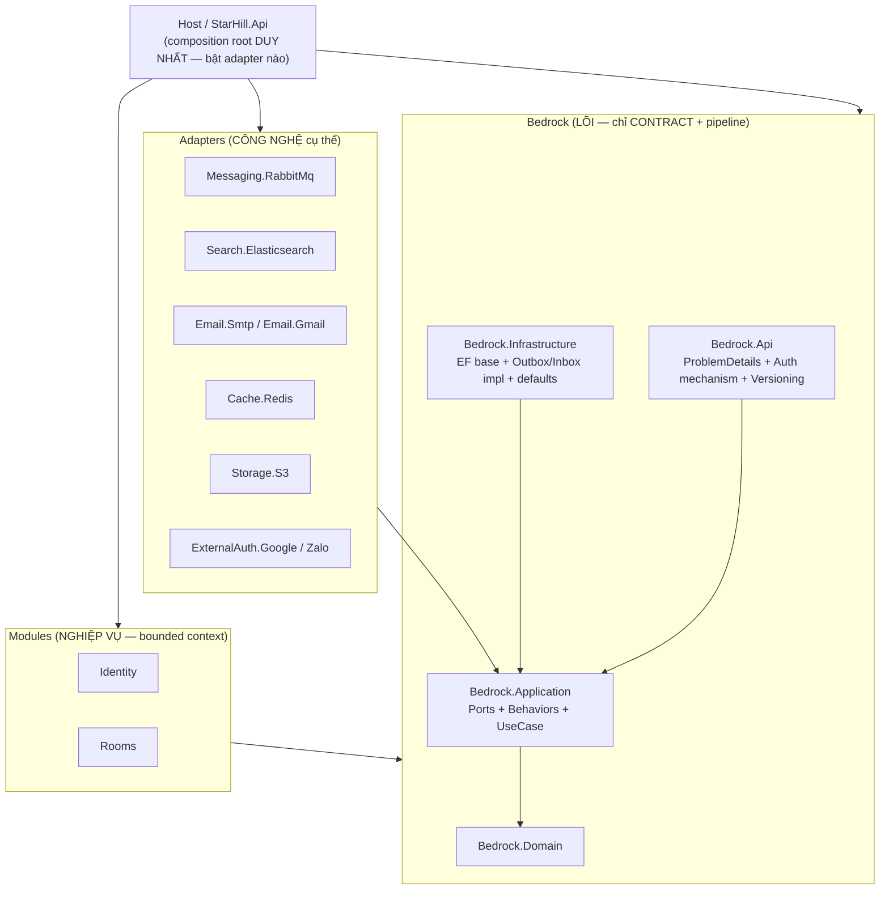
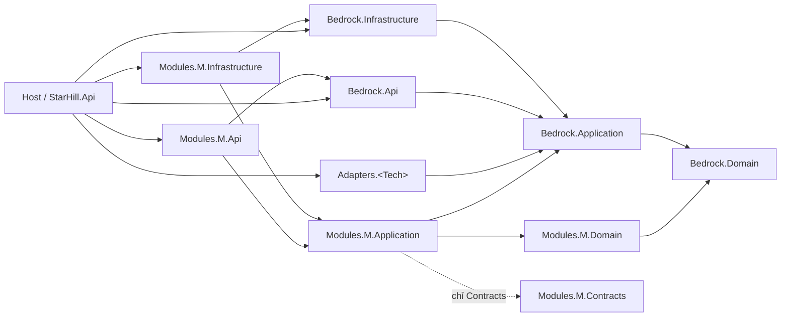
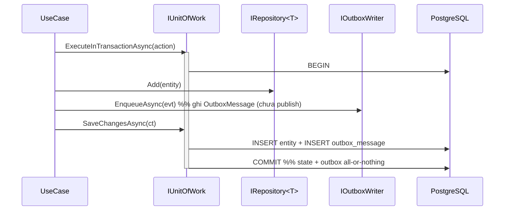
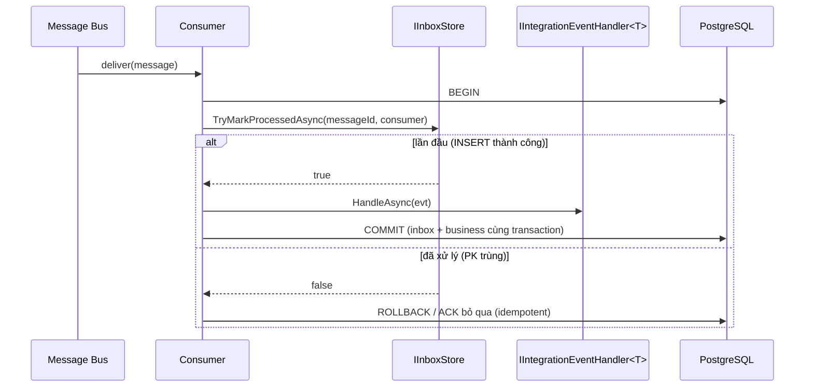
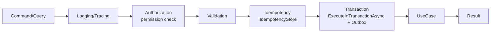

# Design Document: platform-base

> **Loại tài liệu:** Bản thiết kế kỹ thuật (technical design) cho một **base/platform backend domain-agnostic, modular-monolith-ready** trên **.NET 10 (C#)**.
> **Nguồn chuẩn (authoritative sources):**
> - #[[file:foundation/FOUNDATION-BLUEPRINT.md]] — thiết kế đích (prescription): 10 invariants, solution layout, dependency matrix, DI composition, port contracts, module anatomy, Outbox/Inbox, data ownership, versioning, resilience, telemetry, secrets, auth, pipeline behaviors, testing, build order P0→P2, Definition of Done.
> - #[[file:foundation/ARCHITECTURE-REVIEW.md]] — chẩn đoán hiện trạng (findings **F1–F35**) justify từng quyết định thiết kế.
> - #[[file:foundation/docs/persistence-layer-design.md]] — chi tiết EF persistence base (UoW/Repo/RefreshToken atomic/xmin conditional).
>
> **Nguyên tắc truy vết:** mỗi quyết định lớn dưới đây map ngược về **F#** (finding) + **§** (mục blueprint) + requirement (R1–R34). Thiết kế này đặt nền cho một tasks breakdown theo **build order P0 → P1 → P1.5 → P2**. Nơi thiết kế **tinh chỉnh khác** blueprint gốc có nhãn `[Tinh chỉnh so với Blueprint]` kèm lý do — blueprint là nguồn *rationale* (đóng băng), tài liệu này là nguồn thiết kế chuẩn duy nhất.
> **Quyết định đã chốt (áp dụng toàn spec):** (a) prefix lõi = **`Bedrock.*`** (một từ, ngắn — thân thiện MAX_PATH Windows, không lẫn part/whole với thư mục `platform/`); (b) `Result`/`Result<T>` = **`sealed class`** với factory `Success()`/`Failure()` (KHÔNG `readonly struct` — xem §4.4). Thư mục giải pháp giữ tên `platform/`.

---

## Overview

`platform-base` là lõi nền (foundation/platform) tái sử dụng cho nhiều dự án, được tái cấu trúc từ `foundation/` hiện tại (`Foundation.*`) thành bốn nhóm vai trò tách bạch: **Bedrock** (lõi không biết nghiệp vụ, chỉ có *port*), **Adapters** (công nghệ cụ thể: RabbitMQ/Elasticsearch/Gmail/Redis/S3/Google/Zalo), **Modules** (bounded context nghiệp vụ), và **Host** (composition root duy nhất). Mục tiêu tối thượng: *thêm công nghệ hoặc nghiệp vụ mới = thêm adapter/module, KHÔNG sửa lõi* (Blueprint §17, review §10/F24).

Kiến trúc giữ nguyên toàn bộ phần kỹ thuật đã được đánh giá tốt trong `foundation/` (Result/Error trung lập HTTP, Argon2id + JWT + refresh rotation nguyên tử, EF base/UoW, validation decorator, ProblemDetails, security headers, health, rate-limit) và **tái cấu trúc ranh giới + đặt "ổ cắm" mở rộng** (ports/adapters/registry/outbox-inbox). Diagnosis F1 (khủng hoảng định danh library/host), F2–F4 (rò nghiệp vụ vào lõi), F13/F24/F25 (thiếu building blocks + extension architecture + outbox) là động lực gốc cho việc tái cấu trúc này.

Thiết kế này phục vụ như **base kỹ thuật thuần**: nó không chứa `guest/room/resort/Admin/Staff`, không chứa `Program.cs` nghiệp vụ, không kéo SDK công nghệ cụ thể vào `Bedrock.*`. Nó cung cấp hợp đồng (ports) + pipeline + convention DI + luật kiến trúc (enforce bằng NetArchTest) để mọi module/adapter/host cắm vào một cách nhất quán và fail-fast.

### 1.1 Naming conventions của base (khác `foundation/` cũ)

| Khía cạnh | Giá trị trong `platform-base` | Ghi chú / Finding |
|---|---|---|
| Solution root | `platform/` | thay `foundation/` |
| Solution file | `Platform.slnx` | thay `Foundation.slnx` |
| Project/namespace prefix lõi | `Bedrock.*` (đã chốt — một từ) | KHÔNG dùng `Foundation.*` (review §4, F1/F13) |
| Ports folder | `Application/Ports/*` | thay `Application/Abstractions` (F12, review §5) |
| Clock port | `IClock` | đổi tên từ `IDateTimeProvider` |
| Concurrency marker | `IHasConcurrencyToken` | đổi tên từ `IConcurrencyAware`, không nhắc `xmin`/Npgsql trong kernel (F8) |
| Repository | `IRepository<T>` KHÔNG có `Query()` | bỏ leaky `IQueryable` (F9) |
| Runtime/user message | machine code ổn định + English trung lập; localization ở app-layer | F20 |
| XML-doc comment | tiếng Việt (ngôn ngữ team) được chấp nhận | chỉ *comment*; message runtime theo F20 |

### 1.2 Non-goals (chống scope creep)

- **KHÔNG** phải microservice framework: một process, một PostgreSQL vật lý (schema-per-module); tách service là bước sau nếu thật sự cần.
- **KHÔNG** event sourcing / CQRS đầy đủ (chỉ read-model "CQRS-lite" qua query service trả DTO).
- **KHÔNG** cam kết multi-provider DB ở production (PostgreSQL là provider đích; SQLite chỉ dùng test provider-agnostic).
- **KHÔNG** đóng gói/publish NuGet ở v1 (base tiêu thụ dạng project-reference trong solution; packaging là bước sau khi API ổn định).
- **KHÔNG** UI/BFF/gateway.

---

## 2. Mười luật bất biến (invariants) — Blueprint §1

Đây là các ràng buộc thiết kế cấp cao nhất; toàn bộ phần High-Level và Low-Level bên dưới phải tuân thủ. Mỗi luật được enforce bằng architecture test (NetArchTest) khi có thể.

| # | Invariant | Cơ chế enforce | Finding |
|---|---|---|---|
| I1 | Lõi không biết nghiệp vụ (`Bedrock.*` không guest/room/resort/Admin/Staff) | ArchTest no-business-in-core (grep chuỗi cấm) | F2/F3/F4 |
| I2 | Lõi không biết công nghệ cụ thể (chỉ port; tech ở `Adapters.*`) | ArchTest: `Bedrock.*` không ref SDK adapter | F24 |
| I3 | Một điểm ghi DB mỗi giao dịch (state + Outbox + domain-event effects cùng transaction) | Transaction behavior + UoW reentrancy (§5.1) + integration test | F5/F25 |
| I4 | Use case không gọi hạ tầng ngoài trực tiếp (chỉ qua port) | Port `IOutboxWriter`/`IEmailSender`; ArchTest cấm ref adapter | F25 |
| I5 | Module là bounded context (A chạm B chỉ qua `B.Contracts` + integration event) | ArchTest module boundary | F30 |
| I6 | Dữ liệu thuộc về module (schema-per-module, migration per-module, không JOIN chéo) | 1 DbContext + 1 schema/module; review | F31 |
| I7 | Api không kéo Infrastructure (composition chỉ ở Host) | ArchTest: `Bedrock.Api` không ref `*.Infrastructure` | F14 |
| I8 | Interface tự chặn sai (naming + namespace tách riêng cho seam nguy hiểm) | `IOutboxWriter` (Messaging) vs `IEventBusPublisher` (namespace `Messaging.Dispatch` — ArchTest cấm use case ref, CP11) | F25 |
| I9 | Fail-fast mọi môi trường (thiếu config/port bắt buộc → chặn boot) | `RequiredPortsValidator` scope-aware (§9.4) + `ValidateOnBuild`/`ValidateScopes` explicit | F7/F35 |
| I10 | Mọi lát refactor giữ build 0 warning + test xanh | `TreatWarningsAsErrors=true` + ArchTest lưới an toàn | — |

---

## Architecture

> Phần High-Level Design: system diagrams, package graph, dependency rules.

### 3.1 Mô hình 4 tầng cắm công nghệ (Blueprint §17, review §10)



Ý nghĩa: *Lõi biết "cần gì" (port), adapter biết "làm bằng gì" (tech), module biết "nghiệp vụ gì", Host biết "bật cái nào".* (Blueprint §17)

### 3.2 Solution layout đích — Blueprint §2

```
platform/
  Platform.slnx
  global.json                       # .NET SDK 10.0.301
  Directory.Build.props             # net10.0, Nullable=enable, TreatWarningsAsErrors=true, analyzers latest-Recommended, EnforceCodeStyleInBuild
  Directory.Packages.props          # Central Package Management (FluentValidation 12.1.1; xunit/NetArchTest)
  .editorconfig
  src/
    Bedrock/
      Bedrock.Domain/              # Entity, ValueObject, DomainEvent, Result/Error, Guard, IHasConcurrencyToken (zero-dep)
      Bedrock.Messaging.Contracts/ # CHỈ IntegrationEvent (abstract record) — zero-dep; dùng chung bởi Application + mọi *.Contracts (AD-017)
      Bedrock.Application/         # Ports/*, Behaviors/*, UseCases, Paging, messaging seam (IOutboxWriter...); IntegrationEvent ở Messaging.Contracts
      Bedrock.Infrastructure/  # EF base (DbContext/UoW/Repo), Cryptography, Tokens, Outbox/Inbox impl, defaults
      Bedrock.Api/             # ProblemDetails, Authentication(mechanism), HttpSecurity, Versioning, OpenApi, RateLimit, Observability  (KHÔNG ref Infrastructure — F14)
    Adapters/
      Messaging.RabbitMq/  Search.Elasticsearch/  Email.Gmail/  Email.Smtp/
      Cache.Redis/  Storage.S3/  ExternalAuth.Google/  ExternalAuth.Zalo/
    Modules/
      Identity/  { Identity.Contracts, Identity.Domain, Identity.Application, Identity.Infrastructure, Identity.Api }
      Rooms/     { Rooms.Contracts,    Rooms.Domain,    Rooms.Application,    Rooms.Infrastructure,    Rooms.Api }
    Host/
      StarHill.Api/                   # Program.cs, appsettings.*, composition
  tests/
    Bedrock.ArchitectureTests/ # dependency rule + module boundary + no-business-in-core + naming
    Bedrock.UnitTests/
    <Module>.UnitTests / <Module>.IntegrationTests
    Adapters.<Tech>.IntegrationTests  # Testcontainers per adapter
```

**Khác biệt cốt lõi so với `foundation/`:** `Foundation.Api/Application/Infrastructure` đang **vừa là base vừa là app** (F1) → tách thành **Bedrock (nền) + Modules (nghiệp vụ) + Adapters (công nghệ) + Host (ráp)** (F1/F13, review §4).

### 3.3 Dependency matrix — Blueprint §3 / review §14 (enforce bằng NetArchTest)

| Project | Được reference | TUYỆT ĐỐI KHÔNG |
|---|---|---|
| `Bedrock.Domain` | — | mọi thứ khác |
| `Bedrock.Messaging.Contracts` | — (zero-dep) | Domain, Application, Infrastructure, EF, ASP.NET, mọi thứ khác |
| `Bedrock.Application` | Domain, Bedrock.Messaging.Contracts | EF, ASP.NET, adapter, module |
| `Bedrock.Infrastructure` | Application, Domain | ASP.NET Http pipeline, module, adapter cụ thể |
| `Bedrock.Api` | Application | **Infrastructure** (F14), module, adapter |
| `Adapters.<Tech>` | Bedrock.Application (+ Domain bắc cầu) | module, adapter khác, Api, Infrastructure |
| `Modules.<M>.Contracts` | `Bedrock.Messaging.Contracts` (chỉ để kế thừa `IntegrationEvent`)¹ | `Bedrock.Application`/`Infrastructure`/`Domain`, module khác, EF, ASP.NET |
| `Modules.<M>.Domain` | Bedrock.Domain | EF, ASP.NET, module khác |
| `Modules.<M>.Application` | M.Domain, **M.Contracts (của chính nó — để phát event)**, Bedrock.Application, **B.Contracts** (module khác chỉ Contracts) | M.Infrastructure, EF, ASP.NET |
| `Modules.<M>.Infrastructure` | M.Application, Bedrock.Infrastructure | Api, module khác (trừ Contracts) |
| `Modules.<M>.Api` | M.Application, Bedrock.Api | Infrastructure của bất kỳ module nào |
| `Host` | tất cả | (composition root duy nhất) |

> ¹ `IntegrationEvent` (base record) nằm ở assembly trung tính **`Bedrock.Messaging.Contracts`** (zero-dependency) — KHÔNG ở `Bedrock.Application`. Nhờ vậy `Modules.<M>.Contracts` giữ đúng bản chất **DTO thuần**: chỉ phụ thuộc một kernel event trung tính, KHÔNG bao giờ trỏ ngược lên tầng Application. Đây thay cho phương án cũ (Contracts→Application) — xem journal **AD-017 (supersedes DV-001)**. `[Tinh chỉnh so với Blueprint]`

**6 luật bất biến enforce bằng NetArchTest (review §14):**
1. `Bedrock.*` KHÔNG biết nghiệp vụ (không guest/room/resort/Admin/Staff) — F2/F3/F4.
2. `Bedrock.Api` KHÔNG reference `*.Infrastructure` — F14.
3. `Adapters.*` chỉ reference Bedrock.Application (+ Domain bắc cầu), KHÔNG module/adapter khác/Api.
4. `Modules.A` chỉ chạm `Modules.B` qua `Modules.B.Contracts` (+ integration event) — F30.
5. Chỉ `Host` được reference đồng thời Api + Infrastructure + Adapters.
6. Type hiện thực `IUseCase`/`ICommandUseCase` KHÔNG được phụ thuộc bất kỳ type nào thuộc namespace `*.Messaging.Dispatch` (`IEventBusPublisher`/`IOutboxDispatcher`/`IInboxStore`) — luật kiểm được bằng máy nhờ tách namespace (§5.2) — F25.

Test bắt buộc phải có **negative control** (khẳng định vi phạm bị bắt), theo phong cách `DependencyRuleTests` hiện có (review §2).

### 3.4 Package graph (Mermaid — review §14)



### 3.5 Thứ tự HTTP middleware pipeline (Host gọi `MapBedrockApi`/`UseBedrock*`)

Thứ tự pipeline là composition risk kinh điển (F16 yêu cầu ForwardedHeaders sớm; F21 yêu cầu correlation có trước khi ProblemDetails được ghi). Base quy định thứ tự chuẩn, Host không tự sắp xếp lại:

| # | Middleware | Lý do đứng ở đây | Finding |
|---|---|---|---|
| 1 | `UseForwardedHeaders` | mọi thứ sau thấy IP/scheme thật | F16 |
| 2 | CorrelationId (resolve 1 lần → `HttpContext.Items` + response header) | exception handler và log đọc lại cùng giá trị | F21 |
| 3 | ExceptionHandler (ProblemDetails; log path qua masker) | bọc ngoài mọi lỗi phía sau; cần correlation đã có | F15/F20 |
| 4 | HSTS / HTTPS redirect | trước khi trả nội dung | — |
| 5 | SecurityHeaders | áp headers cho mọi response | — |
| 6 | Request logging (path qua masker dùng chung) | sau correlation, trước routing | F15/F2 |
| 7 | `UseRouting` | — | — |
| 8 | CORS | sau routing (per-endpoint policy) | F17 |
| 9 | RateLimiter (partition theo IP thật đã resolve ở #1) | sau routing để dùng per-endpoint policy | F16 |
| 10 | AuthN → AuthZ | trước endpoint | F3 |
| 11 | Endpoints (health liveness/readiness + module endpoints qua `IEndpointModule`) | — | R34 |

## Components and Interfaces

### 4.1 Tổng quan components

- **Bedrock.Domain** — Kernel sạch tuyệt đối: `Entity` (UUIDv7 + identity equality + domain events), `AuditableEntity`, marker `IAuditable`/`ISoftDeletable`/`IHasConcurrencyToken` (F8), `ValueObject`, `IDomainEvent`, `Result`/`Result<T>`/`Error`/`ErrorType`/`CommonErrors`, `ConcurrencyConflictException`, `Guard`. Zero dependency.
- **Bedrock.Messaging.Contracts** — assembly trung tính **zero-dependency** chứa DUY NHẤT `IntegrationEvent` (base record: `Id`/`OccurredAt`/`EventType`/`SchemaVersion`). Dùng chung bởi `Bedrock.Application` (seam messaging) và mọi `Modules.*.Contracts` (để khai integration event) → `Contracts` KHÔNG bao giờ trỏ lên tầng Application (AD-017, supersedes DV-001).
- **Bedrock.Application** — Ports (`IClock`, `ICurrentUser`, `ITokenGenerator`, `IHtmlSanitizer`, persistence `IRepository`/`IUnitOfWork`, security `IRefreshTokenStore`/`IPasswordHasher`, messaging seam, domain-event seam), Behaviors (logging + authorization + validation + idempotency + transaction), `IUseCase`/`ICommandUseCase`, `Paging`, DI service markers (`IScopedService`/`ISingletonService`/`ITransientService`/`IManualRegistration`) + `AddBedrockCore(params Assembly[])`. (`IntegrationEvent` nằm ở `Bedrock.Messaging.Contracts`.)
- **Bedrock.Infrastructure** — `PlatformDbContext` base (conventions + audit + soft-delete + concurrency-token conditional theo provider), `EfRepository<T>`, `EfUnitOfWork` (reentrancy-aware), **domain-event dispatch trong SaveChanges** (R33), cryptography (Argon2id `IPasswordHasher`), tokens (`IJwtTokenService` key-ring, `ITokenGenerator`, `EfRefreshTokenStore` + `RefreshTokenRecord` ẩn — F19), Outbox/Inbox impl + dispatcher worker + type registry, default port an toàn, `RequiredPortsValidator`.
- **Bedrock.Api** — ProblemDetails builder + `ErrorType→HTTP` map, auth **mechanism** (JWT bearer đọc `JwtKeyRingOptions` — không ref Infrastructure, §5.7 — + `ICurrentUser` binding + 401/403), HttpSecurity (headers/CORS/forwarded headers), versioning (Asp.Versioning), OpenApi grouping, rate-limit, observability (correlation + OpenTelemetry wiring), health endpoint mapping (`MapBedrockHealth`), `IEndpointModule` (discovery contract). **KHÔNG** ref Infrastructure (F14).
- **Adapters.\*** — impl port bằng công nghệ cụ thể + resilience pipeline ở biên (F33) + integration test riêng (F29).
- **Modules.\*** — bounded context vertical-by-feature; `Contracts` public, `Domain/Application/Infrastructure/Api` internal. Nghiệp vụ authentication (login/refresh/external-login use case, policy role/permission) thuộc **Modules.Identity** — lõi chỉ giữ *cơ chế* (JWT sign/verify, refresh-token store nguyên tử, Argon2id).
- **Host** — `Program.cs`, compose DI, chọn adapter bật, map endpoint qua `IEndpointModule` discovery.

**Quyết định đặt chỗ refresh-token (F19 + I1):** `RefreshTokenRecord`/`EfRefreshTokenStore` nằm ở `Bedrock.Infrastructure` (cơ chế tái dùng — record không chứa từ vựng nghiệp vụ nào, `UserId` là Guid opaque), port `IRefreshTokenStore` ở `Bedrock.Application/Ports/Security`; **bảng vật lý do module tiêu thụ sở hữu** — `Identity.Infrastructure` gọi `modelBuilder.AddRefreshTokens(schema: "identity")` để map bảng vào schema của mình (tôn trọng I6, không có bảng "mồ côi" của lõi). Use case rotation thuộc `Identity.Application`. Tradeoff: lõi Infrastructure chứa một cơ chế bảo mật dùng chung — đổi lại mọi app hưởng rotation chống race đã kiểm chứng, không mỗi module tự viết lại.

### 4.2 Anatomy of a Module — Blueprint §6

```
Modules/Rooms/
  Rooms.Contracts/            # PUBLIC: DTO + integration event + hằng số cho module khác dùng
    Events/  RoomCreatedIntegrationEvent.cs
    Dtos/    RoomSummaryDto.cs
  Rooms.Domain/               # Room, RoomStatus, RoomQrToken, domain rules/events (POCO thuần)
  Rooms.Application/          # vertical-by-feature
    CreateRoom/   { CreateRoomCommand, CreateRoomUseCase, CreateRoomValidator }
    RotateToken/  { ... }
    Ports/        # port riêng module (read-model IRoomQueries)
  Rooms.Infrastructure/
    Persistence/  RoomsDbContext (schema "rooms"), configurations, migrations, EfRoomQueries
    Integration/  RoomsIntegrationEventHandlers (consume event module khác)
  Rooms.Api/      RoomEndpoints.cs, RoomContracts (http request/response)  # per-endpoint policy
```

**Đăng ký module một dòng ở Host:** `AddRoomsModule(cfg)` → nội bộ gọi `AddDbContext<RoomsDbContext>` + `AddRoomsPersistence` + validators + đăng ký `IEndpointModule`. Gỡ module = xóa 1 dòng + 1 thư mục. Giao tiếp liên-module: phát `RoomCreatedIntegrationEvent` (trong `Rooms.Contracts`) qua `IOutboxWriter`; module khác consume qua `IIntegrationEventHandler<RoomCreatedIntegrationEvent>` (F30).

**Discovery contract (thay "endpoint/module discovery" mơ hồ):** mỗi `Modules.<M>.Api` khai một class implement `IEndpointModule` (ở `Bedrock.Api`):

```csharp
namespace Bedrock.Api.Endpoints;

public interface IEndpointModule
{
    void MapEndpoints(IEndpointRouteBuilder endpoints);   // per-endpoint policy/versioning do module tự khai
}
```

Host gọi `app.MapBedrockApi()` → resolve `IEnumerable<IEndpointModule>` (mỗi `AddXModule` đã đăng ký instance của mình) và gọi `MapEndpoints` — không reflection-scan mờ ám, không magic string. Lợi ích: "thêm module = 1 dòng" có cơ chế cụ thể, testable.

---

## Data Models

### 4.3 Domain kernel (Bedrock.Domain — contract mục tiêu, cần tạo)

```csharp
namespace Bedrock.Domain.Entities;

// Định danh + identity equality + domain events. Id là UUIDv7 (thời gian-sortable).
public abstract class Entity
{
    private readonly List<IDomainEvent> _domainEvents = [];
    public Guid Id { get; protected init; } = Guid.CreateVersion7();   // UUIDv7 (.NET 9+)
    public IReadOnlyCollection<IDomainEvent> DomainEvents => _domainEvents.AsReadOnly();

    protected void RaiseDomainEvent(IDomainEvent e) => _domainEvents.Add(e);
    public void ClearDomainEvents() => _domainEvents.Clear();

    public override bool Equals(object? obj) => obj is Entity other && Id.Equals(other.Id) && GetType() == other.GetType();
    public override int GetHashCode() => HashCode.Combine(GetType(), Id);
}

public abstract class AuditableEntity : Entity, IAuditable
{
    public DateTimeOffset CreatedAt { get; set; }
    public Guid? CreatedByUserId { get; set; }
    public DateTimeOffset? UpdatedAt { get; set; }
    public Guid? UpdatedByUserId { get; set; }
}

public interface IAuditable { DateTimeOffset CreatedAt { get; set; } /* ... */ }
public interface ISoftDeletable { bool IsDeleted { get; set; } DateTimeOffset? DeletedAt { get; set; } }

// F8: đổi tên khỏi IConcurrencyAware; comment TRUNG LẬP — kernel KHÔNG nhắc xmin/Npgsql.
public interface IHasConcurrencyToken { uint RowVersion { get; set; } }
```

> **Tradeoff có ý thức (F8):** kiểu `uint` được giữ vì khớp token của provider đích (PostgreSQL system column 32-bit) và EF map thẳng; *wording* trong kernel vẫn trung lập (không xmin/Npgsql — thoả R11.1). Nếu sau này cần provider có token dạng khác (SQL Server `rowversion` = byte[8]), đó là breaking change chấp nhận được vì ngoài Non-goals §1.2 (không cam kết multi-provider production).

### 4.4 Result / Error (Bedrock.Domain — HTTP-neutral, F20)

```csharp
namespace Bedrock.Domain.Results;

public enum ErrorType { Validation, NotFound, Conflict, Unauthorized, Forbidden, Failure }

// Machine code ỔN ĐỊNH (hợp đồng BE↔FE) + message English trung lập (default developer message).
// Localized user message thuộc app/UI layer theo Accept-Language (F20).
public sealed record Error(string Code, string Message, ErrorType Type)
{
    public static readonly Error None = new(string.Empty, string.Empty, ErrorType.Failure);
}

// Hợp đồng đầy đủ (type được dùng nhiều nhất toàn platform — không để sơ sài):
// QUYẾT ĐỊNH ĐÃ CHỐT: sealed class (không phải struct) — xem ghi chú dưới.
public sealed class Result
{
    public bool IsSuccess { get; }
    public bool IsFailure => !IsSuccess;
    public Error Error { get; }                       // Error.None khi thành công
    public static Result Success() => /* IsSuccess=true, Error=None */;
    public static Result Failure(Error error) => /* guard error != None */;
}

public sealed class Result<T>
{
    public bool IsSuccess { get; }
    public bool IsFailure => !IsSuccess;
    public Error Error { get; }
    public T Value { get; }                           // access khi IsFailure → throw InvalidOperationException (không trả default âm thầm)
    public static Result<T> Success(T value);
    public static Result<T> Failure(Error error);
    public static implicit operator Result<T>(T value);
    public static implicit operator Result<T>(Error error);
    public TOut Match<TOut>(Func<T, TOut> onSuccess, Func<Error, TOut> onFailure);
}

public static class CommonErrors
{
    // code ổn định + message English trung lập
    public static Error NotFound(string entity) => new($"{entity}.not_found", $"{entity} was not found.", ErrorType.NotFound);
    public static readonly Error Concurrency = new("concurrency_conflict", "The resource was modified concurrently.", ErrorType.Conflict);
}
```

> **Quyết định ĐÃ CHỐT (b): `sealed class`** (không dùng `readonly struct`). Lý do: platform là web API I/O-bound → chi phí một cấp phát gen0 cho `Result` không đáng kể so với latency DB/HTTP, trong khi `struct` mang bẫy `default(Result)` (trạng thái rỗng bị coi là kết quả hợp lệ) — footgun không cần thiết cho team nhiều cấp độ. Factory dùng `Success()`/`Failure()`. Truy cập `Value` khi `IsFailure` → ném `InvalidOperationException` (không trả `default` âm thầm). Chỉ cân nhắc lại `struct` nếu profiling chỉ ra một hot-path in-memory thực sự (khó xảy ra ở tầng API).

### 4.5 Messaging: IntegrationEvent + Outbox/Inbox (Blueprint §5.2/§7)

```csharp
namespace Bedrock.Messaging.Contracts;   // assembly trung tính zero-dep (AD-017) — Bedrock.Application + mọi *.Contracts cùng ref

// EventType (string ổn định) + SchemaVersion (int) — versioning F32.
public abstract record IntegrationEvent(Guid Id, DateTimeOffset OccurredAt)
{
    public abstract string EventType { get; }
    public virtual int SchemaVersion => 1;
}
```

**Schema bảng (per-module — quyết định ở §4.6):**

```
outbox_message(
  id              uuid PK,
  event_type      text        NOT NULL,
  schema_version  int         NOT NULL,
  payload         jsonb       NOT NULL,
  occurred_at     timestamptz NOT NULL,
  processed_at    timestamptz NULL,          -- NULL = chưa publish thành công
  error_count     int         NOT NULL DEFAULT 0,
  next_attempt_at timestamptz NULL,          -- NULL = đủ điều kiện ngay; set theo exponential backoff khi fail (R8.5)
  dead_lettered_at timestamptz NULL,         -- khác NULL = cách ly, không retry tự động (R8.5)
  correlation_id  text        NULL           -- W3C traceparent propagation (F34/F21)
)
-- Partial index cho dispatcher poll:
--   ix_outbox_pending ON (occurred_at) WHERE processed_at IS NULL AND dead_lettered_at IS NULL
-- Claim khi poll: khoá row nguyên tử trong transaction poll (row-lock skip-locked trên PostgreSQL)
--   để nhiều dispatcher instance không lấy trùng batch (R8.6, CP15). Wording trung lập ở design;
--   câu SQL cụ thể là chi tiết của Bedrock.Infrastructure (không rò lên Application).

inbox_message(
  message_id   uuid        NOT NULL,
  consumer     text        NOT NULL,
  processed_at timestamptz NOT NULL,
  PRIMARY KEY (message_id, consumer)          -- idempotency chống xử lý trùng
)
```

> **Đảm bảo:** at-least-once publish (Outbox) + idempotent consume (Inbox) = hiệu ứng **đúng-một-lần** về mặt nghiệp vụ. DB là source-of-truth; bus chỉ là kênh (Blueprint §7). **Không cam kết global ordering** khi có retry/claim song song — consumer phải tolerant với thứ tự xấp xỉ (ghi rõ để module không thiết kế dựa vào FIFO tuyệt đối).

### 4.6 Data ownership / migration — Blueprint §8 (F31)

- Mỗi module: **1 `DbContext` + 1 schema** (`identity`, `rooms`...). Cùng một PostgreSQL vật lý nhưng tách schema; cấm FK chéo schema module.
- Migration per-module: mỗi module có history table riêng (`__EFMigrationsHistory` theo schema) → deploy/migrate độc lập.
- Liên-module KHÔNG JOIN. Cần dữ liệu module khác → gọi API nội bộ / đọc read-model projection qua integration event.
- **Outbox/Inbox: CHỌN per-module (quyết định, không để ngỏ).** `[Tinh chỉnh so với Blueprint]` (blueprint để "hoặc"): bảng `outbox_message`/`inbox_message` được map vào **chính DbContext + schema của module** qua helper `modelBuilder.AddOutboxInbox()` của Bedrock.Infrastructure. Lý do kỹ thuật (không chỉ là tự chủ): **cùng DbContext = cùng transaction hiển nhiên** — CP6 (state + outbox nguyên tử) đúng bằng cấu trúc, không cần distributed transaction hay chia sẻ connection thủ công giữa hai context. Tradeoff: dispatcher phải poll N schema (mỗi module đăng ký dispatcher của mình qua `AddOutboxDispatcher<TDbContext>()`) — chấp nhận, vì tính đúng đắn đứng trên tiện lợi vận hành.

### 4.7 RefreshToken (persistence entity — F19)

`RefreshTokenRecord` (persistence-facing) được **giấu trong Infrastructure**; Application chỉ nói qua port nghiệp vụ `IRefreshTokenStore` (§5.7) — KHÔNG lộ shape lưu trữ ra Application (fix F19, review §9). Bảng được map vào schema của module tiêu thụ qua `modelBuilder.AddRefreshTokens(schema)` (§4.1 — quyết định đặt chỗ).

```
refresh_token(
  id                 uuid PK,
  user_id            uuid        NOT NULL,   -- index
  family_id          uuid        NOT NULL,   -- index (reuse-detection thu hồi cả family)
  token_hash         text        NOT NULL,   -- UNIQUE ux_refresh_hash (F10) — SHA-256 của token 256-bit CSPRNG
  expires_at         timestamptz NOT NULL,
  created_at         timestamptz NOT NULL,
  revoked_at         timestamptz NULL,
  replaced_by_token_id uuid      NULL,
  revoked_reason     text        NULL
)
```

---

## 5. Low-Level Design — Port Contracts (Blueprint §5)

Toàn bộ port đặt trong `Bedrock.Application/Ports/*` (đổi tên từ `Abstractions` — F12, review §5), trừ messaging seam có namespace riêng §5.2. Interface được đặt tên/scope để **tự chặn dùng sai** (I8/F25). Quy ước chung: mọi method async nhận `CancellationToken` (tham số cuối).

### 5.1 Persistence / Unit of Work (Blueprint §5.1)

```csharp
namespace Bedrock.Application.Ports.Persistence;

public interface IRepository<T> where T : Entity
{
    ValueTask<T?> FindByIdAsync(Guid id, CancellationToken ct = default);
    Task<T?> FirstOrDefaultAsync(Expression<Func<T, bool>> predicate, CancellationToken ct = default);
    Task<bool> AnyAsync(Expression<Func<T, bool>> predicate, CancellationToken ct = default);
    void Add(T entity);
    void Update(T entity);                 // chỉ cần cho detached entity; entity đã track tự phát hiện thay đổi
    void Remove(T entity);                 // ISoftDeletable → interceptor xử lý ở SaveChanges
    // KHÔNG có Query(): bỏ leaky IQueryable (F9). Đọc phức tạp → query service/read-model trả DTO.
}

public interface IUnitOfWork
{
    Task<int> SaveChangesAsync(CancellationToken ct = default);
    Task<TResult> ExecuteInTransactionAsync<TResult>(
        Func<CancellationToken, Task<TResult>> action, CancellationToken ct = default);
    // REENTRANCY (R7.4): nếu đã có transaction do chính UoW này mở đang hoạt động,
    // lời gọi lồng THAM GIA transaction hiện hành (không BEGIN lồng, không commit sớm).
    // Cần thiết vì Transaction behavior (§8) bọc command + use case cũng có thể gọi tường minh.
}
```

- `[Tinh chỉnh so với Blueprint]` — **bỏ `IUnitOfWork.Repository<T>()`** (blueprint §5.1 có): accessor này là service-locator ẩn — constructor của use case không khai báo aggregate nào nó đụng, khó fake từng repo khi test. Thay bằng **inject `IRepository<T>` trực tiếp** (DI scoped, cùng DbContext với UoW trong một scope → vẫn một điểm ghi duy nhất). Lợi: dependency tường minh + testability; chi phí: thêm tham số constructor.
- Rotation refresh + Outbox **luôn** trong `ExecuteInTransactionAsync` (I3/F5).
- `DbUpdateConcurrencyException` (từ SaveChanges) được UoW bắt và ném `ConcurrencyConflictException` (kernel) → Api map 409 → giữ Api KHÔNG phụ thuộc EF (persistence-layer-design §3/§7).

### 5.2 Messaging — Outbox/Inbox (Blueprint §5.2 / review §15 — tên + namespace tự chặn sai, F25/I8)

```csharp
namespace Bedrock.Application.Messaging;
// === Application side — use case CHỈ được thấy namespace này ===

public interface IOutboxWriter
{
    Task EnqueueAsync(IntegrationEvent e, CancellationToken ct);   // ghi OutboxMessage CÙNG transaction DB
}
public interface IIntegrationEventHandler<in TEvent> where TEvent : IntegrationEvent
{
    Task HandleAsync(TEvent e, CancellationToken ct);
}
```

```csharp
namespace Bedrock.Application.Messaging.Dispatch;
// === Worker / adapter side — ArchTest CP11 CẤM use case phụ thuộc namespace này ===
// Tách namespace để luật "use case không publish trực tiếp" kiểm được BẰNG MÁY (không dựa code review).

public interface IOutboxDispatcher
{
    Task DispatchPendingAsync(CancellationToken ct);
}
public interface IEventBusPublisher
{
    Task PublishAsync(OutboxMessage m, CancellationToken ct);      // impl ở Adapters.Messaging.RabbitMq
}
public interface IInboxStore
{
    Task<bool> TryMarkProcessedAsync(Guid messageId, string consumer, CancellationToken ct);
}

// Consumer cần deserialize payload → ánh xạ EventType (string) → CLR type (R17.3).
// Host build registry lúc boot từ các assembly *.Contracts được đăng ký; EventType lạ → dead-letter.
public interface IIntegrationEventTypeRegistry
{
    Type? Resolve(string eventType);
}
```

> **Lý do tách tên + namespace (review §15):** `IIntegrationEventPublisher.PublishAsync` (bản cũ) **nguy hiểm** — dev dễ gọi publish thẳng RabbitMQ trong use case, phá đảm bảo Outbox. Use case chỉ được thấy `IOutboxWriter.EnqueueAsync`. Namespace `Messaging.Dispatch` cho phép CP11 viết thành một rule NetArchTest đơn giản (type implement `IUseCase*` không ref namespace `*.Dispatch`).

**Serialization contract (chốt để không mơ hồ):** `IOutboxWriter` impl (Infrastructure) serialize event bằng System.Text.Json (options cố định: camelCase, bỏ qua null), lưu `EventType` + `SchemaVersion` từ chính event, `correlation_id` từ `Activity.Current`. `IEventBusPublisher` publish **payload thô + headers** (không cần CLR type — adapter không biết schema, giữ adapter mỏng). Consumer dùng `IIntegrationEventTypeRegistry` để deserialize về đúng type rồi gọi handler.

### 5.3 Domain events in-process (R33 — F13) `[Bổ sung so với Blueprint]`

`Entity.RaiseDomainEvent` đã có trong kernel — nếu không có cơ chế dispatch thì collection này là tính năng treo (dangling). Seam tối thiểu:

```csharp
namespace Bedrock.Application.Events;

public interface IDomainEventHandler<in TEvent> where TEvent : IDomainEvent
{
    Task HandleAsync(TEvent e, CancellationToken ct);
}

// Gọi bởi PlatformDbContext.SaveChangesAsync TRƯỚC commit (cùng transaction — R33.1/R33.2).
// Vòng lặp: dispatch → handler có thể stage thêm thay đổi/phát thêm event → lặp; max-depth chặn vòng vô hạn (R33.4).
public interface IDomainEventDispatcher
{
    Task DispatchAsync(IReadOnlyCollection<IDomainEvent> events, CancellationToken ct);
}
```

- Default: dispatcher resolve `IEnumerable<IDomainEventHandler<T>>` từ DI; không có handler → no-op (an toàn — domain event là tùy chọn).
- Use case chuẩn để "domain event → integration event": handler inject `IOutboxWriter` và enqueue trong cùng transaction (R33.3).
- **Ranh giới:** domain event = in-process, trong module, cùng transaction. Integration event = cross-module, qua Outbox. Không dùng lẫn.

### 5.4 Search (Blueprint §5.3 — ownership F26)

```csharp
namespace Bedrock.Application.Ports.Search;

public interface ISearchIndex<TDoc>
{
    Task IndexAsync(TDoc doc, CancellationToken ct);
    Task DeleteAsync(string id, CancellationToken ct);
}
public interface ISearchQuery<TDoc>
{
    Task<SearchResult<TDoc>> SearchAsync(SearchRequest req, CancellationToken ct);
}

// DTO tối thiểu của hợp đồng (contract-first — không để "tự hiểu"):
public sealed record SearchRequest(string Query, int Page = 1, int PageSize = 20,
    IReadOnlyDictionary<string, string>? Filters = null);
public sealed record SearchResult<TDoc>(IReadOnlyList<TDoc> Hits, long Total);
```

- Mỗi `TDoc` thuộc 1 module; index-name + mappingVersion + alias swap (blue/green reindex); poison-doc → dead-letter.
- Search KHÔNG thay repository chính — là read-model/search projection; DB vẫn source-of-truth (eventual consistency).

### 5.5 Email / Cache split / Storage (Blueprint §5.4 / review §15 — F28)

```csharp
namespace Bedrock.Application.Ports.Email;
public sealed record EmailMessage(string To, string Subject, string HtmlBody, string? TextBody = null);
public interface IEmailSender    { Task SendAsync(EmailMessage msg, CancellationToken ct); }  // Gmail/Smtp/SendGrid adapter

namespace Bedrock.Application.Ports.Caching;
// Cache tách thành PORT HẸP (chống leaky abstraction — review §15). Redis adapter impl cả 4.
public sealed record CacheEntryOptions(TimeSpan? AbsoluteTtl = null, TimeSpan? SlidingTtl = null);
public interface IAppCache        { Task<T?> GetAsync<T>(string k, CancellationToken ct); Task SetAsync<T>(string k, T v, CacheEntryOptions o, CancellationToken ct); Task RemoveAsync(string k, CancellationToken ct); }
public interface ILockHandle : IAsyncDisposable { }
public interface IDistributedLock { Task<ILockHandle?> AcquireAsync(string key, TimeSpan ttl, CancellationToken ct); }
public interface IIdempotencyStore{ Task<bool> TryBeginAsync(string idempotencyKey, TimeSpan ttl, CancellationToken ct); }
public interface IRateLimitStore  { Task<bool> TryAcquireAsync(string partition, int limit, TimeSpan window, CancellationToken ct); }

namespace Bedrock.Application.Ports.Storage;
public sealed record FileBlob(string FileName, string ContentType, Stream Content);
public interface IFileStorage     { Task<string> SaveAsync(FileBlob blob, CancellationToken ct); Task<Stream> OpenAsync(string key, CancellationToken ct); }
```

**Phân loại default khi chưa có adapter (R16.4 — fail-loud vs degrade-an-toàn):**

| Port | Default của `AddXxxCore()` | Lý do |
|---|---|---|
| `IAppCache` | `NullAppCache` (miss-through) | degrade an toàn — cache miển là đúng, chậm hơn |
| `IEmailSender`, `IFileStorage`, `IDistributedLock`, `IIdempotencyStore`, `IRateLimitStore`, `ISearchIndex/Query` | `Throwing*` (ném `InvalidOperationException` "No <tech> adapter registered") | no-op âm thầm = mất email / mất file / mất lock (race!) — nguy hiểm hơn crash |
| `IHtmlSanitizer`, `IPasswordHasher` | KHÔNG có default — port bảo mật bắt buộc, thiếu → `RequiredPortsValidator` chặn boot | fail-secure, không bao giờ "quên sanitize" âm thầm |

**Quan hệ `IRateLimitStore` vs Api rate-limit (chống nhập nhằng):** `Bedrock.Api` dùng ASP.NET RateLimiter middleware (in-memory per-node) cho HTTP; `IRateLimitStore` là port cho giới hạn **distributed** (nhiều node) — Host quyết định nối partition của middleware vào store này khi cần. Hai tầng, một khái niệm, không trùng lặp trách nhiệm.

### 5.6 External Auth (Blueprint §5.5 — F27)

```csharp
namespace Bedrock.Application.Ports.ExternalAuth;

public interface IExternalAuthProvider
{
    string Name { get; }                                                             // "google" | "zalo"
    Task<ExternalAuthChallenge> CreateChallengeAsync(ExternalAuthRequest r, CancellationToken ct);  // state + PKCE + nonce + returnUrl(whitelist)
    Task<ExternalUserProfile>   CompleteAsync(ExternalAuthCallback cb, CancellationToken ct);        // verify state/pkce, replay-protect
}
public interface IExternalAuthProviderRegistry { IExternalAuthProvider Resolve(string name); }

// Email/EmailVerified NULLABLE: KHÔNG giả định provider nào cũng trả email_verified (Zalo có thể không trả email).
public sealed record ExternalUserProfile(
    string Provider, string ProviderUserId, string? Email, bool? EmailVerified, string? DisplayName);
// ProviderUserId unique + account-linking policy + email-trust policy ở Identity.Application (KHÔNG ở lõi — F3).
```

### 5.7 Cross-cutting (Blueprint §5.6)

```csharp
namespace Bedrock.Application.Ports.Time;
public interface IClock { DateTimeOffset UtcNow { get; } }   // đổi tên từ IDateTimeProvider

namespace Bedrock.Application.Ports.Users;
// F23: mở rộng permission-based + multi-tenant + session.
public interface ICurrentUser
{
    Guid? UserId { get; }
    bool IsAuthenticated { get; }
    IReadOnlyCollection<string> Roles { get; }
    IReadOnlyCollection<string> Permissions { get; }   // F23 — authz theo permission
    Guid? TenantId { get; }                             // F23 — multi-tenant
    Guid? SessionId { get; }                            // F23 — audit/revoke
    bool IsInRole(string role);
    bool HasPermission(string permission);
}

namespace Bedrock.Application.Ports.Security;
public interface ITokenGenerator { string NewToken(int byteLength = 32); }   // CSPRNG, base64url
public interface IHtmlSanitizer  { string Sanitize(string html); }
public interface IPasswordHasher { string Hash(string password); bool Verify(string password, string hash); }  // Argon2id

// F19: Application chỉ thấy port nghiệp vụ — shape lưu trữ (RefreshTokenRecord) ẩn trong Infrastructure.
public interface IRefreshTokenStore
{
    Task<RefreshTokenSnapshot?> GetActiveByHashAsync(string tokenHash, CancellationToken ct);
    Task<bool> TryConsumeAsync(Guid tokenId, DateTimeOffset now, string reason, Guid replacedByTokenId, CancellationToken ct); // UPDATE nguyên tử
    Task AddAsync(RefreshTokenSnapshot newToken, CancellationToken ct);       // stage — commit ở SaveChanges
    Task RevokeFamilyAsync(Guid familyId, CancellationToken ct);
}
// Snapshot = DTO bất biến phục vụ use case (Id, UserId, FamilyId, TokenHash, ExpiresAt, RevokedAt) — KHÔNG phải EF entity.

public interface IJwtTokenService                                            // F22 — key-ring
{
    string Issue(ClaimsIdentity identity);      // ký bằng active key, gắn "kid" vào header
}
```

**Phân giải key-ring KHÔNG phá F14 (Api ⊥ Infrastructure):** ký và verify dùng chung **`JwtKeyRingOptions`** (bind từ config: `ActiveKid`, `Keys[{kid, secret}]`, `Issuer`, `Audience`):
- `Bedrock.Infrastructure/Tokens` đọc options để **ký** (active key, header `kid`).
- `Bedrock.Api/Authentication` đọc **cùng options** để cấu hình JwtBearer `TokenValidationParameters` (`IssuerSigningKeyResolver` chọn key theo `kid`, verify được active + previous keys — rolling rotation).
- Hai layer gặp nhau ở **config**, không ở project reference → F14 được bảo toàn. Options validate-on-start (F35). Cân nhắc RS256/ES256 khi nhiều service verify (chỉ phát tán public key).

---

## 6. Low-Level Design — DI Composition & Conventions (Blueprint §4)

### 6.1 Quy ước cặp API `AddXxxCore()` ↔ `AddYyyXxx(cfg)`

- `AddXxxCore()`: đăng ký **port default an toàn (§5.5) + behavior + khai báo port bắt buộc vào `StartupValidationOptions.RequiredPorts`**, luôn gọi (ở lõi/module core).
- `AddYyyXxx(cfg)`: đăng ký **adapter cụ thể**, CHỈ ở Host. Bỏ dòng adapter = tắt tính năng (port quay về default an toàn: degrade hoặc fail-loud khi bị gọi — R16.4).

```csharp
// Host/Program.cs — nơi DUY NHẤT compose (Blueprint §4):
builder.Services
    .AddBedrockCore()                 // Result/behaviors/clock/currentuser
    .AddBedrockApi(cfg)               // ProblemDetails, auth mechanism, versioning, OpenApi, rate-limit, observability, health
    .AddBedrockPersistence(cfg);      // EF base + outbox/inbox impl + startup validator

builder.Services
    .AddMessagingCore()      .AddRabbitMqMessaging(cfg)       // bỏ dòng adapter = tắt tính năng
    .AddSearchCore()         .AddElasticsearchSearch(cfg)
    .AddEmailCore()          .AddSmtpEmail(cfg)               // đổi .AddGmailEmail(cfg) không đụng use case
    .AddCacheCore()          .AddRedisCache(cfg)
    .AddExternalAuthCore()   .AddGoogleAuth(cfg).AddZaloAuth(cfg);

builder.Services
    .AddIdentityModule(cfg)
    .AddRoomsModule(cfg);
```

### 6.2 Luật DI (sửa F18/F6)

- Platform default dùng **`TryAdd`** (adapter/app override được bằng cách đăng ký TRƯỚC, hoặc dùng `Replace` tường minh).
- Port **single-implementation** có **duplicate-guard**: sau khi Host compose xong, `RequiredPortsValidator` (§9.4) kiểm `IServiceCollection` — nếu một port single-impl có >1 `ServiceDescriptor` không qua `Replace` tường minh → fail-fast với message nêu cả hai impl. Không last-wins âm thầm (F18).
- Port **multi-implementation** (`IExternalAuthProvider`, `IIntegrationEventHandler<T>`, `IDomainEventHandler<T>`, health checks) đăng ký `IEnumerable<T>` **có chủ đích** + registry resolve theo tên/type — miễn duplicate-guard (khai báo trong danh sách multi-impl để guard bỏ qua).
- Thay `NotInNamespaceOf<DbContext>` bằng **marker tường minh `IManualRegistration`** cho service hard-require DbContext (sửa F6, tránh bẫy quy ước namespace-string).
- Mọi API đăng ký scan nhận **`params Assembly[]`** để quét use case/validator/handler của app assembly (F6).
- `AddPlatform()` all-in-one CHỈ dùng trong template/sample, KHÔNG trong library core (F6).
- Bật `ValidateOnBuild`/`ValidateScopes = true` **tường minh** trong `AddBedrockCore` guidance cho Host (không dựa mặc định chỉ-Development — F7).

### 6.3 Service markers (mục tiêu — Bedrock.Application/DependencyInjection)

```csharp
public interface IScopedService { }
public interface ISingletonService { }
public interface ITransientService { }
public interface IManualRegistration { }   // F6 — service hard-require DbContext, loại khỏi auto-scan tường minh
```

### 6.4 Folder / namespace structure (đổi tên per Blueprint §5 / review §5)

| `foundation/` cũ | `platform-base` mới | Lý do |
|---|---|---|
| `Application/Abstractions` | `Application/Ports` (con: `Persistence`, `Security`, `Time`, `Users`, `Html`) | "Ports" = cổng ra ngoài (Hexagonal) |
| `Application/Common` | `Application/UseCases` + `Application/Validation` + `Application/Paging` | tránh tên "Common" thùng rác |
| `Application/Identity` | (chuyển sang `Modules/Identity`) | Identity là nghiệp vụ, không thuộc lõi |
| `Api/Endpoints` | folder theo capability (module tự khai) | tránh "bãi phẳng" |
| `Api/Security` | `Api/Authentication` + `Api/HttpSecurity` | tách HTTP-auth khỏi headers/CORS |
| `Infrastructure/Security` | `Infrastructure/Cryptography` + `Infrastructure/Tokens` + `Infrastructure/Sanitization` | rõ công nghệ, hết chồng nghĩa |
| `IDateTimeProvider` | `IClock` | ngắn gọn, trung lập |
| `IConcurrencyAware` | `IHasConcurrencyToken` | bỏ khái niệm `xmin` khỏi kernel (F8) |

---

## 7. Low-Level Design — Key Algorithms

### 7.1 Outbox producer — ghi nguyên tử (Blueprint §7, I3/F5/F25)

**Sequence:**



**Preconditions:** `entity` hợp lệ; `evt` là `IntegrationEvent` có `EventType` ổn định; đang ở ngoài transaction (behavior mở transaction).
**Postconditions:** entity + `outbox_message` được persist trong **cùng một commit** — hoặc cả hai cùng có, hoặc cả hai cùng không (nguyên tử). `outbox_message.processed_at = NULL` (chờ publish). `correlation_id` mang traceparent hiện hành (F34/F21).
**Invariant:** use case KHÔNG bao giờ publish trực tiếp lên bus (I4/F25) — chỉ `EnqueueAsync`.

```csharp
// Pattern (thực thi qua Transaction behavior, §8):
await uow.ExecuteInTransactionAsync(async ct =>
{
    repo.Add(entity);                          // thay đổi state
    await outboxWriter.EnqueueAsync(evt, ct);  // ghi OutboxMessage CÙNG transaction (chưa publish)
    await uow.SaveChangesAsync(ct);            // 1 commit — state + outbox all-or-nothing
    return Result.Success();
}, ct);
```

### 7.2 Outbox dispatcher — phát ở worker nền (Blueprint §7/§10) — R8.4–8.6, CP15

```
IOutboxDispatcher.DispatchPendingAsync(ct):            # đăng ký per-module: AddOutboxDispatcher<TDbContext>()
    BEGIN TX
    batch ← CLAIM đến n message:                       # claim NGUYÊN TỬ (row-lock skip-locked / lease)
            WHERE processed_at IS NULL
              AND dead_lettered_at IS NULL
              AND (next_attempt_at IS NULL OR next_attempt_at <= now)
            ORDER BY occurred_at
    FOR each m IN batch:
        TRY:
            await eventBusPublisher.PublishAsync(m, ct)   # RabbitMQ adapter (resilience ở biên — F33)
            m.processed_at ← clock.UtcNow
        CATCH:
            m.error_count ← m.error_count + 1
            IF m.error_count >= MaxAttempts:              # options per-module
                m.dead_lettered_at ← clock.UtcNow        # cách ly poison, không chặn message khác
            ELSE:
                m.next_attempt_at ← now + backoff(error_count)   # exponential + jitter
    SaveChanges; COMMIT                                   # release claim
```

**Nguyên tắc:** at-least-once publish — crash sau `PublishAsync` trước khi mark → message publish lại lần sau (Inbox phía consumer khử trùng). **Claim nguyên tử** bảo đảm nhiều dispatcher instance (nhiều node) không lấy trùng batch đang xử lý (CP15). Retry/backoff ở worker, KHÔNG ở request path người dùng (F33). Metrics: outbox lag (tuổi pending cũ nhất) + dead-letter count (R24.3).

### 7.3 Inbox consumer — idempotent (Blueprint §7, I5/F30)



**Postcondition:** mỗi `(message_id, consumer)` chỉ chạy handler **đúng một lần**; commit inbox + business trong 1 transaction → không double-effect (F30). Phân tích cửa sổ crash: (a) crash trước COMMIT → rollback cả inbox mark lẫn business → NACK/redeliver → xử lý lại sạch; (b) crash SAU commit trước ACK → redeliver → PK trùng → bỏ qua (idempotent). Handler phát event mới → bắt buộc qua `IOutboxWriter` cùng transaction (R9.4). `EventType` không có trong `IIntegrationEventTypeRegistry` → dead-letter, không crash consumer (R17.3).

### 7.4 Refresh-token rotation nguyên tử (Blueprint §5.1/§13, F5/F10, persistence §4)

```
RefreshTokenUseCase.ExecuteAsync(rawToken):
    uow.ExecuteInTransactionAsync(async ct => {          // F5 — rotation trong transaction
        hash    ← SHA256(rawToken)
        current ← store.GetActiveByHashAsync(hash, ct)
        IF current IS NULL OR current.ExpiresAt < clock.UtcNow:
            RETURN Result.Failure(AuthErrors.InvalidRefreshToken)   // code ổn định (F20)

        // reuse-detection: nếu token đã revoked mà vẫn được dùng → thu hồi cả family
        IF current.RevokedAt IS NOT NULL:
            await store.RevokeFamilyAsync(current.FamilyId, ct)
            RETURN Result.Failure(AuthErrors.InvalidRefreshToken)

        newRecord ← CreateRotated(current)               // cùng FamilyId, hash mới
        // consume-if-not-revoked NGUYÊN TỬ ở DB (ExecuteUpdate: UPDATE ... WHERE id=@id AND revoked_at IS NULL)
        consumed  ← await store.TryConsumeAsync(current.Id, clock.UtcNow, "rotated", newRecord.Id, ct)
        IF NOT consumed:                                  // 0 rows → request khác đã consume (race)
            RETURN Result.Failure(AuthErrors.InvalidRefreshToken)

        await store.AddAsync(newRecord, ct)
        await uow.SaveChangesAsync(ct)                    // enlist cùng transaction → all-or-nothing (fix F5)
        RETURN Result.Success(Issue(newRecord))
    })
```

**Invariant race (persistence §4):** `TryConsumeAsync` sinh **một** `UPDATE ... WHERE id=@id AND revoked_at IS NULL` → 2 request đồng thời chỉ 1 câu ăn 1 row (row-level lock) → đúng 1 thắng. Không lock ứng dụng. `token_hash` `UNIQUE` (F10) đảm bảo cấp DB. Fix F5: consume + insert nằm trong cùng `ExecuteInTransactionAsync` → nếu insert fail thì consume cũng rollback (không mất token). Use case này thuộc `Identity.Application` (nghiệp vụ); store nguyên tử `IRefreshTokenStore` là cơ chế của Bedrock (§4.1).

### 7.5 Domain-event dispatch trong SaveChanges (R33 — F13)

```
PlatformDbContext.SaveChangesAsync(ct):
    depth ← 0
    LOOP:
        events ← collect + clear DomainEvents từ mọi entity đang track
        IF events rỗng OR depth >= MaxDispatchDepth: BREAK      # R33.4 — chặn vòng vô hạn
        await domainEventDispatcher.DispatchAsync(events, ct)    # handler có thể stage thêm thay đổi / EnqueueAsync outbox
        depth ← depth + 1
    audit/soft-delete interceptor áp thay đổi
    RETURN base.SaveChangesAsync(ct)                             # MỘT commit — state + handler effects + outbox all-or-nothing
```

**Postcondition (CP14):** hiệu ứng của handler và state gốc commit **cùng transaction**; handler ném exception → không gì được commit (R33.2). Vượt MaxDispatchDepth → ném lỗi rõ ràng (không silent-drop event).

---

## 8. Application Pipeline Behaviors (Blueprint §14, F13)

Bọc quanh use case theo thứ tự (decorator/pipeline), generic, đăng ký ở `AddBedrockCore`:

```
Logging/Tracing → Authorization → Validation → Idempotency → Transaction → UseCase
```

`[Tinh chỉnh so với Blueprint §14]` — blueprint đặt Validation trước Authorization; đảo lại vì: (a) **an ninh** — không trả chi tiết validation cho caller không có quyền (information disclosure); (b) **chi phí** — permission check theo claim rẻ hơn validate payload. Authorization behavior là khai báo theo permission claim (`ICurrentUser.HasPermission`); authorization theo TRẠNG THÁI resource (cần load dữ liệu) vẫn nằm trong use case.



| Behavior | Vai trò | Port | Finding |
|---|---|---|---|
| Logging/Tracing | span + structured log qua masker dùng chung | `IClock`, telemetry | F15/F34 |
| Authorization | permission check theo `ICurrentUser.Permissions` (khai báo trên command qua attribute/metadata) | `ICurrentUser` | F23 |
| Validation | FluentValidation decorator (`ValidationUseCaseDecorator`) | FluentValidation 12.1.1 | (P0) |
| Idempotency | command mang `IdempotencyKey`: `TryBeginAsync` false → trả `Error("idempotency_conflict", ..., Conflict)` — KHÔNG replay response ở v1 (replay = extension của adapter, tránh serialize response vào store) | `IIdempotencyStore` | F28 |
| Transaction | mở `ExecuteInTransactionAsync` cho command ghi + outbox; reentrancy §5.1 → use case gọi tường minh không xung đột | `IUnitOfWork` | I3/F5/F25 |

> Behavior nền: `ValidationUseCaseDecorator`, `ValidationCommandUseCaseDecorator` (tạo ở giai đoạn đầu). Các behavior còn lại (Logging/Authorization/Idempotency/Transaction) là phần mở rộng P2.

---

## 9. Cross-cutting Standards

### 9.1 Versioning (Blueprint §9, F32)
- **HTTP API:** `Asp.Versioning` (URL `/v1` hoặc header). OpenAPI group theo version. Deprecation policy có thời hạn.
- **Integration event:** `EventType` (string ổn định) + `SchemaVersion` (int). Evolution: chỉ **thêm field optional** = backward-compat; **breaking** = tạo `EventType` mới (v2) chạy song song. Consumer là **tolerant reader** (bỏ qua field lạ).

### 9.2 Resilience (Blueprint §10, F33)
- `Microsoft.Extensions.Resilience`/Polly v8, áp **ở biên adapter** (KHÔNG ở use case/lõi).
- Pipeline per-adapter: **timeout → retry (exponential + jitter, CHỈ idempotent) → circuit-breaker → fallback**. Cấu hình per-adapter (`RabbitMq:Resilience`, `Elasticsearch:Resilience`...).
- Bulkhead/isolation: một dependency chậm/chết KHÔNG kéo sập request khác.

### 9.3 Telemetry (Blueprint §11, F34/F21)
- **OpenTelemetry** 3 trụ: traces (HTTP/EF/bus/handler spans), metrics (`Meter` nghiệp vụ + hạ tầng), logs (Serilog → OTLP).
- **Propagate W3C `traceparent`** xuyên HTTP + bus (outbox mang `correlation_id`/traceparent).
- **Thống nhất** `X-Correlation-Id` (header) = `traceId` (ProblemDetails) = trace hiện hành (fix F21): resolve 1 lần, lưu `HttpContext.Items`, cả header lẫn ProblemDetails đọc lại cùng giá trị.
- Metrics tối thiểu: request rate/latency/error, EF query time, rate-limit rejects, outbox lag (pending age), consumer processing time, external-auth success/fail.

### 9.4 Secrets / config governance (Blueprint §12, F35/F7)
- Secret KHÔNG commit: dev = User-Secrets; prod = env/Key Vault/SOPS. `appsettings.json` chỉ non-secret + placeholder.
- **Validate-on-start cho MỌI options bắt buộc** + **startup validator tường minh** kiểm các port bắt buộc đã đăng ký → chặn boot ở **mọi môi trường** (không chỉ Development — fix F7). `ValidateOnBuild`/`ValidateScopes = true` tường minh.
- Danh sách port bắt buộc KHÔNG hardcode: mỗi `AddXxxCore()` tự khai phần của nó vào `StartupValidationOptions.RequiredPorts` (R13.1) — thêm capability mới không sửa validator.

```csharp
// Startup validator (fail-fast mọi môi trường — F7/I9). Đặt ở Bedrock.Infrastructure/Startup.
// LƯU Ý sửa 2 lỗi của bản phác cũ: (1) port scoped KHÔNG được resolve từ root provider
// (ValidateScopes=true sẽ ném) → phải tạo scope; (2) báo GỘP mọi port thiếu, không dừng ở cái đầu tiên.
public sealed class RequiredPortsValidator(
    IServiceScopeFactory scopeFactory,
    IOptions<StartupValidationOptions> options) : IHostedService
{
    public Task StartAsync(CancellationToken ct)
    {
        using var scope = scopeFactory.CreateScope();
        var missing = options.Value.RequiredPorts
            .Where(t => scope.ServiceProvider.GetService(t) is null)
            .Select(t => t.FullName)
            .ToList();
        return missing.Count == 0
            ? Task.CompletedTask
            : throw new InvalidOperationException(
                $"Boot blocked — missing required ports: {string.Join(", ", missing)}");
    }
    public Task StopAsync(CancellationToken ct) => Task.CompletedTask;
}
```

### 9.5 Auth / AuthZ target (Blueprint §13)
- **Mechanism vs policy tách bạch (F3):** `Bedrock.Api` cung cấp cơ chế (JWT bearer, `ICurrentUser`, 401/403 ProblemDetails, helper tạo policy). Role/permission cụ thể (Admin/Staff) do **module Identity + Host** khai — KHÔNG hardcode trong lõi.
- **Permission-based authz (F23):** policy theo permission claim; role là một nguồn suy ra permission.
- **JWT key-ring (F22):** `kid` trong header; active key ký + previous keys verify (rolling); cân nhắc RS256/ES256.
- **External auth (F27):** module Identity + adapter per-provider; state/PKCE/nonce/returnUrl-whitelist/replay-protection/account-linking; profile email nullable.
- **Cookie/CORS mode (F17):** options `CookieSameSiteMode`; same-site → Strict/Lax (không CSRF token); cross-site → SameSite=None + CSRF + CORS siết.
- **ForwardedHeaders (F16):** `ForwardedHeadersOptions` (KnownProxies/KnownNetworks), `UseForwardedHeaders` sớm; rate-limit partition theo IP thật sau resolve.
- **Log an toàn (F15):** MỌI nơi log path đi qua masker dùng chung (kể cả exception handler) — `MaskedPathPrefixes` từ options (F2), không hardcode path guest.

### 9.6 Health checks (R34) `[Bổ sung so với Blueprint — giữ từ phần kỹ thuật tốt của foundation]`
- `Bedrock.Api` cung cấp `MapBedrockHealth()`: `/health/live` (liveness — không check dependency ngoài) và `/health/ready` (readiness — tổng hợp checks tagged `ready`).
- `AddBedrockPersistence` đóng góp DB check (tag `ready`, timeout 5s). Adapter/module đăng ký check riêng qua `IHealthChecksBuilder` trong `AddYyyXxx(cfg)`/`AddXModule(cfg)` — không sửa lõi (R34.3, I2).
- Dependency down → readiness 503, liveness vẫn 200 (orchestrator ngừ route nhưng không restart vô ích).

---

## 10. Implementation State — Greenfield (CHƯA có code trên đĩa)

> **Trạng thái thực tế (đã kiểm chứng):** thư mục `platform/` **KHÔNG tồn tại** trên đĩa tại thời điểm này — một bản dựng thử trước đó đã bị hoàn tác (checkpoint restore). Toàn bộ giải pháp bên dưới là **thiết kế mục tiêu để triển khai từ đầu**, KHÔNG phải mô tả code đã tồn tại. Mọi đoạn C# trong tài liệu này là **contract mục tiêu**, không phải trích từ file có sẵn.
>
> Hệ quả: các nhãn "đã implement/đã có/tested" ở những phần trên (nếu còn) phải đọc là **"cần tạo theo thiết kế"**. Việc "kiểm tra" (build/test) chỉ chạy được **sau khi** thực thi tasks (task 1 dựng khung solution, task 2 tạo `Bedrock.Domain`).

**Cần tạo (config solution) — theo thiết kế §3.2:**
- `global.json` — .NET SDK **10.0.301** (`rollForward: latestFeature`).
- `Directory.Build.props` — `net10.0`, `Nullable=enable`, `TreatWarningsAsErrors=true`, analyzers `latest-Recommended`, `EnforceCodeStyleInBuild=true`.
- `Directory.Packages.props` — Central Package Management (FluentValidation **12.1.1**; xunit/NetArchTest test stack).
- `.editorconfig`, `Platform.slnx`.

**Cần tạo (`src/Bedrock.Domain`) — layer sạch, ưu tiên đầu tiên:**
- Results: `Result`, `Result<T>`, `Error`, `ErrorType`, `CommonErrors` (code ổn định + message English trung lập theo F20), `ConcurrencyConflictException`.
- Entities: `Entity` (UUIDv7 + identity equality + domain events), `AuditableEntity`, marker `IAuditable`/`ISoftDeletable`/`IHasConcurrencyToken` (F8 — đổi tên từ `IConcurrencyAware`, không `xmin`/provider wording trong kernel).
- Primitives: `ValueObject`. Events: `IDomainEvent`. Guards: `Guard`.

**Cần tạo (`src/Bedrock.Application`):**
- DependencyInjection: markers `IScopedService`/`ISingletonService`/`ITransientService` + `IManualRegistration` (F6) + `AddBedrockCore(params Assembly[])`.
- Ports: `Time/IClock`, `Users/ICurrentUser` (mở rộng `Permissions`/`TenantId`/`SessionId` — F23), `Html/IHtmlSanitizer`, `Security/ITokenGenerator|IPasswordHasher|IRefreshTokenStore`, `Persistence/IRepository` (KHÔNG `Query()` — F9), `Persistence/IUnitOfWork` (không `Repository<T>()` — §5.1; reentrancy R7.4).
- Events: `IDomainEventHandler<T>`, `IDomainEventDispatcher` (R33).
- UseCases: `IUseCase`/`ICommandUseCase`, `Paging`. Behaviors: `ValidationUseCaseDecorator`, `ValidationCommandUseCaseDecorator`.
- Messaging seam (F25): namespace `Messaging` (`IntegrationEvent`, `IOutboxWriter`, `IIntegrationEventHandler<T>` — tránh/suppress-có-lý-do `CA1711`) + namespace `Messaging.Dispatch` (`OutboxMessage`, `IOutboxDispatcher`, `IEventBusPublisher`, `IInboxStore`, `IIntegrationEventTypeRegistry`).

**Cần tạo (giai đoạn sau):** `Bedrock.Infrastructure`, `Bedrock.Api`, `Adapters.*`, `Modules.*`, `Host`, `tests/*` (kể cả ArchitectureTests).

---

## Correctness Properties

Các thuộc tính đúng đắn cấp platform (nền cho property-based / architecture / integration test). Mỗi property là ứng viên cho một test tương ứng.

### Property 1: No business in core
∀ type `t` trong `Bedrock.*`, tên/namespace/chuỗi của `t` KHÔNG chứa `guest|room|resort|Admin|Staff`. (I1/F2/F3/F4; ArchTest)
**Validates: Requirements 1**

### Property 2: Api không ref Infrastructure
`Bedrock.Api` KHÔNG có dependency (trực/gián tiếp compile-time) tới bất kỳ `*.Infrastructure`. (I7/F14; ArchTest)
**Validates: Requirements 4**

### Property 3: Adapter isolation
∀ `Adapters.<Tech>`, chỉ reference `Bedrock.Application`; KHÔNG module/adapter khác/Api. (I2/F29; ArchTest)
**Validates: Requirements 5, 16**

### Property 4: Module boundary
∀ cặp module A≠B, `Modules.A` KHÔNG reference `Modules.B.{Domain,Application,Infrastructure}`; chỉ được `Modules.B.Contracts`. (I5/F30; ArchTest)
**Validates: Requirements 6**

### Property 5: Single composition root
Chỉ `Host` reference đồng thời Api + Infrastructure + Adapters. (ArchTest)
**Validates: Requirements 2, 4**

### Property 6: Outbox atomicity
Với mọi command ghi dữ liệu phát event, entity + `outbox_message` được persist trong cùng một transaction — either both committed or neither. (I3/F5/F25; integration test Testcontainers)
**Validates: Requirements 8**

### Property 7: Rotation atomicity
Hai request refresh đồng thời trên cùng token → đúng **một** thành công, request còn lại nhận `invalid_refresh_token`; nếu insert token mới fail → consume rollback (không mất token). (F5/F10; integration test)
**Validates: Requirements 10**

### Property 8: Inbox idempotency
∀ `(message_id, consumer)`, handler chạy đúng một lần dù message giao nhiều lần. (F30; integration test)
**Validates: Requirements 9**

### Property 9: Fail-fast on missing port
Thiếu bất kỳ port bắt buộc → boot fail ở **mọi** môi trường (kể cả Production). (I9/F7)
**Validates: Requirements 13, 25**

### Property 10: Correlation unity
Với mọi request, `X-Correlation-Id` (header) == `traceId` (ProblemDetails) == trace hiện hành. (F21)
**Validates: Requirements 24**

### Property 11: Use case không publish trực tiếp
∀ type hiện thực `IUseCase`/`ICommandUseCase`, KHÔNG phụ thuộc bất kỳ type nào thuộc namespace `*.Messaging.Dispatch` (`IEventBusPublisher`/`IOutboxDispatcher`/`IInboxStore`) — chỉ `IOutboxWriter`. Kiểm bằng NetArchTest theo namespace (§5.2). (I4/I8/F25)
**Validates: Requirements 8, 17**

### Property 12: Error code contract
∀ `Error.Code` là chuỗi ổn định machine-readable; message mặc định English trung lập; không có message người-dùng hardcode ngôn ngữ trong lõi. (F20; contract test reflection)
**Validates: Requirements 29**

### Property 13: Log masking
∀ nơi log path (kể cả exception handler), path đi qua masker dùng chung; không log raw token path. (F15)
**Validates: Requirements 3**

### Property 14: Domain-event atomic dispatch
∀ domain event được raise bởi entity trong một transaction, hiệu ứng của handler và state gốc commit cùng transaction; handler ném exception → không gì được commit; vòng dispatch bị chặn ở max-depth với lỗi rõ ràng. (F13/I3; integration test)
**Validates: Requirements 33**

### Property 15: Outbox exclusive claim
Với N dispatcher instance poll đồng thời, mỗi message pending được claim bởi tối đa một instance tại một thời điểm; message dead-letter không bao giờ được claim lại tự động. (F25/F33; integration test Testcontainers đa-connection)
**Validates: Requirements 8**

---

## Error Handling

- **Result-first:** use case trả `Result`/`Result<T>` với `Error(code, message, type)` trung lập HTTP. Api map `ErrorType → HTTP status` tại `ErrorTypeToHttp` (Application KHÔNG biết status code — review §2).
- **ProblemDetails (F20):** `title` = developer/neutral English message; body mang `code` (machine) + `traceId` (= correlationId, F21). UI dịch theo `code` (localization ở app layer).
- **Concurrency (F5/persistence §3):** UoW bắt `DbUpdateConcurrencyException` → ném `ConcurrencyConflictException` (kernel) → Api middleware map `409 concurrency_conflict` (Api KHÔNG phụ thuộc EF).
- **Exception handler (F15):** log path qua masker dùng chung (`MaskedPathPrefixes`); KHÔNG log raw token.
- **Poison message:** Outbox dispatcher tăng `error_count` + `next_attempt_at` backoff; vượt ngưỡng → `dead_lettered_at` (cách ly). Consumer gặp `EventType` không có trong registry → dead-letter, KHÔNG crash (R17.3). Search poison-doc → dead-letter, không chặn cả luồng (F26).
- **Optional port chưa có adapter (R16.4):** port fail-loud ném `InvalidOperationException` với message chỉ rõ adapter cần đăng ký — không silent no-op (trừ `IAppCache` degrade an toàn).
- **External auth:** verify state/PKCE/nonce/replay; thất bại → error trung lập, không lộ chi tiết provider.

---

## Testing Strategy

> Blueprint §15, F11.

- **Unit:** domain rules + use case (fakes cho port).
- **Architecture (NetArchTest):** dependency matrix §3.3 + module boundary (F30) + no-business-in-core (F2/F3/F4) + use-case-không-ref-`Messaging.Dispatch` (CP11) + naming; mỗi test có **negative control** (review §2).
- **Integration (module):** SQLite (Docker-free) cho provider-agnostic + **Testcontainers/PostgreSQL** cho Postgres-specific (concurrency-token → 409, partial unique index, migration Npgsql, race rotation đa-connection — F11, persistence §6; claim đa-dispatcher CP15; domain-event atomic CP14).
- **Adapter integration:** Testcontainers cho RabbitMQ/Elastic/Redis; WireMock cho external-auth (Google/Zalo) — KHÔNG đụng lõi (F29).
- **Contract:** snapshot registry `Error.Code` (reflection — CP12; phát hiện code bị đổi/mất) + integration-event schema snapshot (chống breaking vô ý — F32). Đồng bộ FE (khi có) qua artifact export, ngoài phạm vi base.

**Property test library:** dùng test stack đã pin (xunit + NetArchTest). Property-based (nếu dùng) → cân nhắc FsCheck/CsCheck cho các thuộc tính CP6–CP8; mặc định integration test có kiểm soát cho tính nguyên tử/idempotency.

---

## 14. Finding → Design Decision Traceability

| Finding | Mức | Quyết định thiết kế | Mục |
|---|---|---|---|
| F1 định danh library/host | 🔴 | Tách Host (`StarHill.Api`) khỏi library `Bedrock.*`; không `Program.cs`/endpoint mẫu trong lõi | §3.2 |
| F2 rò path guest | 🔴 | `MaskedPathPrefixes` qua options; masker dùng chung | §9.5, Error Handling |
| F3 rò role Admin/Staff | 🔴 | Mechanism vs policy tách; role/permission khai ở Identity+Host | §9.5 |
| F4 rò comment app | 🟡 | Comment generic; ví dụ app → sample/README | §1.1 |
| F5 transaction rotation | 🟡 | Rotation trong `ExecuteInTransactionAsync`; consume+insert all-or-nothing | §7.4 |
| F6 DI scan/overload | 🟡 | Marker `IManualRegistration`; overload nhận appAssemblies | §6.2/§6.3 |
| F7 fail-fast môi trường | 🟡 | Startup validator tường minh + ValidateOnBuild explicit | §9.4 |
| F8 xmin trong kernel | 🟢 | `IHasConcurrencyToken` (kernel không nhắc xmin; tradeoff `uint` ghi rõ) | §4.3 |
| F9 IQueryable rò | 🟢 | `IRepository` bỏ `Query()`; read-model/query service | §5.1 |
| F10 TokenHash chưa unique | 🟢 | `UNIQUE ux_refresh_hash` | §4.7 |
| F11 chưa test Postgres | 🟡 | Testcontainers cho concurrency/partial-index/migration/race | Testing Strategy |
| F12 semantic folder | 🟡 | Bảng đổi tên folder (Ports/UseCases/Validation...) | §6.4 |
| F13 thiếu building blocks | 🟡 | Bedrock + Modules + Host + behaviors + outbox + versioning + **domain-event dispatcher (§5.3/§7.5, R33)** | §3/§8 |
| F14 Api→Infrastructure | 🟡 | `Bedrock.Api` KHÔNG ref Infrastructure (enforce ArchTest); key-ring gặp nhau ở options §5.7 | §3.3, CP2 |
| F15 log raw path | 🔴 | Masker dùng chung ở exception handler | Error Handling, CP13 |
| F16 forwarded headers | 🟡 | `ForwardedHeadersOptions` + `UseForwardedHeaders` sớm | §9.5 |
| F17 cookie/CORS mode | 🟡 | Options `CookieSameSiteMode` (same-site vs cross-site + CSRF) | §9.5 |
| F18 DI duplicate/override | 🟡 | `TryAdd` default + duplicate-guard + multi-impl có chủ đích + phân loại default an toàn/fail-loud (§5.5) | §6.2 |
| F19 RefreshTokenRecord in App | 🟡 | Ẩn persistence entity trong Infrastructure; Application qua `IRefreshTokenStore` | §4.7, §5.7 |
| F20 hardcode VI message | 🟡 | machine code + English neutral + localization app-layer | §4.4, Error Handling |
| F21 correlationId ≠ traceId | 🟢 | Resolve 1 lần vào `HttpContext.Items`; header=traceId | §9.3, CP10 |
| F22 JWT key-ring | 🟡 | `IJwtTokenService` với `kid` + active/previous keys; Api↔Infra gặp nhau ở options | §5.7, §9.5 |
| F23 auth context role-only | 🟡 | `ICurrentUser` + Permissions/TenantId/SessionId | §5.7 |
| F24 extension architecture | 🔴 | Cặp API `AddXxxCore()`/`AddYyyXxx(cfg)`; 4-tier plug | §3.1, §6.1 |
| F25 messaging + outbox/inbox | 🔴 | `IOutboxWriter` vs `IEventBusPublisher` tách tên + namespace `Messaging.Dispatch`; luồng nguyên tử; claim/backoff/dead-letter; type registry | §5.2, §7 |
| F26 search projection | 🟡 | `ISearchIndex`/`ISearchQuery`; read-model, alias swap | §5.4 |
| F27 external auth | 🟡 | `IExternalAuthProvider`+registry; email nullable | §5.6 |
| F28 email/cache/storage | 🟡 | Port hẹp: `IEmailSender`/`IAppCache`/`IDistributedLock`/... + phân loại default | §5.5 |
| F29 optional adapter packaging | 🟡 | Mỗi tech = project riêng + integration test riêng | §3.2, Testing Strategy |
| F30 module boundary | 🔴 | `*.Contracts` public; ArchTest cấm chạm internal module khác | §4.2, CP4 |
| F31 data ownership | 🔴 | 1 DbContext + 1 schema/module; migration per-module; không JOIN chéo; outbox per-module | §4.6 |
| F32 versioning | 🟡 | Asp.Versioning + `EventType`/`SchemaVersion` tolerant reader | §9.1 |
| F33 resilience | 🟡 | Polly v8 ở biên adapter (timeout/retry/CB/fallback) | §9.2 |
| F34 telemetry | 🟡 | OpenTelemetry 3 trụ + W3C traceparent | §9.3 |
| F35 secrets governance | 🟡 | Secret ngoài repo + validate-on-start mọi options | §9.4 |

---

## 15. Build Order P0 → P2 (Blueprint §16) — nền cho tasks breakdown

| Giai đoạn | Việc | Finding |
|---|---|---|
| **P0** | Tách Host khỏi library; gỡ rò nghiệp vụ (PathMasker→options, auth role→app, comment); fix log raw path | F1,F2,F3,F4,**F15** |
| **P1** | Refresh rotation trong transaction; DI marker+overload+duplicate policy; startup validator fail-fast; ForwardedHeaders; cookie/CORS mode; Testcontainers Postgres; unique TokenHash | F5,F6,F7,F16,F17,F18,F11,F10 |
| **P1.5** | Đặt "ổ cắm" SỚM: IntegrationEvent + IOutboxWriter/Dispatcher/Inbox + khung AddXxxCore/AddYyy; định nghĩa port Search/Email/Cache-split/ExternalAuth/Storage | F24,F25,F26,F27,F28 |
| **P2** | Bedrock+Modules+Host + semantic folder; module boundary tests; schema-per-module + migration; API/event versioning; resilience; OpenTelemetry; secrets governance; permission authz + JWT key-ring; correlation thống nhất | F12,F13,F30–F35,F19,F20,F21,F22,F23,F29,F8,F9 |

**Nguyên tắc chuyển đổi:** mỗi lát nhỏ giữ **build 0 warning + test xanh**; KHÔNG kéo SDK công nghệ vào lõi — chỉ thêm contract + extension point ở P1.5, impl adapter khi thật sự cần (I10).

---

## 16. Definition of Done — "base cực chất" (Blueprint §17)

- [ ] `Bedrock.*` pass test **no-business-in-core** (CP1) + Api không ref Infrastructure (CP2).
- [ ] Thêm 1 module mới = 5 project theo khuôn + `AddXModule(cfg)` một dòng ở Host; module boundary test xanh (CP4).
- [ ] Thêm 1 công nghệ mới (RabbitMQ) = `Adapters.Messaging.RabbitMq` + `AddRabbitMqMessaging(cfg)` + integration test; **0 file lõi Application/Domain bị sửa** (CP3).
- [ ] Command ghi dữ liệu luôn kèm outbox trong 1 transaction (CP6); consumer idempotent qua inbox (CP8); dispatcher claim exclusive + dead-letter (CP15); domain event atomic (CP14).
- [ ] Boot fail-fast ở mọi môi trường khi thiếu config/port bắt buộc (CP9).
- [ ] 3 trụ telemetry hoạt động; `traceId` = `X-Correlation-Id` = trace hiện hành (CP10).
- [ ] Health liveness/readiness hoạt động; dependency down → readiness 503, liveness 200 (R34).
- [ ] Không secret trong repo; validate-on-start phủ mọi options bắt buộc (F35).

---

## 17. Dependencies

**Đã pin (Central Package Management — `Directory.Packages.props`):**
- FluentValidation `12.1.1` (validation behavior).
- Test stack: xunit, NetArchTest (architecture tests).

**Sẽ thêm khi implement (pin lúc cài, verify tương thích .NET 10 — persistence §1):**
- `Microsoft.EntityFrameworkCore` + `Npgsql.EntityFrameworkCore.PostgreSQL` (10.x), `EFCore.NamingConventions` (snake_case), `Microsoft.EntityFrameworkCore.Design`.
- `Microsoft.EntityFrameworkCore.Sqlite` (test provider-agnostic), `Testcontainers.PostgreSql` (test Postgres-specific).
- Cryptography/Tokens: Argon2id (`Isopoh.Cryptography.Argon2` hoặc tương đương), `Microsoft.AspNetCore.Authentication.JwtBearer`.
- Web/Versioning: `Asp.Versioning.Http`/`.Mvc`.
- Observability: `OpenTelemetry.*` (traces/metrics/logs) + Serilog + OTLP exporter (F34).
- Resilience: `Microsoft.Extensions.Resilience`/Polly v8 (F33) — CHỈ ở adapter.
- Adapter SDK (per-adapter, KHÔNG ở lõi): RabbitMQ client, Elasticsearch/OpenSearch client, Redis (`StackExchange.Redis`), AWS S3 SDK, Google/Zalo OAuth.

> **Nguyên tắc phụ thuộc (I2/F24) — whitelist per-project (enforce bằng ArchTest + CPM):**
>
> | Project | Được phép phụ thuộc (ngoài BCL) | Ghi chú |
> |---|---|---|
> | `Bedrock.Domain` | — (zero) | kernel sạch tuyệt đối |
> | `Bedrock.Application` | FluentValidation; `Microsoft.Extensions.DependencyInjection.Abstractions`; `Microsoft.Extensions.Logging.Abstractions`; Scrutor | DI/logging *abstractions* + Scrutor là plumbing composition (không I/O, không technology) — cần cho `AddBedrockCore` decorate open-generic; tradeoff: 1 dep 3rd-party trong lõi, đổi lại không tự viết engine decorate dễ sai |
> | `Bedrock.Infrastructure` | EF Core + Npgsql + NamingConventions; Argon2; `Microsoft.IdentityModel.JsonWebTokens` (ký) | KHÔNG ASP.NET |
> | `Bedrock.Api` | ASP.NET Core (FrameworkReference); JwtBearer (verify); Asp.Versioning; OpenTelemetry wiring | KHÔNG EF/Npgsql (F14) |
> | `Adapters.<Tech>` | SDK của đúng tech đó + `Microsoft.Extensions.Resilience`/Polly | mỗi adapter 1 project — không "kéo cả thế giới" (F29) |
>
> SDK công nghệ cụ thể CHỈ xuất hiện trong `Adapters.*`. Api KHÔNG kéo EF/Npgsql (F14).
