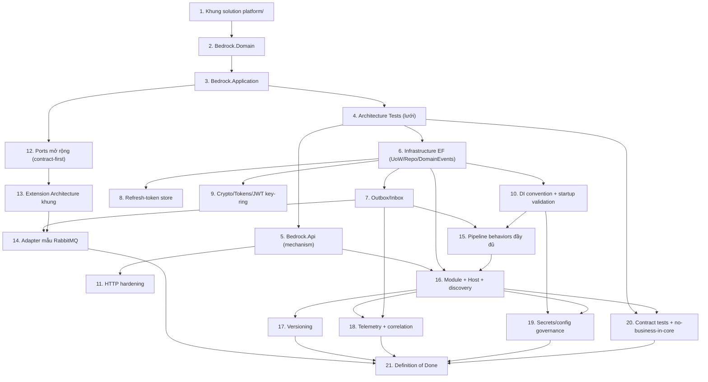

# Implementation Plan

> **Nguồn:** `design.md` (thiết kế) + `requirements.md` (EARS, R1–R34). Thứ tự bám **build order P0 → P1 → P1.5 → P2** (design §15).
> **Nguyên tắc bất biến (I10/R31):** mỗi task/sub-task chỉ được coi là xong khi **build 0 warning** (`TreatWarningsAsErrors=true`) + **toàn bộ test xanh** (`dotnet test Platform.slnx`). Viết test/architecture-test làm lưới an toàn trước khi mở rộng.
> **Trạng thái thực tế (greenfield — đã kiểm chứng):** thư mục `platform/` **CHƯA tồn tại** trên đĩa (bản dựng thử trước đã bị hoàn tác). Tất cả task dưới đây là **tạo mới từ đầu**, không có phần "đã test sẵn".
> **Quyết định nền đã chốt:** prefix lõi = `Bedrock.*`; `Result`/`Result<T>` = `sealed class` + `Success()/Failure()`; dead-letter = cột `dead_lettered_at`.

## Overview

Kế hoạch triển khai `platform-base` gồm 21 task chia theo 5 nhóm bám build order của design (§15): **Giai đoạn 0** (khởi tạo solution + lõi Domain/Application + architecture-test làm lưới), **P0** (Api mechanism không rò nghiệp vụ, không ref Infrastructure), **P1** (Infrastructure/EF + domain events + Outbox/Inbox + refresh rotation + crypto/JWT + DI/startup validation + HTTP hardening), **P1.5** (đặt ổ cắm mở rộng: ports contract-first + extension architecture + adapter mẫu RabbitMQ), **P2** (behaviors đầy đủ + Modules/Host + versioning/telemetry/secrets + contract tests + DoD). Bắt đầu từ greenfield; mỗi task tăng dần, có test đi kèm, giữ build 0 warning.

## Tasks

### Giai đoạn 0 — Dựng nền solution + lõi Domain/Application (greenfield)

- [ ] 1. Dựng khung solution `platform/`
  - Tạo `platform/` với `global.json` (SDK 10.0.301), `Directory.Build.props` (`net10.0`, `Nullable=enable`, `TreatWarningsAsErrors=true`, analyzers `latest-Recommended`, `EnforceCodeStyleInBuild=true`), `Directory.Packages.props` (CPM: FluentValidation 12.1.1 + xunit/NetArchTest), `.editorconfig`, `Platform.slnx`.
  - Nghiệm thu: `dotnet build` solution rỗng thành công, 0 warning.
  - _Requirements: 31.1_

- [ ] 2. Tạo `Bedrock.Domain` (layer sạch, ưu tiên đầu tiên)
  - Tạo Results (`Result`, `Result<T>` theo hợp đồng đầy đủ design §4.4 — **`sealed class`** + factory `Success()/Failure()`, `Value` on-failure ném exception, `Match`, implicit operators; `Error`, `ErrorType`, `CommonErrors` — code ổn định + message English trung lập), Entities (`Entity` UUIDv7 + identity equality + domain events, `AuditableEntity`, `IAuditable`/`ISoftDeletable`/`IHasConcurrencyToken`), `ValueObject`, `IDomainEvent`, `Guard`, `ConcurrencyConflictException`.
  - Bảo đảm kernel KHÔNG nhắc `xmin`/Npgsql (comment trung lập — tradeoff `uint` ghi theo design §4.3).
  - Nghiệm thu: unit test Domain xanh (Result semantics, entity equality, guard) + build 0 warning.
  - _Requirements: 11.1, 29.1, 29.2, 30.2, 31.1_

- [ ] 3. Tạo `Bedrock.Application` (ports + seams + behaviors)
- [ ] 3.1 Tạo contract ports + DI markers
  - Tạo `Ports/` gồm `Time/IClock`, `Users/ICurrentUser` (Permissions/TenantId/SessionId), `Html/IHtmlSanitizer`, `Security/ITokenGenerator|IPasswordHasher|IRefreshTokenStore` (+ `RefreshTokenSnapshot`), `Persistence/IRepository` (KHÔNG `Query()`), `Persistence/IUnitOfWork` (KHÔNG `Repository<T>()` — design §5.1; ghi chú reentrancy R7.4 trong XML-doc).
  - Tạo DI markers `IScopedService`/`ISingletonService`/`ITransientService`/`IManualRegistration`.
  - Nghiệm thu: build 0 warning.
  - _Requirements: 7.3, 12.4, 26.1, 28.2, 30.1, 30.2_
- [ ] 3.2 Tạo messaging seam với namespace tách đôi (không dính lỗi analyzer)
  - Namespace `Messaging`: `IntegrationEvent` (EventType + SchemaVersion), `IOutboxWriter`, `IIntegrationEventHandler<T>` (tránh/`[SuppressMessage]` có lý do rõ cho `CA1711`).
  - Namespace `Messaging.Dispatch`: `OutboxMessage`, `IOutboxDispatcher`, `IEventBusPublisher`, `IInboxStore`, `IIntegrationEventTypeRegistry` (design §5.2 — CP11 dựa vào ranh giới namespace này).
  - Nghiệm thu: build 0 warning.
  - _Requirements: 8.2, 17.1, 17.2, 17.3, 31.1_
- [ ] 3.3 Tạo domain-event seam + UseCases + Paging + Validation behaviors
  - `Events/IDomainEventHandler<T>` + `Events/IDomainEventDispatcher` (contract — impl ở task 6.4); `IUseCase`/`ICommandUseCase`; `PagedRequest`/`PagedResult`; `ValidationUseCaseDecorator`/`ValidationCommandUseCaseDecorator`.
  - Nghiệm thu: build 0 warning.
  - _Requirements: 33.1_
- [ ] 3.4 Unit test cho Application layer
  - Test validation decorator (pass-through, short-circuit, command variant), Paging chuẩn hóa, `ICurrentUser` semantics.
  - Nghiệm thu: `dotnet test` xanh + 0 warning.
  - _Requirements: 31.1, 32.1_

- [ ] 4. Thiết lập bộ Architecture Tests (lưới an toàn cho toàn bộ ranh giới)
  - Tạo `tests/Bedrock.ArchitectureTests` (NetArchTest) với **negative control** cho mỗi luật.
  - Luật ban đầu: no-business-in-core (cấm `guest|room|resort|Admin|Staff` trong `Bedrock.*`); dependency matrix hiện có (Application chỉ ref Domain; Domain không ref gì).
  - Nghiệm thu: test xanh + negative control chứng minh vi phạm bị bắt + build 0 warning.
  - _Requirements: 1.1, 1.2, 31.2_
  - _Correctness Properties: CP1_

---

### Giai đoạn P0 — Gỡ rò nghiệp vụ & tách vai (F1–F4, F14, F15)

- [ ] 5. Dựng `Bedrock.Api` (cơ chế HTTP thuần, KHÔNG ref Infrastructure)
- [ ] 5.1 Khởi tạo project + ProblemDetails + ErrorType→HTTP map
  - Tạo `Bedrock.Api` reference CHỈ `Bedrock.Application` (KHÔNG Infrastructure).
  - `ProblemDetailsBuilder`: `title` = message neutral, body mang `code` + `traceId`.
  - Nghiệm thu: build 0 warning + unit test map ErrorType→status xanh.
  - _Requirements: 4.1, 4.3, 29.3_
- [ ] 5.2 Path masker dùng chung qua options
  - `ObservabilityOptions.MaskedPathPrefixes` (app cấu hình); `PathMasker` nhận prefix từ options.
  - Dùng masker ở request-logging VÀ exception handler (không log raw token path).
  - Nghiệm thu: test masker (có/không prefix khớp, exception path) xanh + 0 warning.
  - _Requirements: 1.3, 3.1, 3.2, 3.3_
  - _Correctness Properties: CP13_
- [ ] 5.3 Auth mechanism (không policy nghiệp vụ) + verify key-ring theo `kid`
  - `AddBedrockAuthCore()`: JWT bearer đọc `JwtKeyRingOptions` (`IssuerSigningKeyResolver` theo `kid`, verify active + previous keys) + `ICurrentUser` binding + 401/403 ProblemDetails. KHÔNG khai role `Admin/Staff`.
  - Nghiệm thu: build 0 warning + test 401/403 ProblemDetails.
  - _Requirements: 1.4, 26.2, 27.2_
- [ ] 5.4 Middleware order chuẩn + health endpoints
  - `MapBedrockApi()` áp thứ tự pipeline design §3.5 (ForwardedHeaders → Correlation → ExceptionHandler → ... → Endpoints); `MapBedrockHealth()` với `/health/live` + `/health/ready`; contract `IEndpointModule`.
  - Nghiệm thu: integration test (WebApplicationFactory) liveness 200 + build 0 warning.
  - _Requirements: 34.1, 34.2_
- [ ] 5.5 Architecture test: Api ⊥ Infrastructure
  - Thêm luật NetArchTest `Bedrock.Api` KHÔNG ref `*.Infrastructure` (+ negative control).
  - Nghiệm thu: test xanh + 0 warning.
  - _Requirements: 4.2_
  - _Correctness Properties: CP2_

---

### Giai đoạn P1 — Boundary & persistence chắc chắn (F5–F11, F16–F19, F22)

- [ ] 6. Dựng `Bedrock.Infrastructure` — EF base (UoW/Repo/DomainEvents)
- [ ] 6.1 `PlatformDbContext` base + conventions
  - snake_case (EFCore.NamingConventions), audit interceptor (set `CreatedAt/UpdatedAt/*ByUserId` từ `IClock`+`ICurrentUser`), soft-delete query filter + interceptor, concurrency-token map **conditional** theo provider (chỉ khi Npgsql — kernel không biết).
  - Nghiệm thu: build 0 warning.
  - _Requirements: 11.2, 30.3_
- [ ] 6.2 `EfRepository<T>` + `EfUnitOfWork` (reentrancy-aware)
  - Repo KHÔNG phơi `IQueryable`; `IRepository<T>` đăng ký DI scoped (cùng DbContext với UoW); UoW `SaveChangesAsync` là điểm ghi duy nhất + `ExecuteInTransactionAsync` (commit/rollback; gọi lồng → join transaction hiện hành — R7.4).
  - Map `DbUpdateConcurrencyException` → `ConcurrencyConflictException`.
  - Nghiệm thu: build 0 warning.
  - _Requirements: 7.1, 7.2, 7.3, 7.4, 11.3_
- [ ] 6.3 Cấu hình package EF + pin version + test provider-agnostic + DB readiness check
  - `dotnet add` EF Core + Npgsql + Sqlite (test) + EFCore.NamingConventions (pin version thật vào Directory.Packages.props, verify tương thích .NET 10).
  - Integration test SQLite: convention/UoW rollback/soft-delete/reentrancy (transaction lồng không nổ).
  - Đóng góp health check DB (tag `ready`, timeout 5s) qua `AddBedrockPersistence`.
  - Nghiệm thu: `dotnet test` xanh + 0 warning.
  - _Requirements: 32.2, 34.2_
- [ ] 6.4 Domain-event dispatch trong SaveChanges
  - Impl `IDomainEventDispatcher` default (resolve `IEnumerable<IDomainEventHandler<T>>`); vòng collect→dispatch→collect với `MaxDispatchDepth` (design §7.5); không handler → no-op.
  - Integration test (SQLite): handler effects commit cùng transaction; handler ném → rollback toàn bộ; max-depth ném lỗi rõ.
  - Nghiệm thu: test xanh + 0 warning.
  - _Requirements: 33.1, 33.2, 33.3, 33.4_
  - _Correctness Properties: CP14_

- [ ] 7. Outbox / Inbox — hiện thực persistence + dispatcher
- [ ] 7.1 Schema + entity + EF config helper per-module
  - `modelBuilder.AddOutboxInbox()` map `outbox_message(id, event_type, schema_version, payload jsonb, occurred_at, processed_at?, error_count, next_attempt_at?, dead_lettered_at?, correlation_id)` + partial index pending; `inbox_message(message_id, consumer, processed_at)` PK `(message_id, consumer)` — vào schema của DbContext gọi helper (design §4.6: per-module).
  - Nghiệm thu: build 0 warning.
  - _Requirements: 8.3, 9.1_
- [ ] 7.2 `IOutboxWriter` impl (ghi cùng transaction) + serialize payload
  - Enqueue ghi `OutboxMessage` qua ChangeTracker (không tự commit); System.Text.Json options cố định; gắn `correlation_id` từ `Activity.Current`.
  - Nghiệm thu: build 0 warning.
  - _Requirements: 8.1, 8.2, 8.3_
- [ ] 7.3 `IOutboxDispatcher` worker (claim/backoff/dead-letter) + `IInboxStore` + type registry
  - Dispatcher `AddOutboxDispatcher<TDbContext>()`: claim nguyên tử batch pending (design §7.2) → `IEventBusPublisher.PublishAsync` → mark processed; fail → `error_count`+`next_attempt_at` backoff; vượt ngưỡng → `dead_lettered_at`.
  - Inbox `TryMarkProcessedAsync` idempotent (PK conflict → false). `IIntegrationEventTypeRegistry` build từ assemblies Contracts; EventType lạ → dead-letter.
  - Nghiệm thu: build 0 warning + unit test backoff/threshold.
  - _Requirements: 8.4, 8.5, 8.6, 9.1, 9.2, 9.3, 17.3_
- [ ] 7.4 Integration test Outbox/Inbox (Testcontainers/PostgreSQL)
  - Test: command ghi state + outbox trong 1 transaction (rollback nếu lỗi); message giao 2 lần → handler chạy 1 lần; 2 dispatcher đồng thời không claim trùng message; message dead-letter không được claim lại.
  - Nghiệm thu: test xanh (cần Docker; skip-có-điều-kiện nếu thiếu) + 0 warning.
  - _Requirements: 32.2_
  - _Correctness Properties: CP6, CP8, CP15_
- [ ] 7.5 Retention/cleanup job cho outbox (dead-letter = cột, quyết định đã chốt)
  - Background job dọn định kỳ row `processed_at IS NOT NULL` quá TTL cấu hình được, và giữ/di-trú row `dead_lettered_at` theo chính sách (mặc định giữ để soi, có thể export). Vì dead-letter là cột trên `outbox_message` (không bảng DLQ riêng), job này giữ bảng gọn thay cho việc move sang bảng khác.
  - Nghiệm thu: unit test chọn đúng tập row hết hạn (không xóa nhầm pending/dead-letter) + 0 warning.
  - _Requirements: 8.5_

- [ ] 8. Refresh-token store nguyên tử (F5/F10/F19 — cơ chế, không nghiệp vụ)
- [ ] 8.1 Ẩn `RefreshTokenRecord` trong Infrastructure + port nghiệp vụ + mapping helper
  - Entity persistence ở Infrastructure; Application chỉ thấy `IRefreshTokenStore` (task 3.1). Helper `modelBuilder.AddRefreshTokens(schema)` để module tiêu thụ sở hữu bảng trong schema của mình.
  - Schema `refresh_token` với `UNIQUE ux_refresh_hash`, index `user_id`/`family_id`.
  - Nghiệm thu: build 0 warning.
  - _Requirements: 10.5, 28.1, 28.2_
- [ ] 8.2 Rotation trong transaction + consume nguyên tử + reuse-detection
  - `TryConsumeAsync` = một `UPDATE ... WHERE id=@id AND revoked_at IS NULL`; consume+insert trong cùng `ExecuteInTransactionAsync`; reuse → revoke family.
  - Nghiệm thu: integration test SQLite consume-if-not-revoked xanh + 0 warning.
  - _Requirements: 10.1, 10.2, 10.3, 10.4_
- [ ] 8.3 Integration test race rotation (Testcontainers, đa-connection)
  - 2 request đồng thời → đúng 1 thắng; insert fail → consume rollback (không mất token).
  - Nghiệm thu: test xanh (cần Docker) + 0 warning.
  - _Requirements: 32.2_
  - _Correctness Properties: CP7_

- [ ] 9. Cryptography / Tokens (Argon2id, JWT key-ring, CSPRNG)
- [ ] 9.1 `IPasswordHasher` Argon2id + `ITokenGenerator` CSPRNG base64url
  - KHÔNG đăng ký default no-op cho hai port này (fail-secure — design §5.5).
  - Nghiệm thu: unit test hash/verify + độ dài token xanh + 0 warning.
  - _Requirements: 30.3_
- [ ] 9.2 `IJwtTokenService` key-ring (F22) — phía ký
  - Ký bằng active key, gắn `kid` header; `JwtKeyRingOptions` (ActiveKid/Keys/Issuer/Audience) validate-on-start; verify side đã ở task 5.3 (cùng options, không cross-reference project).
  - Nghiệm thu: unit test issue→verify (kể cả key rotation: token ký bằng previous key vẫn verify được) + 0 warning.
  - _Requirements: 27.1, 27.2, 27.3, 25.2_

- [ ] 10. DI convention + startup validation (F6/F7/F18/F35)
- [ ] 10.1 Registration engine: TryAdd + duplicate-guard + IManualRegistration + appAssemblies overload
  - Auto-scan theo marker; single-impl port duplicate-guard fail-fast (khai báo whitelist multi-impl); loại `IManualRegistration` khỏi scan; mọi API scan nhận `params Assembly[]`.
  - Nghiệm thu: unit test duplicate-guard (2 impl → fail; multi-impl whitelist → pass) xanh + 0 warning.
  - _Requirements: 12.1, 12.2, 12.3, 12.4, 12.5_
- [ ] 10.2 `RequiredPortsValidator` (fail-fast mọi môi trường) + ValidateOnBuild/Scopes explicit
  - `IHostedService` scope-aware (design §9.4 — tạo scope cho port scoped, báo GỘP mọi port thiếu); `StartupValidationOptions.RequiredPorts` do từng `AddXxxCore` đóng góp; bật `ValidateOnBuild`/`ValidateScopes=true` tường minh; validate-on-start options.
  - Nghiệm thu: integration test host thiếu port → boot fail với message liệt kê đủ + 0 warning.
  - _Requirements: 13.1, 13.2, 13.3, 25.2_
  - _Correctness Properties: CP9_

- [ ] 11. HTTP hardening (F16/F17)
- [ ] 11.1 ForwardedHeaders + rate-limit theo IP thật
  - `ForwardedHeadersOptions` (KnownProxies/KnownNetworks); `UseForwardedHeaders` sớm (slot #1 §3.5); rate-limit partition theo client IP đã resolve.
  - Nghiệm thu: integration test header X-Forwarded-For → partition đúng + 0 warning.
  - _Requirements: 14.1, 14.2_
- [ ] 11.2 Cookie/CORS mode options
  - `CookieSameSiteMode`; same-site → Strict/Lax; cross-site → SameSite=None + CSRF + siết CORS.
  - Nghiệm thu: test hai mode cấu hình đúng cookie flags + 0 warning.
  - _Requirements: 15.1, 15.2, 15.3_

---

### Giai đoạn P1.5 — Đặt "ổ cắm" mở rộng (F24–F28)

- [ ] 12. Định nghĩa & khóa các port mở rộng (contract-first, chưa cần adapter)
- [ ] 12.1 Search ports
  - `ISearchIndex<TDoc>`/`ISearchQuery<TDoc>` + `SearchRequest`/`SearchResult` (DTO đầy đủ theo design §5.4).
  - Nghiệm thu: build 0 warning.
  - _Requirements: 18.1, 18.2_
- [ ] 12.2 Email / Cache-split / Storage ports
  - `IEmailSender` + `EmailMessage`; `IAppCache`/`IDistributedLock` (+`ILockHandle`)/`IIdempotencyStore`/`IRateLimitStore` + `CacheEntryOptions`; `IFileStorage` + `FileBlob`.
  - Nghiệm thu: build 0 warning.
  - _Requirements: 19.1, 19.2, 19.3_
- [ ] 12.3 External auth ports + registry
  - `IExternalAuthProvider` (+ challenge/callback/profile records, email nullable) + `IExternalAuthProviderRegistry`.
  - Nghiệm thu: build 0 warning.
  - _Requirements: 20.1, 20.2, 20.3_

- [ ] 13. Khung Extension Architecture (AddXxxCore/AddYyy) + default an toàn + registry
  - Cặp API `AddXxxCore()`/`AddYyyXxx(cfg)` cho từng nhóm (Messaging/Search/Email/Cache/ExternalAuth/Storage); mỗi `AddXxxCore` đăng ký default theo phân loại design §5.5 (`NullAppCache` degrade vs `Throwing*` fail-loud) + đóng góp `StartupValidationOptions.RequiredPorts`; registry cho multi-impl.
  - Nghiệm thu: unit test — gọi port fail-loud khi chưa có adapter → exception rõ ràng; `IAppCache` default miss-through; build 0 warning.
  - _Requirements: 16.1, 16.2, 16.4, 13.1_

- [ ] 14. Adapter mẫu chứng minh "cắm không sửa lõi" (F29)
  - Hiện thực `Adapters.Messaging.RabbitMq` (`IEventBusPublisher`) + resilience ở biên (timeout → retry idempotent → circuit-breaker) + `AddRabbitMqMessaging(cfg)`.
  - Architecture test: `Adapters.*` chỉ ref Bedrock.Application (+ negative control); kiểm chứng bằng git-diff rằng thêm adapter KHÔNG sửa file lõi.
  - Nghiệm thu: integration test Testcontainers/RabbitMQ publish thành công + arch test xanh + 0 warning.
  - _Requirements: 5.1, 5.2, 5.3, 16.3, 23.1, 23.2_
  - _Correctness Properties: CP3_

---

### Giai đoạn P2 — Platform hệ lớn (Modules/Host + cross-cutting)

- [ ] 15. Application pipeline behaviors đầy đủ (F13)
  - Thêm Logging/Tracing → Authorization (permission, khai báo trên command) → Idempotency (`idempotency_conflict` khi trùng key) → Transaction (mở `ExecuteInTransactionAsync` + outbox; dựa reentrancy R7.4); đăng ký generic ở `AddBedrockCore` theo thứ tự design §8.
  - Nghiệm thu: unit test từng behavior + test thứ tự pipeline + 0 warning.
  - _Requirements: 8.1, 26.3_

- [ ] 16. Khuôn Module + Host + discovery (F1/F13/F30/F31)
- [ ] 16.1 Tạo module mẫu `Identity` theo khuôn 5-project + schema riêng
  - `Identity.Contracts/Domain/Application/Infrastructure/Api`; schema `identity` (gọi `AddOutboxInbox()` + `AddRefreshTokens("identity")`); use case refresh rotation dùng `IRefreshTokenStore`; `AddIdentityModule(cfg)` một dòng; đăng ký health check riêng của module.
  - Nghiệm thu: build 0 warning + unit test use case với fake store.
  - _Requirements: 21.1, 21.3, 26.2, 34.3_
- [ ] 16.2 Host `StarHill.Api` — composition root duy nhất
  - `Program.cs` compose `AddBedrockCore/Api/Persistence` + adapters + modules; map qua `IEndpointModule`; không `Program.cs`/endpoint mẫu trong `Bedrock.*`.
  - Nghiệm thu: host boot xanh (WebApplicationFactory smoke) + 0 warning.
  - _Requirements: 2.1, 2.2, 2.3_
- [ ] 16.3 Architecture tests: module boundary + single composition root + use-case-không-Dispatch
  - `Modules.A` không ref internal của `Modules.B` (chỉ Contracts); chỉ Host ref Api+Infra+Adapters; type implement `IUseCase*` không phụ thuộc namespace `*.Messaging.Dispatch` (+ negative control mỗi luật).
  - Nghiệm thu: arch tests xanh + 0 warning.
  - _Requirements: 6.1, 6.2, 6.3, 21.2_
  - _Correctness Properties: CP4, CP5, CP11_

- [ ] 17. Versioning (F32)
  - API versioning (Asp.Versioning) + OpenAPI group theo version; integration-event `SchemaVersion` evolution + tolerant reader; snapshot test schema event.
  - Nghiệm thu: test snapshot + endpoint /v1 hoạt động + 0 warning.
  - _Requirements: 22.1, 22.2, 22.3, 32.4_

- [ ] 18. Telemetry & correlation unity (F34/F21)
  - OpenTelemetry traces/metrics/logs + W3C traceparent (HTTP + bus/outbox `correlation_id`); thống nhất `X-Correlation-Id` = `traceId` = trace hiện hành (resolve 1 lần vào `HttpContext.Items`); metrics tối thiểu R24.3 (kể cả outbox lag + dead-letter count).
  - Nghiệm thu: integration test header == ProblemDetails.traceId + metrics xuất hiện + 0 warning.
  - _Requirements: 24.1, 24.2, 24.3_
  - _Correctness Properties: CP10_

- [ ] 19. Secrets & config governance (F35)
  - User-Secrets (dev) / env/Key Vault (prod); `appsettings.json` chỉ non-secret + placeholder; validate-on-start phủ mọi options bắt buộc; kiểm không có secret trong repo.
  - Nghiệm thu: host boot fail khi thiếu options bắt buộc (test) + 0 warning.
  - _Requirements: 25.1, 25.2_

- [ ] 20. Contract tests + hoàn tất no-business-in-core cuối cùng
  - Snapshot registry `Error.Code` (reflection — phát hiện đổi/mất code); rà soát toàn `Bedrock.*` pass no-business-in-core; xác nhận toàn bộ CP1–CP15 có test tương ứng.
  - Nghiệm thu: contract tests xanh + bảng CP→test đầy đủ + 0 warning.
  - _Requirements: 1.1, 29.1, 32.4_
  - _Correctness Properties: CP1, CP12_

- [ ] 21. Definition of Done — kiểm chứng "base cực chất"
  - Xác nhận theo design §16: thêm module = 5 project + 1 dòng Host (boundary test xanh); thêm tech = 1 adapter + 1 dòng Host (0 file lõi bị sửa); command ghi luôn kèm outbox 1 transaction; domain event atomic; dispatcher claim exclusive; boot fail-fast mọi môi trường; telemetry 3 trụ + correlation thống nhất; health live/ready; không secret trong repo.
  - Nghiệm thu: chạy toàn bộ test suite (unit + architecture + integration + Testcontainers) — build 0 warning, tất cả xanh.
  - _Requirements: 31.1, 31.2, 32.1, 32.2, 32.3, 32.4_

## Task Dependency Graph



Các "wave" gom nhóm task có thể thực thi song song (mọi phụ thuộc đã xong ở wave trước):

```json
{
  "waves": [
    { "wave": 1, "tasks": ["1"], "rationale": "Dựng khung solution platform/ (config + Platform.slnx) — bootstrap greenfield." },
    { "wave": 2, "tasks": ["2"], "rationale": "Tạo Domain — layer sạch, nền cho mọi thứ." },
    { "wave": 3, "tasks": ["3"], "rationale": "Tạo Application (ports/seams/behaviors) — mọi nhánh sau đều cần." },
    { "wave": 4, "tasks": ["4", "12"], "rationale": "Architecture-test lưới an toàn; ports mở rộng contract-first — cả hai chỉ cần Application." },
    { "wave": 5, "tasks": ["5", "6", "13"], "rationale": "Api mechanism và Infrastructure EF (có lưới arch-test); khung extension (cần ports 12)." },
    { "wave": 6, "tasks": ["7", "8", "9", "10", "11"], "rationale": "Outbox/Inbox, refresh store, crypto/JWT, DI+startup validation (đều cần 6); HTTP hardening (cần 5)." },
    { "wave": 7, "tasks": ["14", "15"], "rationale": "Adapter mẫu RabbitMQ (cần outbox 7 + khung 13); pipeline behaviors đầy đủ (cần DI 10 + outbox 7)." },
    { "wave": 8, "tasks": ["16"], "rationale": "Module Identity + Host composition (cần Api 5, Infra 6, behaviors 15)." },
    { "wave": 9, "tasks": ["17", "18", "19", "20"], "rationale": "Versioning, telemetry/correlation, secrets governance, contract tests — sau khi có Host/module." },
    { "wave": 10, "tasks": ["21"], "rationale": "Definition of Done — kiểm chứng toàn bộ." }
  ]
}
```

## Notes

- **Thứ tự khuyến nghị:** Giai đoạn 0 → P0 → P1 → P1.5 → P2 theo waves; nhánh độc lập song song được (ví dụ 7/8/9/10 sau khi có 6).
- **Không kéo SDK vào lõi:** task 12–13 chỉ định nghĩa contract + extension point; SDK công nghệ chỉ xuất hiện ở `Adapters.*` (task 14 trở đi) — whitelist phụ thuộc per-project ở design §17.
- **Testcontainers:** cần Docker cho test Postgres-specific (7.4, 8.3) và adapter (14). Không có Docker → skip có điều kiện nhưng KHÔNG xóa.
- **Mỗi lát nhỏ:** hoàn thành một sub-task → build 0 warning + test xanh trước khi sang sub-task kế (I10/R31) — đây là điều kiện nghiệm thu mặc định của MỌI task, các dòng "Nghiệm thu" chỉ liệt kê phần đặc thù thêm.
- **Truy vết:** mỗi task ghi `_Requirements: X.Y_`; task lập test cho Correctness Property ghi kèm `_Correctness Properties: CPn_`. Toàn bộ CP1–CP15 được phủ bởi các task: CP1(4/20), CP2(5.5), CP3(14), CP4/CP5/CP11(16.3), CP6/CP8/CP15(7.4), CP7(8.3), CP9(10.2), CP10(18), CP12(20), CP13(5.2), CP14(6.4).
- **Greenfield:** `platform/` chưa tồn tại — task 1 dựng khung solution trước, task 2 tạo Domain. Không có code/test "sẵn có" để dựa vào. Quyết định nền (prefix `Bedrock.*`, `Result` = class, dead-letter = cột) đã chốt.
- **Analyzer `CA1711`:** khi tạo `IIntegrationEventHandler<T>` (đuôi `EventHandler`), suppress-có-lý-do để build 0 warning (task 3.2).