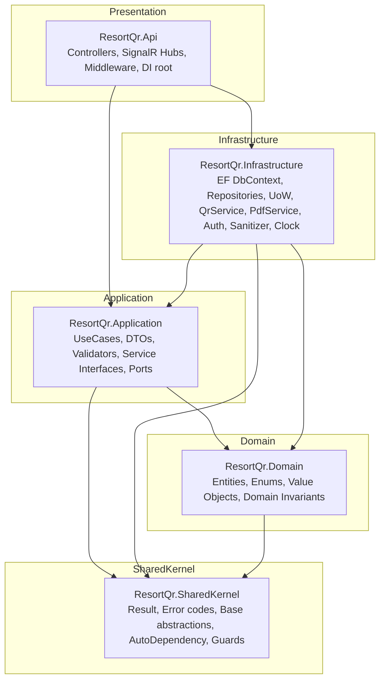
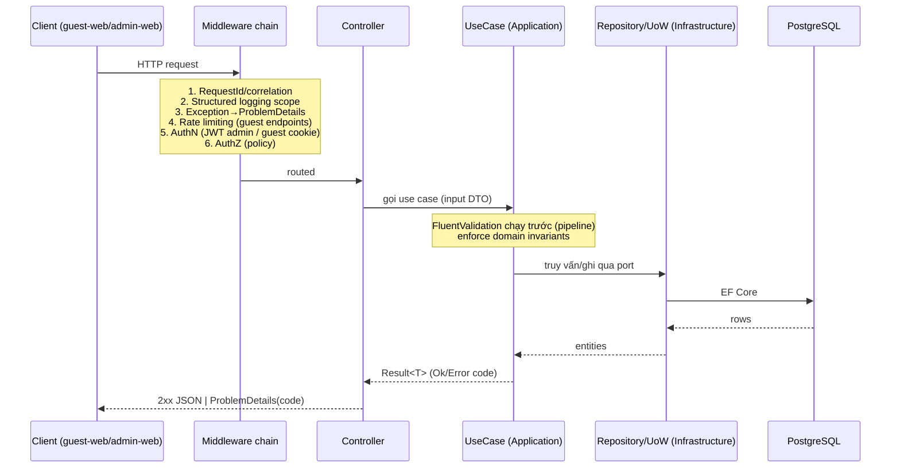
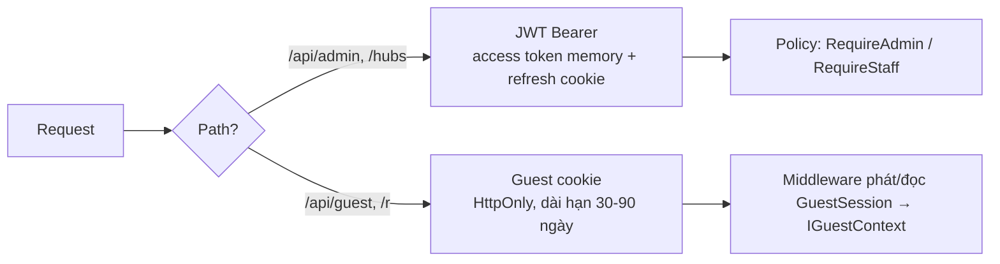
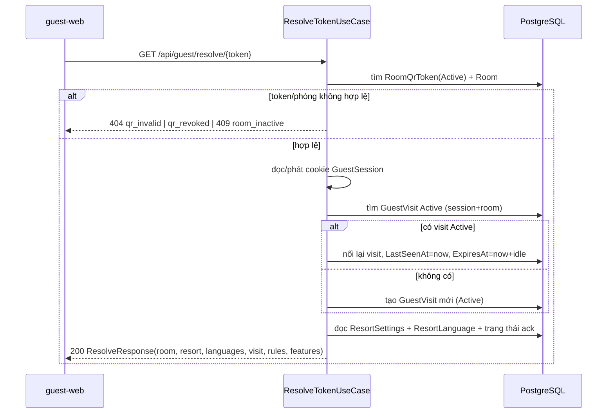

# Design Document: Resort QR Portal — Nền tảng "Base" (Backend + Frontend)

> **Phạm vi tài liệu này**: Đây là thiết kế cho **phần nền móng (foundational base)** của hệ thống Resort QR Portal (Star Hill Guest App), cho **cả Backend lẫn Frontend**. Mục tiêu là dựng một cái "base" thật vững — cấu trúc solution, phân tầng, các abstraction lõi, cross-cutting concerns, nền data model, và quy ước code — để **mọi tính năng nghiệp vụ về sau xây trên đó mà không phải sửa nền**.
>
> Tài liệu này **không** triển khai toàn bộ nghiệp vụ (nội quy/FAQ/chat/housekeeping...). Các nghiệp vụ đó đã được đặc tả trong `docs/resort-qr-portal/requirements.md` và `docs/resort-qr-portal/design.md`; ở đây chỉ dựng nền và **chỉ ra chỗ cắm (extension points)** cho từng module nghiệp vụ.
>
> Tài liệu kế thừa và **cải tiến** kiến trúc tham chiếu `Reference/Backend` (`FresherDev.HMS.*`). Những chỗ code tham chiếu đang có vấn đề sẽ được nêu rõ ("Vấn đề" → "Cải tiến").

---

## ⚠️ Cấu trúc tài liệu (đọc trước)

File `design.md` này là **bản tổng quan cấp cao (master overview)**. **Nội dung chi tiết authoritative** đã được tách theo chủ đề vào các thư mục con — mỗi chủ đề đúng một file để tránh trùng lặp/sai lệch:

- **`design/README.md`** — bản đồ điều hướng toàn bộ thiết kế.
- **`design/backend/`** — thiết kế backend chi tiết (00→09): tổng quan, kiến trúc, core abstractions, cross-cutting, data model, thuật toán, quy ước, testing, correctness properties, và **đối chiếu đã kiểm chứng với `Reference/Backend`**.
- **`design/frontend/`** — nền frontend (Vue 3 + TS + Vite + Pinia): khảo sát reference `EPS.Vuexy` (đã kiểm chứng, không port) + kiến trúc 2 SPA.
- **`ai-notes/`** — nhật ký kiểm chứng xuyên suốt: (1) quyết định AI tự ra, (2) chỗ đổi so với yêu cầu, (3) trade-off, (4) điều cần biết/chưa xác minh.

> Khi có mâu thuẫn giữa file này và file trong `design/backend/`, **các file trong `design/backend/` là nguồn chân lý**. Phần dưới đây giữ lại để tiện đọc nhanh tổng thể.

---

## Overview

Resort QR Portal gồm:

- **1 Backend** ASP.NET Core (.NET 10 LTS) + EF Core + PostgreSQL, cung cấp REST API + SignalR Hub, chạy như **modular monolith**.
- **2 Frontend** Vue 3 SPA riêng biệt: **guest-web** (mobile-first, tiếng Anh mặc định, không đăng nhập) và **admin-web** (tiếng Việt, đăng nhập, phân quyền).
- Chạy trong **WiFi nội bộ resort** (không public internet) — là giả định hạ tầng, không phải cơ chế app tự enforce.

Bản thiết kế "base" này rút ra 5 nhóm nền móng cần chốt trước khi code nghiệp vụ:

1. **Cấu trúc & phân tầng Backend** (modular monolith, dependency rule, module boundary, extension point).
2. **Các abstraction lõi** (Entity/Repository/UnitOfWork/UseCase/Result, CurrentContext, Clock, TokenGenerator, HtmlSanitizer, TranslationResolver).
3. **Cross-cutting concerns** (error handling + ProblemDetails, validation pipeline, auth kép JWT/guest-cookie, rate limiting, structured logging, health check, CORS/security headers).
4. **Nền data model** (base entity conventions, mẫu đa ngôn ngữ Translation, concurrency token, soft-delete, audit, partial unique index) + các entity nền dùng chung (Resort, ResortSettings, ResortLanguage, AppUser).
5. **Nền Frontend** (monorepo 2 SPA + shared packages, API client, i18n, auth/session store, SignalR wrapper, error handling, design tokens).

> **Đã chốt (kế thừa từ Decision Log)**: runtime **.NET 10 LTS**, DB **PostgreSQL** (Npgsql), guest web mặc định **en**, admin web **vi**, SignalR + fallback polling, QRCoder + QuestPDF, không public internet.

### 1.1 Mục tiêu chất lượng của "base" (định hướng mọi quyết định)

| Mục tiêu | Ý nghĩa cụ thể trong dự án này |
|---|---|
| **Correctness-by-construction** | Bất biến quan trọng (1 token active/phòng, 1 ngôn ngữ default/resort...) enforce ở **DB constraint + domain**, không chỉ ở code service. |
| **Testability** | Mọi use case test được không cần HTTP thật; abstraction cho `IClock`, `ITokenGenerator`, `ICurrentContext` để loại bỏ tính bất định. |
| **Low coupling giữa module** | Module giao tiếp qua interface trong tầng Application, không tham chiếu chéo implementation. |
| **Explicit boundaries** | Guest surface và Admin surface tách bạch (controller, policy, DTO, rate limit) để không rò rỉ dữ liệu. |
| **Ít bất ngờ khi mở rộng** | Thêm 1 module nghiệp vụ = thêm 1 thư mục theo khuôn mẫu, không sửa Program.cs thủ công (nhờ AutoDependency + convention). |
| **Ergonomics** | Boilerplate tối thiểu: base class + generic repo + convention DI; nhưng không "magic" khó debug. |

---

## Architecture

_Backend — Modular Monolith._

### 2.1 Sơ đồ tầng (Dependency Rule)

Quy tắc phụ thuộc: **mũi tên chỉ vào trong**. Domain không biết gì về Infrastructure/Api. Api chỉ phụ thuộc Application (qua interface) + composition root.



**Điểm mấu chốt (khác với reference)**: `Infrastructure` **triển khai các port/interface** khai báo ở `Application` (Dependency Inversion). Api là composition root — chỗ duy nhất "biết" cả Application lẫn Infrastructure để ghép DI. Domain thuần, không tham chiếu EF Core.

### 2.2 Cấu trúc solution

```text
/backend
  ResortQr.sln
  Directory.Build.props          # net10.0, Nullable enable, ImplicitUsings, LangVersion, warnings-as-errors (chọn lọc)
  Directory.Packages.props       # Central Package Management (pin version)
  src/
    ResortQr.SharedKernel/       # Result<T>, Error, AppError codes, Guard, IClock, base entity abstractions, AutoDependency
    ResortQr.Domain/             # Entities, Enums, ValueObjects, domain invariants (no EF)
    ResortQr.Application/        # UseCase interfaces + impl, DTOs, Validators, Ports (IRepository, IUnitOfWork, IQrService...)
    ResortQr.Infrastructure/     # EF Core (DbContext, Configurations, Migrations, Repositories, UoW), adapters (Qr, Pdf, Auth, Sanitizer, Clock, RateLimit store)
    ResortQr.Api/                # Program.cs, Controllers (Guest + Admin), Hubs, Middleware, DI wiring, appsettings
  tests/
    ResortQr.UnitTests/          # Domain + Application (use case) tests, property-based tests
    ResortQr.IntegrationTests/   # API + EF (Testcontainers PostgreSQL)
    ResortQr.ArchitectureTests/  # NetArchTest: enforce dependency rule + naming conventions
```

> **Cải tiến so với reference**: reference tách rất nhiều project nhỏ (`Api.Core`, `Api.Core.Shared`, `Core`, `Core.Shared`, `Domain`, `EntityFramework`, `Infrastructure`, `Auth`, `Common`) khiến ranh giới mờ và khó biết code nằm ở đâu. Base mới gom về **5 project rõ vai trò** + thư mục module bên trong. Ít project hơn = build nhanh hơn, ranh giới rõ hơn, vẫn giữ được dependency rule.

### 2.3 Module boundary (vertical slice trong monolith)

Trong `Application` và `Infrastructure`, tổ chức theo **module nghiệp vụ** (vertical slice), không theo loại kỹ thuật:

```text
ResortQr.Application/
  Common/              # AbstractUseCase, PagedResult, behaviors (validation), mapping base
  Abstractions/        # Ports: IUnitOfWork, IRepository<T>, IQrService, IPdfService, IHtmlSanitizer,
                       #        ITokenGenerator, ICurrentContext, IGuestContext, IDateTimeProvider, IRealtimeNotifier
  Modules/
    Identity/          # AppUser, auth use cases, IPasswordHasher, IJwtIssuer (ports)
    Rooms/             # Room CRUD, RoomQrToken issue/revoke
    GuestAccess/       # resolve token, GuestSession/GuestVisit lifecycle, portal window
    Rules/             # RuleSet draft, publish→snapshot, acknowledge, rule gate
    Faq/               # category/item tree, translations
    Messaging/         # conversation per visit, messages, unread
    Housekeeping/      # tickets, events, complete-by-room/token
    Notes/             # internal notes
    Localization/      # ResortLanguage, translation fallback resolver
    Dashboard/         # stats aggregation
    Settings/          # ResortSettings read/update
```

**Quy tắc giao tiếp giữa module**: module A gọi module B **chỉ qua interface use case/port** của B (đăng ký DI), không đọc thẳng entity nội bộ của B qua DbContext. Điều này giữ khả năng sau này tách module ra service riêng nếu cần.

> **Extension point**: Base chỉ hiện thực **Identity + GuestAccess + Rooms/QrToken + Settings/Localization** (đủ để "quét QR → resolve → phiên khách → đọc settings/ngôn ngữ"). Các module Rules/Faq/Messaging/Housekeeping/Notes/Dashboard chỉ có **khung thư mục + interface trống + entity + migration**, để wave sau điền logic mà không đụng nền.

### 2.4 Vòng đời request (HTTP pipeline)



### 2.5 Cơ chế DI theo convention (AutoDependency — cải tiến)

Reference dùng `AutoDependency`: quét mọi interface, mỗi interface **phải có đúng một** implementation, nếu không thì **ném exception**. Cách này tiện nhưng brittle.

**Vấn đề của reference**:
- Interface không có implementation (ví dụ port sẽ implement ở phase sau) → app crash lúc khởi động.
- Interface có nhiều implementation (ví dụ nhiều `IValidator`, nhiều strategy) → crash.
- Phải rải `ForceLoadAssembly` khắp nơi để reflection thấy assembly.
- Lifetime chỉ suy từ attribute trên interface; dễ quên.

**Cải tiến (base mới)** — giữ tinh thần "khai báo tại chỗ, không sửa Program.cs" nhưng an toàn hơn:

```csharp
// SharedKernel: marker interfaces xác định lifetime rõ ràng, không cần attribute rời rạc
public interface IScopedService { }
public interface ISingletonService { }
public interface ITransientService { }

// Convention: 1 interface I{Name} ↔ 1 class {Name} trong cùng assembly.
// Đăng ký assembly tường minh (KHÔNG cần ForceLoadAssembly rải rác).
public static class DependencyInjection
{
    public static IServiceCollection AddResortQrModules(this IServiceCollection services)
    {
        var assemblies = new[]
        {
            typeof(ResortQr.Application.AssemblyMarker).Assembly,
            typeof(ResortQr.Infrastructure.AssemblyMarker).Assembly,
        };

        services.Scan(scan => scan            // Scrutor
            .FromAssemblies(assemblies)
            .AddClasses(c => c.AssignableTo<IScopedService>(), publicOnly: false)
                .AsImplementedInterfaces().WithScopedLifetime()
            .AddClasses(c => c.AssignableTo<ISingletonService>())
                .AsImplementedInterfaces().WithSingletonLifetime()
            .AddClasses(c => c.AssignableTo<ITransientService>())
                .AsImplementedInterfaces().WithTransientLifetime());

        return services;
    }
}
```

Khác biệt: dùng **Scrutor** (thư viện phổ biến, ổn định) thay reflection tự viết; lifetime khai báo bằng marker interface rõ ràng; đăng ký assembly tường minh qua `AssemblyMarker` (mỗi project 1 class rỗng) → **bỏ hẳn `ForceLoadAssembly`**; interface chưa có impl thì đơn giản không được đăng ký (không crash). Validators, use cases, adapters đều tự gom.

> Nếu team muốn giữ đúng "hương vị" reference (attribute `[AutoDependency(...)]`), có thể giữ attribute nhưng chuyển engine sang Scrutor và **không ném lỗi** khi thiếu impl — coi như port chưa sẵn sàng.

---

## Components and Interfaces

_Core Abstractions (Low-Level Design)._

Đây là các "viên gạch" mọi module dùng lại. Code C# thật (.NET 10), có thể copy làm điểm khởi đầu.

### 3.1 Base entity & conventions

Reference có `Entity<TKey>`, `AuditEntity<TKey>`, `SoftDeleteEntity`, `FullyEntity<TKey>` khá tốt. Base mới giữ ý tưởng nhưng gọn hơn, thêm **concurrency token** ngay từ nền (yêu cầu bởi Correctness Property về optimistic concurrency).

```csharp
namespace ResortQr.Domain.Common;

// Khóa chính: uuid, sinh client-side UUIDv7 (chi tiết + rủi ro: design/backend/02 §1).
public abstract class Entity
{
    public Guid Id { get; init; } = Guid.CreateVersion7();
}

public interface IAuditable
{
    DateTimeOffset CreatedAt { get; set; }
    DateTimeOffset? UpdatedAt { get; set; }
    Guid? CreatedByUserId { get; set; }
    Guid? UpdatedByUserId { get; set; }
}

public interface ISoftDeletable
{
    bool IsDeleted { get; set; }
    DateTimeOffset? DeletedAt { get; set; }
}

// Concurrency token — PostgreSQL xmin ánh xạ qua uint (không tốn cột thật).
public interface IConcurrencyAware
{
    uint RowVersion { get; set; }
}

public abstract class AuditableEntity : Entity, IAuditable, IConcurrencyAware
{
    public DateTimeOffset CreatedAt { get; set; }
    public DateTimeOffset? UpdatedAt { get; set; }
    public Guid? CreatedByUserId { get; set; }
    public Guid? UpdatedByUserId { get; set; }
    public uint RowVersion { get; set; }   // map tới xmin
}
```

> **Cải tiến**: reference dùng `TKey` generic cho mọi entity. Thực tế dự án này **luôn dùng `Guid`/`uuid`** (single-resort, không cần int identity). Cố định `Guid` bỏ generic rườm rà, khóa ngoại đồng nhất, Id có sẵn lúc tạo. **Quyết định chi tiết về cách sinh UUIDv7 + rủi ro locality + fallback: xem `design/backend/02` §1** (nguồn chân lý). Audit `CreatedAt/UpdatedAt` set tự động trong `SaveChanges` (xem 4.3).

### 3.2 Result & Error (thay cho throw exception cho lỗi nghiệp vụ)

Reference trả `IHttpResponse`/`HttpResponse<T>` trộn khái niệm HTTP vào tầng domain. Base mới tách: **Application trả `Result<T>` trung lập**, Api dịch sang HTTP/ProblemDetails.

```csharp
namespace ResortQr.SharedKernel;

public sealed record Error(string Code, string Message, ErrorType Type)
{
    public static Error NotFound(string code, string msg) => new(code, msg, ErrorType.NotFound);
    public static Error Conflict(string code, string msg)  => new(code, msg, ErrorType.Conflict);
    public static Error Validation(string code, string msg)=> new(code, msg, ErrorType.Validation);
    public static Error Forbidden(string code, string msg) => new(code, msg, ErrorType.Forbidden);
    public static Error Rate(string code, string msg)      => new(code, msg, ErrorType.RateLimited);
}

public enum ErrorType { Validation, NotFound, Conflict, Forbidden, RateLimited, Unexpected }

public readonly struct Result<T>
{
    public bool IsSuccess { get; }
    public T? Value { get; }
    public Error? Error { get; }
    private Result(bool ok, T? value, Error? error) { IsSuccess = ok; Value = value; Error = error; }

    public static Result<T> Ok(T value) => new(true, value, null);
    public static Result<T> Fail(Error error) => new(false, default, error);
    public static implicit operator Result<T>(Error error) => Fail(error);
}
```

Bộ **mã lỗi ổn định** (guest hợp đồng, đồng bộ với `design.md` cũ) khai báo tập trung:

```csharp
public static class AppErrors
{
    public static readonly Error QrInvalid       = Error.NotFound("qr_invalid", "QR không hợp lệ.");
    public static readonly Error QrRevoked       = Error.NotFound("qr_revoked", "QR đã bị thu hồi.");
    public static readonly Error RoomInactive    = Error.Conflict("room_inactive", "Phòng không khả dụng.");
    public static readonly Error RuleAckRequired = Error.Forbidden("rule_ack_required", "Cần xác nhận nội quy.");
    public static readonly Error SessionExpired  = Error.Forbidden("session_expired", "Phiên đã hết hạn, vui lòng quét QR lại.");
    public static readonly Error RateLimited     = Error.Rate("rate_limited", "Thao tác quá nhanh, thử lại sau.");
    public static readonly Error MessageTooLong  = Error.Validation("message_too_long", "Tin nhắn quá dài.");
    public static readonly Error Conflict        = Error.Conflict("concurrency_conflict", "Nội dung đã đổi, tải lại.");
    // ... language_not_supported, ...
}
```

### 3.3 Repository & Unit of Work (SỬA lỗi lớn của reference)

**Vấn đề reference**: `BaseRepository` gọi `SaveChangesAsync()` **ngay trong mỗi** `AddAsync/UpdateAsync/DeleteAsync`. Hệ quả:
- Không thể gom nhiều thay đổi vào **một transaction/một lần lưu** → mất tính nguyên tử, khó đảm bảo invariant liên bảng (ví dụ publish nội quy: đóng băng nhiều bảng + đổi `IsCurrent`).
- `IUnitOfWork` gần như vô nghĩa (mỗi repo tự save).
- Không có `CancellationToken`.
- `Program.cs` phải `AddScoped<IUnitOfWork, UnitOfWork>()` kèm "TODO: Remove".

**Cải tiến**: Repository **chỉ thao tác ChangeTracker** (Add/Update/Remove/Query), **không** SaveChanges. Chỉ `IUnitOfWork.SaveChangesAsync()` mới ghi DB. Transaction tường minh khi cần nhiều lần save.

```csharp
namespace ResortQr.Application.Abstractions;

public interface IRepository<TEntity> where TEntity : Entity
{
    IQueryable<TEntity> Query();                                  // read-only, có thể .AsNoTracking() ở caller
    ValueTask<TEntity?> FindByIdAsync(Guid id, CancellationToken ct = default);
    Task<TEntity?> FirstOrDefaultAsync(Expression<Func<TEntity, bool>> predicate, CancellationToken ct = default);
    Task<bool> AnyAsync(Expression<Func<TEntity, bool>> predicate, CancellationToken ct = default);
    void Add(TEntity entity);                                     // KHÔNG save
    void Update(TEntity entity);                                  // KHÔNG save
    void Remove(TEntity entity);                                  // soft-delete nếu ISoftDeletable
}

public interface IUnitOfWork
{
    IRepository<TEntity> Repository<TEntity>() where TEntity : Entity;
    Task<int> SaveChangesAsync(CancellationToken ct = default);   // điểm ghi DB DUY NHẤT
    Task<T> ExecuteInTransactionAsync<T>(Func<CancellationToken, Task<T>> action, CancellationToken ct = default);
}
```

Use case điển hình (publish nội quy — nhiều bảng, một transaction):

```csharp
public async Task<Result<int>> PublishAsync(Guid resortId, string? changeNote, CancellationToken ct)
{
    return await _uow.ExecuteInTransactionAsync(async token =>
    {
        var draft = await _uow.Repository<RuleSet>().FirstOrDefaultAsync(x => x.ResortId == resortId, token);
        Guard.NotNull(draft, AppErrors.QrInvalid);              // ví dụ

        var current = await _uow.Repository<RulePublication>()
            .FirstOrDefaultAsync(x => x.ResortId == resortId && x.IsCurrent, token);
        if (current is not null) current.IsCurrent = false;      // hạ cờ bản cũ

        var next = SnapshotFromDraft(draft, version: (current?.Version ?? 0) + 1);
        _uow.Repository<RulePublication>().Add(next);

        await _uow.SaveChangesAsync(token);                      // ghi 1 lần, nguyên tử
        return next.Version;
    }, ct);
}
```

### 3.4 UseCase base & pagination

Giữ khái niệm **use-case-per-operation** của reference (interface nhỏ, dễ test, dễ phân quyền), nhưng bỏ `BaseService` phụ thuộc EF; thay bằng inject port.

```csharp
namespace ResortQr.Application.Common;

// Marker để test/log; không bắt buộc kế thừa.
public interface IUseCase { }

public sealed record PagedRequest(int Page = 1, int PageSize = 20)
{
    public int SafePage => Page < 1 ? 1 : Page;
    public int SafeSize => PageSize is < 1 or > 100 ? 20 : PageSize;
}

public sealed record PagedResult<T>(IReadOnlyList<T> Items, int Page, int PageSize, long Total);
```

Ví dụ interface use case (module GuestAccess):

```csharp
public interface IResolveTokenUseCase : IUseCase
{
    Task<Result<ResolveResponse>> ExecuteAsync(string token, GuestContextInput ctx, CancellationToken ct);
}
```

### 3.5 Cross-cutting ports (loại bỏ tính bất định)

```csharp
namespace ResortQr.Application.Abstractions;

public interface IDateTimeProvider : ISingletonService     // thay DateTimeOffset.UtcNow rải rác → test được
{ DateTimeOffset UtcNow { get; } }

public interface ITokenGenerator : ISingletonService       // sinh PublicToken CSPRNG
{ string NewPublicToken(int bytes = 32); }                 // base64url, không đoán được

public interface IHtmlSanitizer : ISingletonService        // sanitize nội quy/FAQ (allowlist)
{ string Sanitize(string rawHtml); }

public interface ICurrentUser : IScopedService             // ngữ cảnh admin/staff
{ Guid? UserId { get; } string? Role { get; } bool IsAuthenticated { get; } }

public interface IGuestContext : IScopedService            // ngữ cảnh guest (từ cookie)
{ Guid? GuestSessionId { get; } string? SessionKey { get; } }

public interface IRealtimeNotifier : IScopedService        // trừu tượng SignalR để use case không phụ thuộc Hub
{
    Task NotifyStaffAsync(Guid resortId, RealtimeEvent evt, CancellationToken ct);
    Task NotifyConversationAsync(Guid conversationId, RealtimeEvent evt, CancellationToken ct);
}

public interface IQrService : ISingletonService
{ byte[] RenderPng(string url); }

public interface IPdfService : ITransientService
{ byte[] RenderRoomLabels(IReadOnlyList<RoomLabel> labels); }
```

> Nhờ các port này, **toàn bộ use case test được bằng unit test thuần** (giả lập clock/token/sanitizer), đúng mục tiêu chất lượng ở §1.1.

---

## Error Handling

_Phần này gộp Error Handling và các Cross-Cutting Concerns nền vận hành (validation, auth, rate limit, logging, health, CORS)._

### 4.1 Error handling → ProblemDetails

Một middleware duy nhất chuyển exception chưa bắt + `Result.Fail` thành `application/problem+json` với `code` ổn định. Không lộ stack trace ra client.

```csharp
// ResortQr.Api/Middleware — ánh xạ ErrorType → HTTP status
private static int ToStatus(ErrorType t) => t switch
{
    ErrorType.Validation  => StatusCodes.Status400BadRequest,
    ErrorType.NotFound    => StatusCodes.Status404NotFound,
    ErrorType.Conflict    => StatusCodes.Status409Conflict,
    ErrorType.Forbidden   => StatusCodes.Status403Forbidden,
    ErrorType.RateLimited => StatusCodes.Status429TooManyRequests,
    _                     => StatusCodes.Status500InternalServerError,
};
```

Controller helper để không lặp code:

```csharp
protected IActionResult ToResult<T>(Result<T> r) =>
    r.IsSuccess ? Ok(r.Value) : Problem(
        statusCode: ToStatus(r.Error!.Type),
        title: r.Error.Message,
        extensions: new Dictionary<string, object?> { ["code"] = r.Error.Code });
```

### 4.2 Validation pipeline

FluentValidation chạy **trước** use case (decorator/behavior), gom lỗi thành `ProblemDetails` với `code=validation_error` + danh sách field. Validator tự đăng ký qua Scrutor.

```csharp
public sealed class SendMessageValidator : AbstractValidator<SendMessageInput>
{
    public SendMessageValidator(IOptions<GuestLimits> limits)
    {
        RuleFor(x => x.Body).NotEmpty().MaximumLength(limits.Value.MaxMessageLength);
    }
}
```

### 4.3 EF Core: audit, soft-delete, concurrency, snake_case

`DbContext` xử lý tập trung (kế thừa ý tưởng reference nhưng thêm concurrency + naming + ánh xạ actor từ `ICurrentUser`):

```csharp
protected override void OnModelCreating(ModelBuilder b)
{
    b.ApplyConfigurationsFromAssembly(typeof(AppDbContext).Assembly);
    b.UseSnakeCaseNames();                       // convention: room_qr_token, created_at...
    foreach (var et in b.Model.GetEntityTypes())
    {
        if (typeof(ISoftDeletable).IsAssignableFrom(et.ClrType))
            et.AddSoftDeleteQueryFilter();       // tự lọc IsDeleted=false
        if (typeof(IConcurrencyAware).IsAssignableFrom(et.ClrType))
            b.Entity(et.ClrType).UseXminAsConcurrencyToken(); // Npgsql xmin (KHÔNG IsRowVersion kiểu SQL Server) — xem design/backend/03 §3
    }
}

public override Task<int> SaveChangesAsync(CancellationToken ct = default)
{
    var now = _clock.UtcNow;
    var actor = _currentUser.UserId;
    foreach (var e in ChangeTracker.Entries<IAuditable>())
    {
        if (e.State == EntityState.Added)   { e.Entity.CreatedAt = now; e.Entity.CreatedByUserId ??= actor; }
        if (e.State == EntityState.Modified){ e.Entity.UpdatedAt = now; e.Entity.UpdatedByUserId = actor; }
    }
    foreach (var e in ChangeTracker.Entries<ISoftDeletable>().Where(x => x.State == EntityState.Deleted))
    { e.State = EntityState.Modified; e.Entity.IsDeleted = true; e.Entity.DeletedAt = now; }
    return base.SaveChangesAsync(ct);
}
```

`DbUpdateConcurrencyException` được middleware ánh xạ thành `409 concurrency_conflict` (Property 15).

### 4.4 Xác thực kép (Admin JWT + Guest cookie)



- **Admin/Staff**: JWT access token ngắn hạn (client giữ trong memory) + refresh token HttpOnly cookie có rotation; policy `RequireAdmin`, `RequireStaff`. `Infrastructure` cung cấp `IJwtIssuer`, `IPasswordHasher` (Argon2/PBKDF2), `RefreshToken` lưu **hash**.
- **Guest**: middleware sớm phát cookie `shq_guest` (HttpOnly, Secure, SameSite=Lax) chứa **raw secret ngẫu nhiên** (≥256-bit); DB **chỉ lưu `SessionKeyHash`** (hash một chiều của secret, có unique index) — không bao giờ lưu raw secret, đối xứng với cách `RefreshToken` lưu hash. Middleware nạp `IGuestContext`. Không lưu số phòng/token trong cookie.
- Reference gọi `app.UseAuthorization()` nhưng **chưa có `UseAuthentication`/scheme** — base mới wire đầy đủ cả hai scheme + `UseAuthentication` trước `UseAuthorization`.

### 4.5 Rate limiting

Dùng **built-in `Microsoft.AspNetCore.RateLimiting`** (.NET 10) với policy riêng cho guest surface, ngưỡng đọc từ `ResortSettings`/`appsettings`:

| Policy | Áp cho | Khóa phân vùng | Mặc định |
|---|---|---|---|
| `resolve` | `GET /api/guest/resolve/{token}` | IP | chống brute-force token |
| `guest-write` | `POST /messages`, `/housekeeping` | GuestSessionId | theo `MessageRateLimitPerMinute` |

### 4.6 Structured logging & Observability

- **Serilog** JSON, enrich `RequestId`, `ResortId`, `RoomId` (khi resolve), `ConversationId`, `error code`.
- **Mask token**: không log path `/r/{token}` và `/resolve/{token}` dạng đầy đủ; không log mật khẩu/refresh token (Req 11.6, 12.1).
- Health check `/health/live` (self) + `/health/ready` (kiểm DB) qua `Microsoft.Extensions.Diagnostics.HealthChecks`.
- **Background service** duy nhất ở nền: `VisitIdleSweeper` — quét `GuestVisit` quá `ExpiresAt` → `Expired` + cascade (đóng conversation Open, hủy ticket mở). **Không bao giờ** đụng `RoomQrToken` (QR vật lý chỉ revoke thủ công).

### 4.7 CORS & Security headers

- Same-origin ở MVP (`portal.starhill.local`): guest `/`, admin `/admin`, api `/api`, hub `/hubs`. CORS strict theo origin cấu hình.
- Security headers: CSP (`default-src 'self'; frame-ancestors 'none'; connect-src 'self' wss:`), `X-Content-Type-Options`, HSTS khi cert ổn định.
- HTTPS bắt buộc (secure context cho camera/QR trên điện thoại — Req 12.5).

---

## Data Models

_Nền Data Model._

### 5.1 Quy ước chung (áp cho mọi entity nghiệp vụ)

- Khóa chính kiểu `uuid`, sinh client-side UUIDv7 (chi tiết: `design/backend/02` §1). Bảng/cột **snake_case** (Npgsql convention).
- Entity có audit → kế thừa `AuditableEntity` (tự set `CreatedAt/UpdatedAt/actor` + `RowVersion`).
- Xóa "mềm" cho dữ liệu có tham chiếu lịch sử (Room, ...) qua `ISoftDeletable`.
- Nội dung do nội bộ nhập (rich text) **luôn qua `IHtmlSanitizer`** trước khi lưu.
- Bất biến quan trọng enforce ở **DB constraint** (partial unique index), không chỉ ở code.

### 5.2 Mẫu đa ngôn ngữ (Translation pattern) — nền dùng lại

Mọi nội dung đa ngôn ngữ theo cùng một khuôn: entity gốc + bảng `*Translation` (unique theo `(ParentId, LanguageCode)`), resolve có fallback + cờ `isFallback`.

```csharp
public interface ITranslation
{
    string LanguageCode { get; }
}

// Resolver dùng chung cho Rule/Faq/... — nền cho Property 5 & 14
public interface ITranslationResolver : IScopedService
{
    // Trả bản dịch theo lang; nếu thiếu → default language của resort + isFallback=true
    Translated<T> Resolve<T>(IEnumerable<T> translations, string requestedLang, string defaultLang)
        where T : ITranslation;
}

public sealed record Translated<T>(T Value, string ResolvedLanguage, bool IsFallback);
```

### 5.3 Entity nền (base hiện thực đầy đủ ngay)

Đây là các entity **nền** mà mọi module khác dựa vào; base implement + migration ngay từ đầu:

```text
Resort            Id, Name, Timezone, LogoUrl, CreatedAt
ResortSettings    ResortId(PK/FK 1-1),
                  RequireRuleAckForFaq/Chat/Housekeeping (bool),
                  FaqEnabled/ChatEnabled/HousekeepingEnabled (bool),
                  PortalWindowMinutes (=30), VisitIdleExpiryHours (=24),
                  GuestWebBaseUrl, MaxMessageLength,
                  MessageRateLimitPerMinute, HousekeepingRateLimitPerHour,
                  RowVersion, UpdatedAt
ResortLanguage    Id, ResortId, Code, DisplayName, IsEnabled, IsDefault, SortOrder
                  -- partial unique: (ResortId) WHERE IsDefault  → đúng 1 default (=en)
                  -- unique: (ResortId, Code)
AppUser           Id, ResortId, Email(unique), DisplayName, PasswordHash,
                  Role(Admin/Staff), IsActive, LastLoginAt?, CreatedAt, RowVersion
RefreshToken      Id, UserId, TokenHash, ExpiresAt, RevokedAt?, CreatedAt
Room              Id, ResortId, RoomNumber, Building, Floor,
                  Status(Active/Inactive/Maintenance), audit, IsDeleted, DeletedAt?, RowVersion
RoomQrToken       Id, RoomId, Token(indexed), TokenPreview,
                  Status(Active/Revoked), Version,
                  CreatedAt, CreatedByUserId, RevokedAt?, RevokedByUserId?, RevocationReason?
                  -- partial unique: (RoomId) WHERE Status='Active' → 1 token active/phòng
GuestSession      Id, SessionKey(indexed), PreferredLanguage, FirstSeenAt, LastSeenAt
GuestVisit        Id, ResortId, RoomId, GuestSessionId,
                  Status(Active/Closed/Expired),
                  StartedAt, LastSeenAt, ExpiresAt, ClosedAt?, ClosedByUserId?
```

### 5.4 Entity module (migration TĂNG DẦN theo wave — đã chốt TRD-002)

> **Cập nhật (nguồn chân lý: `design/backend/04` §4):** base **KHÔNG** dựng sẵn bảng cho module chưa có code. Mỗi module nghiệp vụ được thêm bằng **migration riêng theo wave** khi hiện thực (tránh schema "chết", đúng YAGNI). Danh sách entity dưới đây chỉ để **nhìn toàn cảnh**, tạo bảng khi tới wave tương ứng:

```text
RuleSet, RuleSection, RuleSectionTranslation
RulePublication, RulePublicationSection, RulePublicationSectionTranslation
RuleAcknowledgement
FaqCategory, FaqCategoryTranslation, FaqItem, FaqItemTranslation
Conversation, Message
HousekeepingTicket, HousekeepingEvent
InternalNote
```

### 5.5 DB constraints (partial/filtered unique index)

Partial/filtered unique index — nền cho các Correctness Property. **Mỗi index được tạo trong migration của wave sở hữu bảng tương ứng** (không dồn hết vào migration đầu tiên), khớp chiến lược migration incremental per-wave — xem `design/backend/04-data-model.md` §5 (nguồn chân lý):

```sql
-- 1 token Active/phòng
CREATE UNIQUE INDEX ux_qr_active ON room_qr_token(room_id) WHERE status = 'Active';
-- đúng 1 ngôn ngữ mặc định/resort
CREATE UNIQUE INDEX ux_lang_default ON resort_language(resort_id) WHERE is_default;
-- đúng 1 publication hiện hành/resort
CREATE UNIQUE INDEX ux_pub_current ON rule_publication(resort_id) WHERE is_current;
-- 1 hội thoại/visit
CREATE UNIQUE INDEX ux_conv_visit ON conversation(guest_visit_id);
-- 1 ack/(visit, publication)
CREATE UNIQUE INDEX ux_ack ON rule_acknowledgement(guest_visit_id, rule_publication_id);
-- 1 ticket mở/phòng
CREATE UNIQUE INDEX ux_hk_open ON housekeeping_ticket(room_id) WHERE status IN ('Requested','InProgress');
-- bản dịch duy nhất
CREATE UNIQUE INDEX ux_tr_rule ON rule_section_translation(rule_section_id, language_code);
CREATE UNIQUE INDEX ux_tr_faq  ON faq_item_translation(faq_item_id, language_code);
```

### 5.6 Seed data nền (Req 12.4)

Migration + seeder tạo: 1 `Resort` (Star Hill), `ResortSettings` mặc định an toàn, `ResortLanguage` (`en` default, `vi`, `ko`, `zh`), 1 tài khoản `Admin`. Seeder idempotent (chạy lại không nhân đôi), kế thừa pattern `WebHostExtensions.SeedData` của reference nhưng gọn và an toàn hơn (kiểm tra tồn tại trước khi thêm).

---

## 6. Thuật toán nền + Đặc tả hình thức (Low-Level)

Ba thuật toán này là "xương sống" của base; các module khác chỉ mở rộng chứ không sửa.

### 6.1 Sinh PublicToken (an toàn, không đoán được)

```csharp
public string NewPublicToken(int bytes = 32)
{
    Span<byte> buffer = stackalloc byte[bytes];
    RandomNumberGenerator.Fill(buffer);          // CSPRNG
    return Base64Url.EncodeToString(buffer);     // không padding, URL-safe
}
```

**Preconditions**: `bytes >= 16`.
**Postconditions**: trả chuỗi URL-safe; entropy ≥ `bytes*8` bit; xác suất trùng thực tế bằng 0. Không chứa số phòng (Req 1.6).
**Invariant**: hàm thuần về mặt tham số (không phụ thuộc trạng thái); tính bất định chỉ đến từ CSPRNG.

### 6.2 UnitOfWork.SaveChanges — điểm ghi DB nguyên tử duy nhất

```pascal
ALGORITHM SaveChangesAsync(ct)
BEGIN
  ASSERT changeTracker != null
  applyAuditStamps(now := clock.UtcNow, actor := currentUser.UserId)   // Added/Modified
  convertHardDeleteToSoftDelete()                                       // ISoftDeletable
  TRY
    affected ← base.SaveChangesAsync(ct)          // gửi 1 batch xuống Postgres
  CATCH DbUpdateConcurrencyException
    RETURN error(concurrency_conflict)            // Property 15
  RETURN affected
END
```

**Preconditions**: mọi thay đổi đã nạp vào ChangeTracker qua `Repository.Add/Update/Remove`.
**Postconditions**: hoặc **tất cả** thay đổi được ghi (thành công), hoặc **không có gì** ghi (ngoại lệ) — nguyên tử ở mức một `SaveChanges`. Với chuỗi nhiều `SaveChanges`, dùng `ExecuteInTransactionAsync`.
**Loop invariant** (vòng duyệt audit): mọi entry đã duyệt có `CreatedAt/UpdatedAt` đúng theo state; entry chưa duyệt giữ nguyên.

### 6.3 Resolve token + lượt lưu trú + cửa sổ thao tác

Thứ tự kiểm tra **cực kỳ quan trọng** (nếu cập nhật `LastSeenAt` trước khi kiểm tra, cửa sổ sẽ tự gia hạn vô hạn — bug đã cảnh báo trong design cũ).



Còn với **API tương tác** (`/rules`, `/faq`, `/messages`, `/housekeeping`, `/conversation`) — kiểm tra cửa sổ TRƯỚC:

```pascal
ALGORITHM EnforcePortalWindow(visit, now, portalMinutes)
BEGIN
  IF visit.Status != Active THEN RETURN error(session_expired)
  IF (now - visit.LastSeenAt) > portalMinutes THEN
     RETURN error(session_expired)          // KHÔNG cập nhật LastSeenAt
  // còn trong hạn:
  proceed(handler)
  visit.LastSeenAt ← now                     // chỉ cập nhật SAU khi xử lý
  visit.ExpiresAt  ← now + idleExpiryHours
END
```

**Preconditions**: `visit` thuộc đúng `GuestSession` hiện tại (từ cookie), `portalMinutes>0`.
**Postconditions**: chỉ `/resolve` (quét lại) mới được refresh cửa sổ; endpoint tương tác không tự gia hạn khi đã quá hạn ⇒ cửa sổ **luôn có thể hết hạn** (Property 9).

### 6.4 Ví dụ ghép nối (Controller → UseCase → Result → HTTP)

```csharp
[ApiController, Route("api/guest")]
public sealed class GuestResolveController(IResolveTokenUseCase resolve) : ApiControllerBase
{
    [HttpGet("resolve/{token}")]
    [EnableRateLimiting("resolve")]
    public async Task<IActionResult> Resolve(string token, CancellationToken ct)
    {
        var ctx = new GuestContextInput(HttpContext);           // cookie, IP, UA
        var result = await resolve.ExecuteAsync(token, ctx, ct);
        return ToResult(result);                                 // Ok | ProblemDetails(code)
    }
}
```

---

## 7. Nền Frontend (2 SPA Vue 3)

### 7.1 Cấu trúc monorepo

```text
/frontend
  package.json                 # workspaces (pnpm) — quản lý cả 2 app + packages dùng chung
  pnpm-workspace.yaml
  tsconfig.base.json
  packages/
    api-client/                # SDK gọi REST (typed), sinh type từ OpenAPI của backend
    shared-types/              # kiểu dùng chung (ErrorCode, DTO enums) — đồng bộ với AppErrors
    ui-kit/                    # component + design tokens dùng chung tối thiểu (Button, Field...)
    realtime/                  # wrapper SignalR (kết nối, reconnect, fallback polling)
  apps/
    guest-web/                 # mobile-first, en mặc định, không auth
    admin-web/                 # vi, đăng nhập, Element Plus
```

> **Vì sao tách 2 app**: guest cần bundle cực nhẹ, tải nhanh trên điện thoại; admin cần nhiều component dashboard. Tách app tách được cả bundle lẫn bề mặt tấn công. Dùng chung logic qua `packages/*` để không lặp code.

### 7.2 Ngăn xếp & nền chung mỗi app

- Vue 3 + TypeScript + Vite + Pinia + Vue Router + vue-i18n.
- **api-client**: một `fetch` wrapper tập trung xử lý: base URL, gửi cookie (`credentials: 'include'`), gắn access token (admin), **bắt `ProblemDetails` → ném `ApiError{code}`** để UI hiển thị theo `code` ổn định (không đoán chuỗi message).
- **Error handling**: interceptor chung ánh xạ `session_expired` → điều hướng màn "quét lại QR" (guest) / refresh token rồi login (admin); `rule_ack_required` → mở RuleGate; `429 rate_limited` → toast nhẹ.
- **i18n nền**: tách rõ **UI text** (JSON trong app) và **content** (từ API, có `isFallback`). Guest resolve ngôn ngữ theo thứ tự `?lang=` → localStorage → `navigator.language` (chuẩn hóa `ko-KR`→`ko`) → default resort (`en`).

```typescript
// packages/api-client — hình dạng lỗi thống nhất với backend
export class ApiError extends Error {
  constructor(public code: string, public status: number, message: string) { super(message); }
}
export async function apiFetch<T>(path: string, init?: RequestInit): Promise<T> {
  const res = await fetch(`${BASE_URL}${path}`, { credentials: 'include', ...init });
  if (!res.ok) {
    const pd = await res.json().catch(() => ({}));            // ProblemDetails
    throw new ApiError(pd.code ?? 'unexpected', res.status, pd.title ?? res.statusText);
  }
  return res.status === 204 ? (undefined as T) : res.json();
}
```

### 7.3 Store nền (Pinia)

- **guest-web**: `useSessionStore` (resolve response, room, features, visit expiry, ngôn ngữ), `useI18nStore`. Các store nghiệp vụ (rules/faq/chat/housekeeping) là **khung rỗng** cho wave sau.
- **admin-web**: `useAuthStore` (access token in-memory, refresh flow, role, guard router theo `RequireAdmin/RequireStaff`). Store nghiệp vụ khung rỗng.

### 7.4 Realtime wrapper

`packages/realtime`: bọc `@microsoft/signalr` — tự reconnect, và **fallback polling** khi WebSocket lỗi (guest poll `GET /conversation` ~15s). Use case UI chỉ subscribe event trừu tượng (`onMessageReceived`, `onHousekeepingUpdated`), không đụng chi tiết Hub.

### 7.5 Routing/guard nền

```text
guest-web:  /r/:token → ResolveLoading → (TokenError) → (RuleGate) → GuestHome → {Rules, Faq, Chat}
admin-web:  /login → [guard] /dashboard, /inbox, /rooms(Admin), /rules, /faq, /housekeeping, /settings(Admin)
```

Base chỉ cần dựng: routing skeleton, guard, layout, i18n bootstrap, api-client, error boundary, LangSwitcher. Màn nghiệp vụ để wave sau.

---

## 8. Quy ước & Coding Standards

- **Namespace/thư mục** theo module: `ResortQr.Application.Modules.GuestAccess`, `...Infrastructure.Modules.GuestAccess`.
- **Đặt tên**: interface `I{Name}`, use case `I{Verb}{Noun}UseCase` + impl `{Verb}{Noun}UseCase`; DTO input `{Verb}{Noun}Input`, output `{Noun}Response`.
- **Async**: mọi I/O `async` + `CancellationToken` propagate tới tận repo (khắc phục thiếu sót reference).
- **Không** trả entity domain ra API — luôn map sang DTO bằng **Mapperly** (source-generator, Apache-2.0 miễn phí) hoặc mapping thủ công gọn. **KHÔNG dùng AutoMapper** (đã chuyển license thương mại 7/2025).
- **Không** dùng `DateTime.Now`/`UtcNow` trực tiếp — dùng `IDateTimeProvider`.
- **Nullable enable**, warnings-as-errors cho nhóm nullability/async.
- **Guard clauses** đầu use case; lỗi nghiệp vụ trả `Result.Fail(AppErrors.*)`, không throw.
- **ArchitectureTests** (NetArchTest) chặn vi phạm dependency rule (Domain không tham chiếu EF, Application không tham chiếu Api...).
- Frontend: ESLint + Prettier + `vue-tsc` strict; component `PascalCase`; store `use{Name}Store`.

## Testing Strategy

_Chiến lược test cho phần nền._

| Loại | Phạm vi ở base | Công cụ |
|---|---|---|
| **Unit (Domain/Application)** | use case với port giả lập (clock/token/sanitizer); invariant token/ngôn ngữ/cửa sổ phiên | xUnit + NSubstitute |
| **Property-based** | sinh token duy nhất; fallback ngôn ngữ luôn có giá trị; cửa sổ phiên luôn có thể hết hạn; unread không âm | **FsCheck** (hoặc CsCheck) |
| **Integration (API+EF)** | resolve hợp lệ/revoked không lộ phòng; partial unique index thực sự chặn (2 token active, 2 default lang...); concurrency → 409; guest không gọi được admin | xUnit + **Testcontainers PostgreSQL** |
| **Architecture** | dependency rule + naming | NetArchTest |
| **Frontend unit** | api-client ánh xạ ProblemDetails→ApiError; resolve ngôn ngữ | Vitest |

> Property-based test đặc biệt hợp với các invariant "with construction" của base (đơn điệu unread, an toàn token, fallback). Sẽ được liệt kê thành task PBT ở `tasks.md`.

## 10. Dependencies (pin qua Central Package Management)

- Backend: `Microsoft.AspNetCore.App` (net10), `Npgsql.EntityFrameworkCore.PostgreSQL`, `Scrutor`, `FluentValidation` (open source), `Riok.Mapperly` (mapping, Apache-2.0 miễn phí — **thay AutoMapper đã chuyển thương mại**; hoặc map thủ công), `Serilog.AspNetCore`, `QRCoder`, `QuestPDF` (⚠️ MIT nếu doanh thu <$1M/năm), `Ganss.Xss` (HtmlSanitizer), `Microsoft.AspNetCore.SignalR`, `Microsoft.AspNetCore.Authentication.JwtBearer`, `Konscious.Security.Cryptography` (Argon2) hoặc ASP.NET Identity hasher. **Kiểm tra license: `design/technology-stack.md`.**
- Test: `xunit`, `NSubstitute`, `FsCheck.Xunit`, `Testcontainers.PostgreSql`, `NetArchTest.Rules`, `Microsoft.AspNetCore.Mvc.Testing`.
- Frontend: `vue`, `vue-router`, `pinia`, `vue-i18n`, `@microsoft/signalr`, `@vueuse/core`; admin: `element-plus`; dev: `vite`, `typescript`, `vitest`, `@playwright/test`, `eslint`, `prettier`, `vue-tsc`. **Version chi tiết: `design/technology-stack.md`.**

## 11. Lộ trình dựng base (thứ tự đề xuất — chi tiết ở tasks.md)

1. Solution skeleton 5 project + `Directory.*.props` (net10, CPM) + ArchitectureTests khung.
2. SharedKernel: `Result/Error/AppErrors`, base entity, marker DI, `Guard`, `IDateTimeProvider`/`ITokenGenerator` ports.
3. Infrastructure EF: `AppDbContext` (audit/soft-delete/concurrency/snake_case), `Repository`/`UnitOfWork` **không auto-save**, **migration NỀN (foundation)**: chỉ entity nền + partial unique index của chúng (migration incremental per-wave — nguồn chân lý `design/backend/04` §4), seeder.
4. Cross-cutting: ProblemDetails middleware, validation pipeline, auth kép + policy, rate limiting, Serilog, health check, CORS/headers.
5. Module nền hiện thực: Identity (login/refresh), Settings/Localization, Rooms + RoomQrToken (issue/revoke, QR PNG/PDF), GuestAccess (resolve + visit + portal window).
6. Module nghiệp vụ còn lại: **chỉ tạo khung thư mục + interface use case rỗng + khung controller** (extension point); entity + migration thêm theo wave khi hiện thực (`design/backend/04` §4).
7. Frontend monorepo: packages (api-client, shared-types, realtime, ui-kit) + 2 app skeleton (routing/guard/i18n/error boundary/LangSwitcher).
8. Kết nối E2E "đường xương sống": admin tạo phòng → sinh QR → guest resolve → nhận session/visit/features.

---

## Correctness Properties

_Các property của phần BASE (bổ sung cho 15 property nghiệp vụ trong `docs/.../design.md`)._

> Các property này xác thực **nền móng**, bổ sung cho 15 property nghiệp vụ trong `docs/.../design.md`. Mỗi property truy vết tới requirement gốc.

### Property 1: (B1) Dependency rule không bị vi phạm
Domain không tham chiếu EF Core/Api; Application không tham chiếu Api/Infrastructure implementation; mọi phụ thuộc chỉ đi vào trong. (ArchitectureTests bắt buộc xanh.)
**Validates: Requirements 8.1, 8.5**

### Property 2: (B2) Ghi DB nguyên tử qua UnitOfWork
Repository không tự `SaveChanges`; một luồng use case chỉ ghi DB ở `SaveChangesAsync`/`ExecuteInTransactionAsync`. Khi transaction lỗi giữa chừng, **không** thay đổi nào được ghi.
**Validates: Requirements 8.3, 10.8**

### Property 3: (B3) Bất biến enforce ở DB, không chỉ ở code
Cố tạo 2 `RoomQrToken` Active cùng phòng / 2 `ResortLanguage` default / 2 `RulePublication` IsCurrent / 2 hội thoại cùng visit đều bị DB từ chối (unique index), kể cả khi bỏ qua tầng service.
**Validates: Requirements 1.5, 2.1, 7.5, 8.3, 5.2**

### Property 4: (B4) Thời gian & ngẫu nhiên tất định trong test
Mọi use case phụ thuộc thời gian/ngẫu nhiên qua `IDateTimeProvider`/`ITokenGenerator`; test giả lập được, không có `DateTime.UtcNow`/`Random` ẩn.
**Validates: Requirements 10.3, 10.4**

### Property 5: (B5) Lỗi nghiệp vụ ra hợp đồng ổn định
Mọi lỗi nghiệp vụ trả `ProblemDetails` có `code` thuộc tập `AppErrors` cố định; không lộ stack trace; frontend `ApiError.code` khớp 1-1.
**Validates: Requirements 1.4, 3.11**

### Property 6: (B6) Ngữ cảnh actor luôn được gắn
Mọi thay đổi entity `IAuditable` có `CreatedAt/UpdatedAt` set tự động; hành động của admin/staff gắn `actorUserId` từ `ICurrentUser`; guest không bao giờ ghi được `actorUserId` của staff.
**Validates: Requirements 6.8, 9.4**

### Property 7: (B7) Sanitize là bắt buộc trên đường ghi
Không có đường ghi nội dung rich text nào (nội quy/FAQ) bỏ qua `IHtmlSanitizer`; nội dung lưu xuống DB không còn script thực thi được.
**Validates: Requirements 8.6, 11.4**

### Property 8: (B8) Cửa sổ thao tác luôn có thể hết hạn
Với chuỗi request tương tác liên tiếp quá `PortalWindowMinutes` kể từ `LastSeenAt`, hệ thống trả `session_expired` và **không** tự gia hạn; chỉ `/resolve` mới refresh.
**Validates: Requirements 10.3**

### Property 9: (B9) Tách bạch guest/admin surface
Endpoint `/api/admin/*` từ chối guest (không JWT hợp lệ); endpoint `/api/guest/*` không yêu cầu JWT nhưng phát/đọc `GuestSession`. Không route nào phục vụ chéo.
**Validates: Requirements 11.1, 11.2, 11.3**

### Property 10: (B10) Concurrency an toàn
Hai lần cập nhật đồng thời cùng bản ghi (`IConcurrencyAware`): lần lưu sau nhận `409 concurrency_conflict`, không ghi đè âm thầm.
**Validates: Requirements 8.1, 8.5**

---

## 13. Bảng đối chiếu: giữ gì / sửa gì so với `Reference/Backend`

| Khía cạnh | Reference (FresherDev.HMS) | Base mới | Lý do |
|---|---|---|---|
| Số project | ~10 project nhỏ, ranh giới mờ | 5 project rõ vai trò + module thư mục | Dễ định vị code, build nhanh, vẫn giữ dependency rule |
| DI convention | AutoDependency tự viết, **crash** khi 0/nhiều impl, cần ForceLoadAssembly | Scrutor + marker interface, assembly marker tường minh | An toàn, bỏ ForceLoadAssembly, hỗ trợ nhiều impl |
| Repository/UoW | **SaveChanges mỗi thao tác** (mất tính nguyên tử) | Repo chỉ đổi ChangeTracker; **1 điểm SaveChanges**; transaction tường minh | Đảm bảo publish/cascade nguyên tử |
| CancellationToken | Không có | Propagate toàn tuyến | Hủy request đúng cách |
| Khóa chính | `TKey` generic | `uuid` + UUIDv7 client-side (fallback PG18 `uuidv7()`) | Gọn, Id lúc tạo; locality kỳ vọng (verify 1 lần) |
| Concurrency token | Không (chỉ vài chỗ) | `IConcurrencyAware`=xmin cho mọi entity nội dung | Property optimistic concurrency |
| Response | `IHttpResponse` trộn HTTP vào domain | `Result<T>` trung lập + map ở Api | Tách tầng, test dễ |
| Error handling | Rải rác | 1 middleware → ProblemDetails + `code` | Hợp đồng lỗi ổn định |
| Validation | Chưa có pipeline | FluentValidation behavior | Chặn input xấu sớm |
| Auth | `UseAuthorization` nhưng **thiếu** authentication scheme | JWT + guest cookie đầy đủ, policy | Bảo mật thực sự |
| Target | net8.0 | **net10.0 LTS** | LTS tới 2028, đã chốt |
| Logging/Health | Không | Serilog + health check + mask token | Vận hành/quan sát |
| Thời gian/ngẫu nhiên | `DateTimeOffset.UtcNow` trực tiếp | `IDateTimeProvider`/`ITokenGenerator` | Test tất định |

## 14. Ghi chú phạm vi & liên kết tài liệu

- Nguồn chân lý nghiệp vụ: `docs/resort-qr-portal/requirements.md` (14 nhóm, EARS) và `docs/resort-qr-portal/design.md` (chi tiết nghiệp vụ + 15 property). Base này **không mâu thuẫn** mà **cung cấp nền** cho chúng.
- Khi wave nghiệp vụ triển khai, chỉ điền logic vào khung module + entity đã có; **không** phải sửa cấu trúc nền, DI, migration nền (trừ khi thêm cột mới có migration cộng dồn).
- Requirements chi tiết cho riêng phần base sẽ được suy ra ở bước tiếp theo của quy trình (Design-First → Requirements → Tasks).
