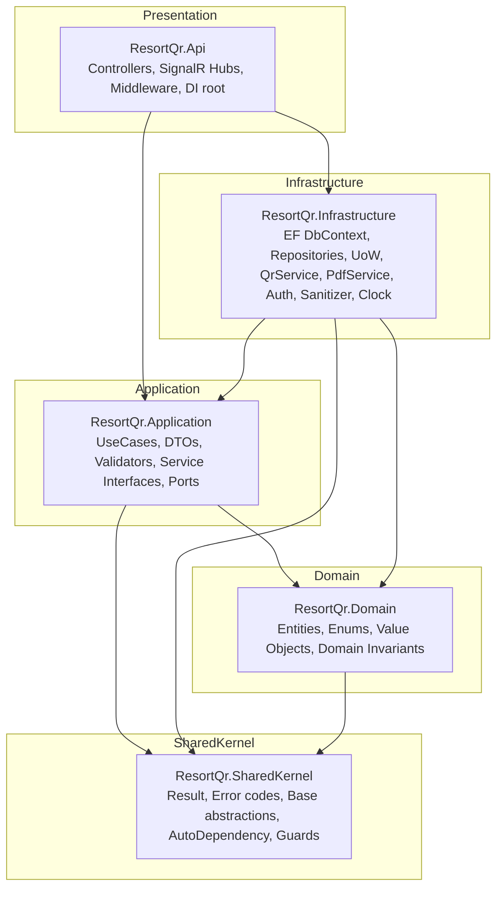
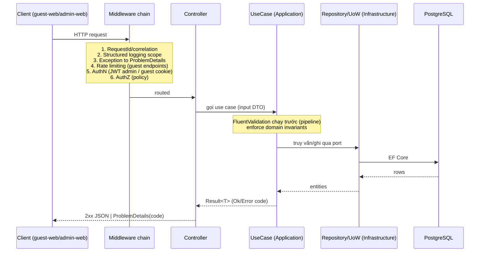

# 01 — Kiến trúc Backend (Modular Monolith)

> **File authoritative cho:** phân tầng, cấu trúc solution, module boundary, HTTP pipeline, DI convention.

## 1. Sơ đồ tầng (Dependency Rule)

Quy tắc phụ thuộc: **mũi tên chỉ vào trong**. Domain không biết gì về Infrastructure/Api. Api chỉ phụ thuộc Application (qua interface) + composition root.



**Điểm mấu chốt (khác reference):** `Infrastructure` **triển khai các port/interface** khai báo ở `Application` (Dependency Inversion). Api là composition root — chỗ duy nhất "biết" cả Application lẫn Infrastructure để ghép DI. Domain thuần, không tham chiếu EF Core.

## 2. Cấu trúc solution

```text
/backend
  ResortQr.sln
  Directory.Build.props          # net10.0, Nullable enable, ImplicitUsings, LangVersion, warnings-as-errors (chọn lọc)
  Directory.Packages.props       # Central Package Management (pin version)
  src/
    ResortQr.SharedKernel/       # Result<T>, Error, AppError codes, Guard, IClock, base entity abstractions, AutoDependency
    ResortQr.Domain/             # Entities, Enums, ValueObjects, domain invariants (no EF)
    ResortQr.Application/        # UseCase interfaces + impl, DTOs, Validators, Ports (IRepository, IUnitOfWork, IQrService...)
    ResortQr.Infrastructure/     # EF Core (DbContext, Configurations, Migrations, Repositories, UoW), adapters (Qr, Pdf, Auth, Sanitizer, Clock, RateLimit store)
    ResortQr.Api/                # Program.cs, Controllers (Guest + Admin), Hubs, Middleware, DI wiring, appsettings
  tests/
    ResortQr.UnitTests/          # Domain + Application (use case) tests, property-based tests
    ResortQr.IntegrationTests/   # API + EF (Testcontainers PostgreSQL)
    ResortQr.ArchitectureTests/  # NetArchTest: enforce dependency rule + naming conventions
```

**Cải tiến so với reference:** reference tách rất nhiều project nhỏ (`Api`, `Api.Core`, `Api.Core.Shared`, `Core`, `Core.Shared`, `Domain`, `EntityFramework`, `Infrastructure`, `Auth`, `Common`) khiến ranh giới mờ và khó biết code nằm ở đâu. Base mới gom về **5 project rõ vai trò** + thư mục module bên trong. Ít project hơn = build nhanh hơn, ranh giới rõ hơn, vẫn giữ dependency rule.

## 3. Module boundary (vertical slice trong monolith)

Trong `Application` và `Infrastructure`, tổ chức theo **module nghiệp vụ** (vertical slice), không theo loại kỹ thuật:

```text
ResortQr.Application/
  Common/              # AbstractUseCase, PagedResult, behaviors (validation), mapping base
  Abstractions/        # Ports: IUnitOfWork, IRepository<T>, IQrService, IPdfService, IHtmlSanitizer,
                       #        ITokenGenerator, ICurrentUser, IGuestContext, IDateTimeProvider, IRealtimeNotifier
  Modules/
    Identity/          # AppUser, auth use cases, IPasswordHasher, IJwtIssuer (ports)
    Rooms/             # Room CRUD, RoomQrToken issue/revoke
    GuestAccess/       # resolve token, GuestSession/GuestVisit lifecycle, portal window
    Rules/             # RuleSet draft, publish→snapshot, acknowledge, rule gate
    Faq/               # category/item tree, translations
    Messaging/         # conversation per visit, messages, unread
    Housekeeping/      # tickets, events, complete-by-room/token
    Notes/             # internal notes
    Localization/      # ResortLanguage, translation fallback resolver
    Dashboard/         # stats aggregation
    Settings/          # ResortSettings read/update
```

**Quy tắc giao tiếp giữa module:** module A gọi module B **chỉ qua interface use case/port** của B (đăng ký DI), không đọc thẳng entity nội bộ của B qua DbContext. Điều này giữ khả năng sau này tách module ra service riêng nếu cần.

**Extension point:** Base chỉ hiện thực **Identity + GuestAccess + Rooms/QrToken + Settings/Localization** (đủ để "quét QR → resolve → phiên khách → đọc settings/ngôn ngữ"). Các module Rules/Faq/Messaging/Housekeeping/Notes/Dashboard chỉ có **khung thư mục + interface trống + entity + migration**, để wave sau điền logic mà không đụng nền.

## 4. Vòng đời request (HTTP pipeline)



## 5. Cơ chế DI theo convention (AutoDependency — cải tiến)

**Bản chất vấn đề của reference** (đã kiểm chứng — xem `09-reference-reconciliation.md`): `AddAutoDependency` quét mọi interface, mỗi interface **phải có đúng một** implementation, nếu không thì **ném exception** (`"have not implement type or more than one"`). Kèm theo phải rải `ForceLoadAssembly` khắp `Program.cs` để reflection thấy assembly. Hệ quả:

- Interface chưa có implementation (ví dụ port sẽ implement ở phase sau) → app crash lúc khởi động.
- Interface có nhiều implementation (nhiều `IValidator`, nhiều strategy) → crash.
- `ForceLoadAssembly` rải rác, dễ quên khi thêm project.
- Lifetime chỉ suy từ attribute trên interface; dễ quên.

**Cải tiến (base mới)** — giữ tinh thần "khai báo tại chỗ, không sửa Program.cs" nhưng an toàn hơn:

```csharp
// SharedKernel: marker interfaces xác định lifetime rõ ràng
public interface IScopedService { }
public interface ISingletonService { }
public interface ITransientService { }

// Convention: 1 interface I{Name} ↔ 1 class {Name} trong cùng assembly.
// Đăng ký assembly tường minh (KHÔNG cần ForceLoadAssembly rải rác).
public static class DependencyInjection
{
    public static IServiceCollection AddResortQrModules(this IServiceCollection services)
    {
        var assemblies = new[]
        {
            typeof(ResortQr.Application.AssemblyMarker).Assembly,
            typeof(ResortQr.Infrastructure.AssemblyMarker).Assembly,
        };

        services.Scan(scan => scan            // Scrutor
            .FromAssemblies(assemblies)
            .AddClasses(c => c.AssignableTo<IScopedService>(), publicOnly: false)
                .AsImplementedInterfaces().WithScopedLifetime()
            .AddClasses(c => c.AssignableTo<ISingletonService>())
                .AsImplementedInterfaces().WithSingletonLifetime()
            .AddClasses(c => c.AssignableTo<ITransientService>())
                .AsImplementedInterfaces().WithTransientLifetime());

        return services;
    }
}
```

**Khác biệt:** dùng **Scrutor** (thư viện phổ biến, ổn định) thay reflection tự viết; lifetime khai báo bằng marker interface rõ ràng; đăng ký assembly tường minh qua `AssemblyMarker` (mỗi project 1 class rỗng) → **bỏ hẳn `ForceLoadAssembly`**; interface chưa có impl thì đơn giản không được đăng ký (**không crash**).

> Nếu team muốn giữ đúng "hương vị" reference (attribute `[AutoDependency(...)]`), có thể giữ attribute nhưng chuyển engine sang Scrutor và **không ném lỗi** khi thiếu impl — coi như port chưa sẵn sàng.
