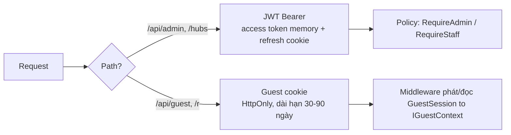

# 03 — Cross-Cutting Concerns & Error Handling

> **File authoritative cho:** error→ProblemDetails, validation pipeline, EF audit/soft-delete/concurrency, auth kép, rate limit, logging/observability, CORS/security headers.

## 1. Error handling → ProblemDetails

Một middleware duy nhất chuyển exception chưa bắt + `Result.Fail` thành `application/problem+json` với `code` ổn định. Không lộ stack trace ra client.

```csharp
// ResortQr.Api/Middleware — ánh xạ ErrorType → HTTP status
private static int ToStatus(ErrorType t) => t switch
{
    ErrorType.Validation  => StatusCodes.Status400BadRequest,
    ErrorType.NotFound    => StatusCodes.Status404NotFound,
    ErrorType.Conflict    => StatusCodes.Status409Conflict,
    ErrorType.Forbidden   => StatusCodes.Status403Forbidden,
    ErrorType.RateLimited => StatusCodes.Status429TooManyRequests,
    _                     => StatusCodes.Status500InternalServerError,
};
```

**Ánh xạ exception → ProblemDetails (trong middleware — tường minh, không rơi hết vào 500):**

```csharp
// Thứ tự ánh xạ exception chưa bắt:
private static (int status, string code) MapException(Exception ex) => ex switch
{
    DbUpdateConcurrencyException => (409, "concurrency_conflict"),   // C5: propagate từ UoW.SaveChanges (05 §2)
    _                            => (500, "unexpected"),             // KHÔNG lộ stack trace (Req 4.5)
};
// Ghi chú: OperationCanceledException (client hủy qua CancellationToken) → KHÔNG trả body
// (client đã ngắt kết nối); chỉ log ở mức thông tin, không phát code client-facing mới (giữ catalog 14 khép kín).
```

> **Vì sao cần case tường minh:** `DbUpdateConcurrencyException` do EF ném từ `UoW.SaveChangesAsync` (`05` §2). Nếu không có case riêng, nó rơi vào nhánh mặc định 500 — **sai** (đúng phải là 409 `concurrency_conflict`, Property B10). `validation_error` (400) đến từ Validation_Pipeline (§2), không qua đường exception này.

Controller helper để không lặp code:

```csharp
protected IActionResult ToResult<T>(Result<T> r)
{
    if (r.IsSuccess) return Ok(r.Value);
    // ControllerBase.Problem() KHÔNG có tham số extensions → dựng ProblemDetails thủ công + set Extensions
    var pd = new ProblemDetails
    {
        Status = ToStatus(r.Error!.Type),
        Title  = r.Error.Message,
        Type   = $"/problems/{r.Error.Code}",           // URI ổn định theo code (Req 4.2 yêu cầu 'type')
    };
    pd.Extensions["code"]    = r.Error.Code;
    pd.Extensions["traceId"] = Activity.Current?.Id ?? HttpContext.TraceIdentifier;   // correlation (19 §2)
    return new ObjectResult(pd) { StatusCode = pd.Status, ContentTypes = { "application/problem+json" } };
```

> **Hợp đồng ProblemDetails đầy đủ (Req 4.2):** mọi response lỗi có **`type`** (`/problems/{code}`), **`title`**, **`status`**, **`code`** (∈ catalog `14`), **`traceId`** (correlation). Middleware exception (`MapException`) cũng set đủ 5 trường này (Type = `/problems/{code}` tương ứng).
}
```

## 2. Validation pipeline

FluentValidation chạy **trước** use case (decorator/behavior), gom lỗi thành `ProblemDetails` với `code=validation_error` + danh sách field. Validator tự đăng ký qua Scrutor.

```csharp
public sealed class SendMessageValidator : AbstractValidator<SendMessageInput>
{
    public SendMessageValidator(IOptions<GuestLimits> limits)
    {
        RuleFor(x => x.Body).NotEmpty().MaximumLength(limits.Value.MaxMessageLength);
    }
}
```

## 3. EF Core: audit, soft-delete, concurrency, snake_case

`DbContext` xử lý tập trung (kế thừa ý tưởng reference nhưng thêm concurrency + naming + ánh xạ actor từ `ICurrentUser`):

```csharp
protected override void OnModelCreating(ModelBuilder b)
{
    b.ApplyConfigurationsFromAssembly(typeof(AppDbContext).Assembly);
    b.UseSnakeCaseNames();                       // convention: room_qr_token, created_at...
    foreach (var et in b.Model.GetEntityTypes())
    {
        if (typeof(ISoftDeletable).IsAssignableFrom(et.ClrType))
            et.AddSoftDeleteQueryFilter();       // tự lọc IsDeleted=false
        if (typeof(IConcurrencyAware).IsAssignableFrom(et.ClrType))
            b.Entity(et.ClrType).UseXminAsConcurrencyToken(); // Npgsql: map xmin system column
    }
}

public override Task<int> SaveChangesAsync(CancellationToken ct = default)
{
    var now = _clock.UtcNow;
    var actor = _currentUser.UserId;
    foreach (var e in ChangeTracker.Entries<IAuditable>())
    {
        if (e.State == EntityState.Added)    { e.Entity.CreatedAt = now; e.Entity.CreatedByUserId ??= actor; }
        if (e.State == EntityState.Modified) { e.Entity.UpdatedAt = now; e.Entity.UpdatedByUserId = actor; }
    }
    foreach (var e in ChangeTracker.Entries<ISoftDeletable>().Where(x => x.State == EntityState.Deleted))
    { e.State = EntityState.Modified; e.Entity.IsDeleted = true; e.Entity.DeletedAt = now; }
    return base.SaveChangesAsync(ct);
}
```

`DbUpdateConcurrencyException` được middleware ánh xạ thành `409 concurrency_conflict` (Property B10).

> ✅ **Đã verify (2026-07-03):** Npgsql dùng **`UseXminAsConcurrencyToken()`** để ánh xạ cột hệ thống `xmin` làm concurrency token (nguồn: [npgsql.org/efcore concurrency](https://www.npgsql.org/efcore/modeling/concurrency.html)). **KHÔNG dùng `IsRowVersion()` kiểu SQL Server** (khác ngữ nghĩa, và từng có bug thêm cột thật vào migration). `IConcurrencyAware.RowVersion (uint)` map tới xmin. Xem `../../ai-notes/04-things-to-know.md` TK-003.

## 4. Xác thực kép (Admin JWT + Guest cookie)



- **Admin/Staff:** JWT access token ngắn hạn (client giữ trong memory) + refresh token HttpOnly cookie có rotation; policy `RequireAdmin`, `RequireStaff`. `Infrastructure` cung cấp `IJwtIssuer`, `IPasswordHasher`, `RefreshToken` lưu **hash**.
- **Guest — TÁCH 2 việc (fix P0 thứ tự pipeline + P1 hash):**
  - **(a) Đọc cookie hiện có → `IGuestContext` (middleware chạy SỚM, TRƯỚC `UseRateLimiter`):** nếu request có cookie `shq_guest`, middleware **hash** giá trị cookie → tra `GuestSession` theo `SessionKeyHash` (unique) → nạp `IGuestContext.GuestSessionId`. Phải chạy trước rate limiter để policy `guest-write` **partition theo GuestSessionId** (Req 13.2) có dữ liệu; nếu không có cookie hợp lệ → `GuestSessionId=null` → rate limiter fallback **partition theo IP** (Req 13.3).
  - **(b) TẠO GuestSession mới CHỈ trong resolve use case (SAU khi token hợp lệ):** không tạo session ở middleware sớm (tránh tạo session cho mọi request rác/scan). Khi `/resolve` xác thực token OK mà chưa có cookie → tạo `GuestSession` + set cookie. (Vì `/resolve` partition rate-limit theo **IP**, không cần GuestSessionId trước — nhất quán.)
  - **Lưu trữ (như refresh token):** cookie chứa **secret ngẫu nhiên CSPRNG raw**; DB lưu **`SessionKeyHash`** (unique, `ux_guestsession_key` trên hash) — **KHÔNG** lưu raw. Cookie dài hạn 30–90 ngày là bearer secret → nếu DB lộ mà lưu raw thì bị chiếm phiên; lưu hash chặn điều đó. HttpOnly, Secure, SameSite=Lax. Không lưu số phòng/token trong cookie.
- **Bản chất vấn đề reference (đã kiểm chứng):** `Program.cs` gọi `app.UseAuthorization()` nhưng **không** gọi `app.UseAuthentication()` và **không** đăng ký authentication scheme nào → authorization không có danh tính để hoạt động đúng. Base mới wire đầy đủ cả hai scheme + `UseAuthentication` trước `UseAuthorization`.

## 5. Rate limiting

Dùng **built-in `Microsoft.AspNetCore.RateLimiting`** (.NET 10) với policy riêng cho guest surface, ngưỡng đọc từ `ResortSettings`/`appsettings`:

| Policy | Áp cho | Khóa phân vùng | Mặc định |
|---|---|---|---|
| `resolve` | `GET /api/guest/resolve/{token}` | IP | chống brute-force token |
| `guest-write` | `POST /messages`, `/housekeeping` | GuestSessionId | theo `MessageRateLimitPerMinute` |

## 6. Structured logging & Observability

- **Serilog** JSON, enrich `RequestId`, `ResortId`, `RoomId` (khi resolve), `ConversationId`, `error code`.
- **Mask token:** không log path `/r/{token}` và `/resolve/{token}` dạng đầy đủ; không log mật khẩu/refresh token (Req 11.6, 12.1).
- Health check `/health/live` (self) + `/health/ready` (kiểm DB) qua `Microsoft.Extensions.Diagnostics.HealthChecks`.
- **Background service** duy nhất ở nền: `VisitIdleSweeper` — quét `GuestVisit` quá `ExpiresAt` → `Expired` + cascade (đóng conversation Open, hủy ticket mở). **Không bao giờ** đụng `RoomQrToken` (QR vật lý chỉ revoke thủ công).

## 7. CORS & Security headers

- Same-origin ở MVP (`portal.starhill.local`): guest `/`, admin `/admin`, api `/api`, hub `/hubs`. CORS strict theo origin cấu hình.
- Security headers: CSP (`default-src 'self'; frame-ancestors 'none'; connect-src 'self' wss:`), `X-Content-Type-Options`, HSTS khi cert ổn định.
- HTTPS bắt buộc (secure context cho camera/QR trên điện thoại — Req 12.5).

## 8. IP client thật sau reverse proxy (ForwardedHeaders) — bắt buộc để rate limit/log đúng

**Bản chất vấn đề (đúng đắn, không phải tối ưu):** hệ chạy sau reverse proxy (Nginx/Caddy/IIS — `10` §7, docs Deployment). Khi đó `HttpContext.Connection.RemoteIpAddress` = **IP của proxy**, không phải của khách. Hệ quả trực tiếp:
- Rate limit `resolve` phân vùng **theo IP** (Req 13.1) sẽ gom **mọi khách vào một bucket** → hoặc chặn nhầm tất cả, hoặc vô dụng.
- Log `RequestId/IP` sai; mọi logic dựa IP sai.
- Cookie `Secure`/`Request.IsHttps` sai nếu proxy terminate TLS (backend thấy http).

**Giải pháp (fix gốc):** bật **`ForwardedHeadersMiddleware`** đọc `X-Forwarded-For` (khôi phục IP khách) + `X-Forwarded-Proto` (khôi phục https):

```csharp
// Program.cs — cấu hình TRƯỚC khi build
builder.Services.Configure<ForwardedHeadersOptions>(o =>
{
    o.ForwardedHeaders = ForwardedHeaders.XForwardedFor | ForwardedHeaders.XForwardedProto;
    o.KnownProxies.Clear();                 // KHÔNG tin mọi proxy
    o.KnownNetworks.Clear();
    // Chỉ tin đúng reverse proxy nội bộ (địa chỉ/subnet lấy từ cấu hình):
    o.KnownProxies.Add(IPAddress.Parse(cfg["ReverseProxy:Ip"]!));   // ⚠️ cấu hình theo hạ tầng
});
// ...
app.UseForwardedHeaders();   // PHẢI chạy SỚM NHẤT, trước rate limiting/auth/logging
```

**Cảnh báo bảo mật (vì sao phải `KnownProxies`):** nếu tin `X-Forwarded-For` từ **bất kỳ** nguồn, khách có thể **giả mạo IP** để né rate limit hoặc bơm IP giả vào log. Vì thế **chỉ tin đúng IP/subnet của reverse proxy** (mặc định ASP.NET Core chỉ tin loopback — phải khai báo proxy thật). ⚠️ Giá trị IP/subnet proxy lấy từ cấu hình hạ tầng — xem `../../ai-notes/04-things-to-know.md` TK-027.

**Thứ tự middleware (quan trọng — đã sửa để guest-write partition đúng):**
```
UseForwardedHeaders → CorrelationId/log → [GuestCookieRead: đọc cookie → IGuestContext.GuestSessionId]
  → UseRateLimiter → UseAuthentication → UseAuthorization
```
- Sai thứ tự `ForwardedHeaders` → rate limit vẫn thấy IP proxy.
- **`GuestCookieRead` PHẢI chạy TRƯỚC `UseRateLimiter`** (fix P0): policy `guest-write` partition theo `GuestSessionId` (Req 13.2) nên GuestSessionId phải sẵn sàng trước khi rate limiter phân vùng; không có cookie → fallback IP (Req 13.3). Middleware này **chỉ ĐỌC** cookie hiện có (không tạo mới — việc tạo ở resolve use case, §4(b)).
- `UseAuthentication` (JWT) sau rate limiter là ổn cho admin (admin rate-limit theo IP nếu có, không cần userId trước); guest không dùng JWT.

## 9. Chính sách allowlist của HtmlSanitizer (nội quy/FAQ)

**Bản chất:** nội dung rich text do Staff/Admin nhập (Req 8.6) là đường XSS lẫn nhau giữa người dùng chung mạng. `IHtmlSanitizer` (impl bằng `Ganss.Xss`, thư viện được bảo trì — **không tự viết**) phải có **chính sách allowlist rõ ràng** (allowlist an toàn hơn blocklist).

**Chính sách khởi điểm (⚠️ rà lại theo nhu cầu nội dung thực tế):**

| Nhóm | Cho phép | Cấm |
|---|---|---|
| Thẻ định dạng | `p, br, span, strong, b, em, i, u, s, ul, ol, li, h2, h3, h4, blockquote, hr` | `script, style, iframe, object, embed, form, input, link, meta, svg, base` |
| Link `<a>` | `href` với scheme **allowlist**: `http, https, mailto, tel`; thêm `rel="noopener noreferrer"` | `href="javascript:"`, `data:`, `vbscript:` |
| Ảnh `` | **Mặc định KHÔNG cho phép** ở base | (bật sau nếu cần, chỉ với src same-origin/scheme allowlist — tránh tracking/exfil/probe mạng nội bộ) |
| Thuộc tính | allowlist tối thiểu (`href`, `title`) | **mọi `on*`** (onclick...), **`style`** (CSS injection/clickjacking), `srcset`, `formaction` |
| URI | http/https/mailto/tel | `javascript:`, `data:`, `vbscript:` |

**Quy tắc:**
- Sanitize **trên đường ghi** (trước khi lưu — Property B7) là điểm enforce chính; nội dung lưu xuống đã sạch.
- FE vẫn tránh `v-html` không kiểm soát; nếu render HTML, chỉ dùng nội dung đã sanitize từ API (defense-in-depth, `../frontend/02` §9).
- Cấu hình sanitizer tập trung một chỗ (một instance/policy), không mỗi nơi cấu hình khác nhau (tránh lỗ hổng do lệch cấu hình).
- ⚠️ Allowlist cụ thể chốt khi biết nhu cầu nội dung (có cần bảng/ảnh không) — xem `../../ai-notes/04-things-to-know.md` TK-028.
