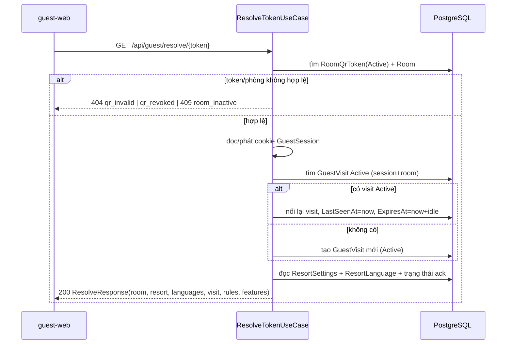

# 05 — Thuật toán nền + Đặc tả hình thức (Low-Level)

> **File authoritative cho:** ba thuật toán "xương sống" của base. Các module khác chỉ mở rộng, không sửa.

## 1. Sinh PublicToken (an toàn, không đoán được)

```csharp
public string NewPublicToken(int bytes = 32)
{
    Span<byte> buffer = stackalloc byte[bytes];
    RandomNumberGenerator.Fill(buffer);          // CSPRNG
    return Base64Url.EncodeToString(buffer);     // không padding, URL-safe
}
```

- **Preconditions:** `bytes >= 16`.
- **Postconditions:** trả chuỗi URL-safe; entropy ≥ `bytes*8` bit; xác suất trùng thực tế bằng 0. Không chứa số phòng (Req 1.6).
- **Invariant:** hàm thuần về tham số (không phụ thuộc trạng thái); tính bất định chỉ đến từ CSPRNG.

> ⚠️ **Cần xác minh khi implement:** `Base64Url` (System.Buffers.Text) có sẵn từ .NET 9. Nếu SDK thiếu, fallback `Convert.ToBase64String` + thay `+/=`. Xem `../../ai-notes/04-things-to-know.md` mục TK-002.

## 2. UnitOfWork.SaveChanges — điểm ghi DB nguyên tử duy nhất

```pascal
ALGORITHM SaveChangesAsync(ct)
BEGIN
  ASSERT changeTracker != null
  applyAuditStamps(now := clock.UtcNow, actor := currentUser.UserId)   // Added/Modified
  convertHardDeleteToSoftDelete()                                       // ISoftDeletable
  affected ← base.SaveChangesAsync(ct)            // gửi 1 batch xuống Postgres
  // KHÔNG catch DbUpdateConcurrencyException ở đây: chữ ký trả Task<int> (02 §3) không mang Result.
  // Exception PROPAGATE lên ProblemDetails middleware → ánh xạ 409 concurrency_conflict (03 §1/§3, Property B10).
  RETURN affected
END
```

> **Nhất quán (C5, audit 3):** `IUnitOfWork.SaveChangesAsync` trả `Task<int>` (`02` §3) nên **không** "return error" trong thân nó. `DbUpdateConcurrencyException` được **middleware** bắt và ánh xạ `409 concurrency_conflict` (một chỗ xử lý duy nhất — `03`). Use case không cần try/catch concurrency.

- **Preconditions:** mọi thay đổi đã nạp vào ChangeTracker qua `Repository.Add/Update/Remove`.
- **Postconditions:** hoặc **tất cả** thay đổi được ghi, hoặc **không có gì** ghi (ngoại lệ) — nguyên tử ở mức một `SaveChanges`. Với chuỗi nhiều `SaveChanges`, dùng `ExecuteInTransactionAsync`.
- **Loop invariant** (vòng duyệt audit): mọi entry đã duyệt có `CreatedAt/UpdatedAt` đúng theo state; entry chưa duyệt giữ nguyên.

## 3. Resolve token + lượt lưu trú + cửa sổ thao tác

> **Bản đầy đủ (authoritative):** `13-guest-access-flows.md` — có xử lý race (`ux_visit_active`), **lazy idle-expiry ở resolve** (không phụ thuộc sweeper), cascade EndVisit idempotent, và ma trận 12 edge-case. Phần dưới là tóm tắt.

Thứ tự kiểm tra **cực kỳ quan trọng** (nếu cập nhật `LastSeenAt` trước khi kiểm tra, cửa sổ sẽ tự gia hạn vô hạn — bug đã cảnh báo trong docs cũ). **Điểm bổ sung quan trọng:** resolve/endpoint tương tác phải tự kiểm tra `now > ExpiresAt` (lazy idle-expiry) trước khi nối lại visit — nếu chỉ xét `Status='Active'` sẽ nối nhầm visit đã idle > 24h khi sweeper chưa chạy (rò rỉ dữ liệu lượt cũ). Xem `13` §2.



Với **API tương tác** (`/rules`, `/faq`, `/messages`, `/housekeeping`, `/conversation`) — kiểm tra cửa sổ TRƯỚC:

```pascal
ALGORITHM EnforcePortalWindow(visit, now, portalMinutes)
BEGIN
  IF visit.Status != Active THEN RETURN error(session_expired)
  IF now > visit.ExpiresAt THEN RETURN error(session_expired)   // LAZY idle-expiry (bản đầy đủ: 13 §4, có EndVisit)
  IF (now - visit.LastSeenAt) > portalMinutes THEN
     RETURN error(session_expired)          // KHÔNG cập nhật LastSeenAt
  // còn trong hạn:
  proceed(handler)
  visit.LastSeenAt ← now                     // chỉ cập nhật SAU khi xử lý
  visit.ExpiresAt  ← now + idleExpiryHours
END
```

- **Preconditions:** `visit` thuộc đúng `GuestSession` hiện tại (từ cookie), `portalMinutes>0`.
- **Postconditions:** chỉ `/resolve` (quét lại) mới được refresh cửa sổ; endpoint tương tác không tự gia hạn khi đã quá hạn ⇒ cửa sổ **luôn có thể hết hạn** (Property B8).

## 4. Ví dụ ghép nối (Controller → UseCase → Result → HTTP)

```csharp
[ApiController, Route("api/guest")]
public sealed class GuestResolveController(IResolveTokenUseCase resolve) : ApiControllerBase
{
    [HttpGet("resolve/{token}")]
    [EnableRateLimiting("resolve")]
    public async Task<IActionResult> Resolve(string token, CancellationToken ct)
    {
        var ctx = new GuestContextInput(HttpContext);           // cookie, IP, UA
        var result = await resolve.ExecuteAsync(token, ctx, ct);
        return ToResult(result);                                 // Ok | ProblemDetails(code)
    }
}
```
