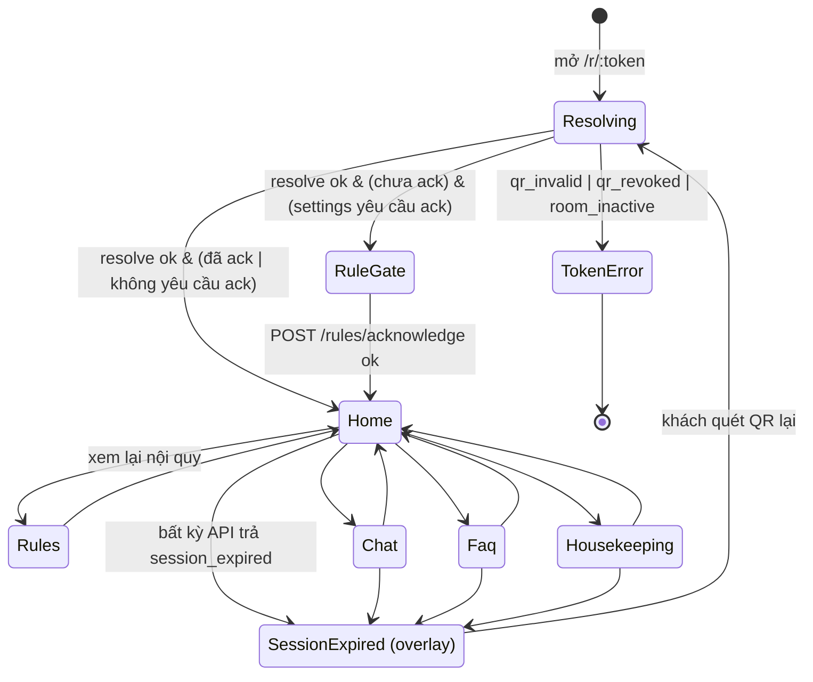

# 03 — guest-web: state machine, session store, xử lý lỗi theo code

> **File authoritative cho:** luồng guest-web (state machine màn hình), hình dạng session store, resolve ngôn ngữ phía FE, và ánh xạ `ErrorCode` → hành vi UI. Đồng bộ hợp đồng với backend `13` (GuestAccess) + `14` (error catalog).
>
> Phạm vi base: dựng **skeleton state machine + session store + xử lý lỗi + i18n bootstrap**; nội dung từng màn nghiệp vụ (RuleGate/FAQ/Chat) điền ở wave sau nhưng **khung điều hướng và hợp đồng lỗi phải đúng ngay từ base**.

## 1. State machine điều hướng (nguồn sự thật cho router guest)



**Quy tắc:**
- **Resolving**: gọi `GET /api/guest/resolve/{token}`, nạp session store (§2), quyết định màn kế theo `rules.acknowledged` + `features.ruleAckRequiredFor*`.
- **TokenError**: terminal, thông báo thân thiện, **không** lộ thông tin phòng khác (khớp Req 1.4). Không có nút "thử lại" vô nghĩa; hướng dẫn hỏi lễ tân.
- **SessionExpired**: là **overlay** trên bất kỳ màn nào (không phải route riêng), kích hoạt khi **bất kỳ** API guest trả `session_expired`. UX: "Phiên đã hết hạn, vui lòng quét QR lại". Chỉ **quét QR lại** (`/resolve`) mới thoát overlay (khớp `13` §4 — chỉ resolve mở khóa).

## 2. Session store (Pinia) — hình dạng khớp `/resolve` response

```ts
interface GuestSessionState {
  room: { id: string; number: string; building?: string; floor?: string };
  resort: { id: string; name: string; logoUrl?: string };
  languages: string[];            // ResortLanguage đã bật
  defaultLanguage: string;        // ResortLanguage.IsDefault (vd 'en')
  visit: { id: string; status: 'Active'|'Expired'|'Closed'; portalWindowExpiresAt: string };
  rules: { currentVersion: number; acknowledged: boolean; acknowledgedVersion: number|null };
  features: {
    faqEnabled: boolean; chatEnabled: boolean; housekeepingEnabled: boolean;
    ruleAckRequiredForFaq: boolean; ruleAckRequiredForChat: boolean; ruleAckRequiredForHousekeeping: boolean;
  };
}
```

- Store là **nguồn sự thật** để bật/tắt nút Home (theo `features`), hiển thị badge ack, và quyết định RuleGate.
- **Không** lưu token/room vào localStorage/JS state nhạy cảm; định danh thiết bị nằm ở **cookie HttpOnly** (JS không đọc được — đúng thiết kế, chống XSS trộm phiên).
- Store nghiệp vụ (rules/faq/chat/housekeeping) = **khung rỗng** ở base.

## 3. Resolve ngôn ngữ phía FE (Req 2.1) — khớp backend MatchSupported

```ts
function resolveLang(query, storage, navigatorLang, enabled, def): string {
  const pick = query.lang ?? storage.get('guestLang') ?? navigatorLang; // ưu tiên
  const norm = normalize(pick);              // 'ko-KR' -> 'ko', lowercase
  if (enabled.includes(norm)) return norm;
  const primary = norm.split('-')[0];
  if (enabled.includes(primary)) return primary;
  return def;                                // fallback default resort ('en') — Req 2.2
}
```

- Thứ tự: `?lang=` → `localStorage` → `navigator.language` → default (Req 2.1). Đổi ngôn ngữ thủ công → lưu `localStorage` (Req 2.3).
- **Nhất quán với backend** (`18` §2): cùng quy tắc primary-subtag → FE và BE chọn cùng ngôn ngữ, tránh lệch. Content lấy từ API theo lang (có cờ `isFallback` → FE có thể hiện nhãn "bản dịch mặc định").
- Tách **UI text** (vue-i18n JSON trong app) vs **content** (từ API) — Req 2.4.

## 4. Ánh xạ ErrorCode → hành vi UI (interceptor chung — khớp `14`)

| code | Hành vi guest-web |
|---|---|
| `qr_invalid`/`qr_revoked`/`room_inactive` | chuyển **TokenError** (chỉ ở bước resolve) |
| `session_expired` | bật overlay **SessionExpired** (quét lại QR) |
| `rule_ack_required` | điều hướng **RuleGate** (mở lại luồng đọc nội quy) |
| `rate_limited` (429) | toast nhẹ + tôn trọng `Retry-After`; khóa nút tạm |
| `message_too_long` | lỗi tại ô nhập chat |
| `unexpected` (500) | toast lỗi chung, không lộ chi tiết |

- Interceptor đặt ở `packages/api-client` (ném `ApiError{code}`); guest-web đăng ký handler theo bảng trên. **Không đoán chuỗi message** — chỉ theo `code`.

## 5. Hiệu năng & UX mobile (Req 13)
- **Lazy-load** module Chat + SignalR (`packages/realtime`) **chỉ khi vào màn Chat** (Req 13.2) — nội quy/FAQ tải trước, chat không kéo bundle vào trang đầu.
- Mobile-first: nút lớn, contrast tốt, dùng một tay; bundle guest nhỏ (không UI kit nặng — `02` §1).
- Realtime: hiển thị **trạng thái kết nối**; WebSocket lỗi → `packages/realtime` tự fallback polling `GET /conversation` (khớp backend).

## 6. RuleGate (khung cho wave Rules — hợp đồng đúng từ base)
- Đi từng section theo `SortOrder`; `RequireScrollEnd` → IntersectionObserver đánh dấu "đã xem" khi cuộn tới cuối; `MinReadSeconds` → đếm ngược nút "Tiếp tục"; progress bar (vd 2/6); section cuối tick đồng ý → `POST /rules/acknowledge`.
- **Server là trọng tài**: FE không tự quyết version; gửi để đối chiếu, server dùng publication `IsCurrent` (khớp `13`/docs). Backend vẫn enforce rule gate (403 `rule_ack_required`) — FE gate chỉ là UX.

## 7. Truy vết
- **Validates: Requirements 1.4, 2.1–2.5, 3.x (khung), 5 (khung), 10.3, 13.1–13.3**
- Đồng bộ: backend `13` (flows), `14` (error codes), `18` (ngôn ngữ).
