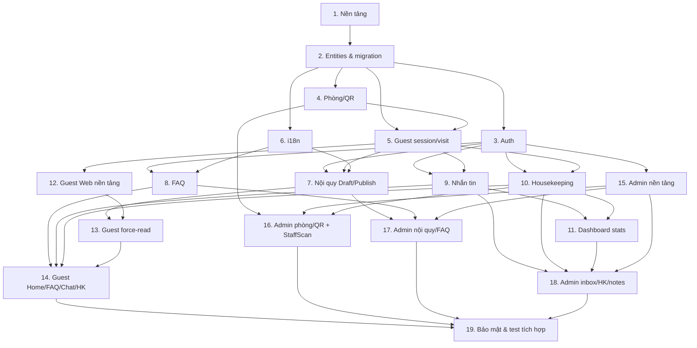

# Implementation Plan

## Overview

Kế hoạch triển khai Resort QR Portal (Star Hill Guest App) theo thứ tự: nền tảng backend → domain/data → xác thực → phòng/QR + phiên khách → nội quy (Draft/Publish) → FAQ → nhắn tin → housekeeping → dashboard → hai frontend Vue → hoàn thiện bảo mật nhẹ & kiểm thử. Hệ thống chạy trong WiFi nội bộ (không public internet), nên bỏ backup và threat model nặng; giữ log có cấu trúc, sanitize, rate limit nhẹ. Mỗi task tham chiếu requirement cụ thể.

## Tasks

- [x] 1. Khởi tạo solution backend & nền tảng
  - Tạo solution ASP.NET Core **.NET 10 LTS** với project: Api, Application, Domain, Infrastructure, Tests
  - Cấu hình DI, structured logging (không log path chứa token), ProblemDetails middleware, CORS allowlist 2 origin, health check `/health/live` + `/health/ready`
  - Cấu hình EF Core DbContext + kết nối **PostgreSQL** (Npgsql) + migration; seed resort, `ResortSettings` mặc định, tài khoản admin, `ResortLanguage` (en/vi/ko/zh; `IsDefault=en`)
  - Deployment: chạy sau reverse proxy cùng origin, **HTTPS cert hợp lệ + DNS nội bộ** (bắt buộc cho camera/secure context); guest web tiếng Anh, admin dashboard tiếng Việt
  - _Requirements: 11.1, 12.1, 12.2, 12.4, 12.5, 14.1_

- [~] 2. Domain entities & migration khởi tạo  <!-- entity NỀN + migration InitialCreate xong; entity module (Rules/Faq/Messaging/Housekeeping/Notes) theo wave (design TRD-002) -->
  - [x] 2.1 Tạo entities & enums  <!-- NỀN: Resort, ResortSettings, ResortLanguage, AppUser, Room, RoomQrToken, GuestSession, GuestVisit + enum. Module entities per-wave. -->
    - Resort, ResortSettings, ResortLanguage, Room, RoomQrToken, GuestSession, GuestVisit, RuleSet, RuleSection, RuleSectionTranslation, RulePublication, RulePublicationSection, RulePublicationSectionTranslation, RuleAcknowledgement, FaqCategory, FaqCategoryTranslation, FaqItem, FaqItemTranslation, Conversation, Message, HousekeepingTicket, HousekeepingEvent, InternalNote, AppUser (Role: Admin/Staff), RefreshToken
    - Quan hệ, self-reference FaqItem.ParentId; RoomQrToken chỉ Active/Revoked (không ExpiresAt); RulePublication* là snapshot bất biến; concurrency token cho RuleSet/RuleSection(Translation)/FaqItem(Translation)/ResortSettings
    - _Requirements: 1.1, 6.1, 7.5, 8.1, 4.1, 10.1, 14.1_
  - [x] 2.2 EF Core fluent config + migration đầu tiên  <!-- 8 config + AppDbContext + AppDbContextFactory + AppUserAuthStore + ResortSeeder + migration InitialCreate (Npgsql: xmin→xid, partial index, CHECK) -->
    - Fluent config; **unique/partial index**: 1 token Active/phòng, 1 Conversation/GuestVisit (tổng, reopen), 1 ack/(GuestVisitId,RulePublicationId), 1 ticket mở/phòng, 1 ResortLanguage IsDefault/resort, 1 RulePublication IsCurrent/resort; unique translation theo (entity+language); tạo & áp dụng migration
    - _Requirements: 1.1, 7.5, 8.1, 8.3, 2.2_

- [x] 3. Xác thực & phân quyền (Admin/Staff)  <!-- nền base đã có; test Staff-bị-chặn bổ sung ở Task 4 -->
  - [x] 3.1 IAuthService: login, refresh token rotation, logout, hash mật khẩu  <!-- base Identity: LoginUseCase/RefreshTokenUseCase/LogoutUseCase + Argon2id -->
    - _Requirements: 11.1_
  - [x] 3.2 Authorization theo Role + endpoints `/api/auth/*`  <!-- policy RequireAdmin/RequireStaff (Admin superset) + /auth/login|refresh|logout|me -->
    - Staff xử lý nội dung/tin nhắn/ticket; Admin thêm rooms/QR/users/settings
    - _Requirements: 11.1, 11.3_
  - [x] 3.3 Test auth & phân quyền (Staff bị chặn endpoint Admin)  <!-- AdminRoomEndpointsTests: Staff POST /rooms → 403; no-token → 401 -->
    - _Requirements: 11.1, 11.3_

- [~] 4. Phòng, token QR & sinh QR  <!-- CRUD + token issue/rotate + QR PNG XONG; PDF nhãn HOÃN (QuestPDF chưa add + license TK-019); resolve token = Task 5 -->
  - [x] 4.1 IRoomService: CRUD phòng, sinh token (1 active/phòng), thu hồi giữ lịch sử  <!-- Create/Update/ChangeStatus/Delete(soft) + CreateRoom issue + RotateRoomToken atomic; resolve → Task 5 -->
    - _Requirements: 1.1, 1.3, 1.4, 1.5, 7.1, 7.4, 7.5_
  - [~] 4.2 IQrService (PNG QR) XONG; IPdfService (PDF nhãn) HOÃN — QRCoder; URL QR dùng `GuestWebBaseUrl`, không nhúng số phòng
    - _Requirements: 7.2, 7.3, 1.6, 14.3_
  - [x] 4.3 Controller admin rooms & QR — CRUD phòng **Admin-only**, Staff chỉ xem (`GET /rooms`)  <!-- /rooms GET(Staff+Admin) CUD(Admin), /{id}/qr.png, /{id}/revoke-token, /{id}/status; qr-labels.pdf HOÃN -->
    - `/rooms` (GET Staff+Admin; CUD Admin), `/qr.png`, `/qr-labels.pdf`, `/revoke-token` (Admin)
    - _Requirements: 7.1, 7.2, 7.3, 7.4, 7.6, 11.3_
  - [x] 4.4 Test token (không đoán được CSPRNG, revoked/phòng vô hiệu → lỗi, 1 active/phòng)  <!-- resolve-không-lộ-phòng thuộc Task 5 -->
    - _Requirements: 1.1, 1.4, 7.5_

- [~] 5. Guest session/visit & resolve  <!-- lõi resolve XONG; sweeper nền + cascade EndVisit + EnforcePortalWindow (endpoint tương tác) + rule_ack hoãn tới wave có entity Rules/Messaging/Housekeeping -->
  - [x] 5.1 GuestSession (cookie thiết bị) + GuestVisit (lazy idle-expiry + nối lại Active + tạo mới race + sliding window) + PortalWindow từ ResortSettings  <!-- ResolveTokenUseCase; IGuestSessionKeyHasher + Sha256 impl -->
    - _Requirements: 10.1, 10.2, 10.3, 10.4, 10.6, 11.2_
  - [~] 5.2 Endpoint `GET /api/guest/resolve/{token}` (room, visitId, portalWindowExpiresAt, feature flags, defaultLanguage) — token lỗi KHÔNG lộ phòng (qr_invalid/qr_revoked/room_inactive); set cookie thiết bị SameSite=Lax  <!-- currentRuleVersion/ackStatus + background sweep + cascade Expired HOÃN (cần Rules/Conversation/Ticket) -->
    - _Requirements: 1.2, 1.3, 1.4, 10.2, 10.3, 10.5, 10.8, 14.2_
  - [x] 5.3 Test nối lại visit / lazy idle-expiry / visit mới / 2 phòng / token lỗi (E1–E6, E11) + HTTP resolve  <!-- ResolveTokenUseCaseTests + GuestResolveEndpointTests -->
    - _Requirements: 10.2, 10.3, 10.5_

- [ ] 6. i18n nội dung (backend)
  - [ ] 6.1 II18nService: lấy nội dung theo LanguageCode + fallback default + cờ `isFallback`
    - _Requirements: 2.2, 2.4, 2.5_

- [ ] 7. Nội quy: Draft → Publish + force-read (backend)
  - [ ] 7.1 IRuleService: CRUD RuleSet Draft + section/translation, cấu hình IsRequired/RequireScrollEnd/MinReadSeconds/Order, sanitize HTML, optimistic concurrency (409 khi ghi đè)
    - _Requirements: 8.1, 8.2, 8.6_
  - [ ] 7.2 Publish → **snapshot** Draft thành RulePublication mới (Version++, đặt IsCurrent, hạ IsCurrent bản cũ) + preview (render Draft) + lịch sử publication (đọc snapshot cũ)
    - _Requirements: 3.9, 8.3, 8.4_
  - [ ] 7.3 Guest rules endpoint (đọc từ publication **IsCurrent**) + acknowledge (**server tự xác định publication IsCurrent**, không tin version client) + enforce rule gate ở backend
    - `GET /rules`, `POST /rules/acknowledge`; `403 rule_ack_required` ở FAQ/messages/housekeeping khi chưa ack (theo ResortSettings)
    - _Requirements: 3.1, 3.2, 3.6, 3.7, 3.8, 3.11_
  - [ ] 7.4 Controller admin rules + chỉ báo thiếu bản dịch
    - _Requirements: 8.1, 8.3, 8.4, 8.7_
  - [ ] 7.5 Test versioning & rule gate
    - Draft không ảnh hưởng khách; publish mới bắt ack lại; chưa ack bị 403
    - _Requirements: 3.2, 3.9, 8.3_

- [ ] 8. FAQ: lễ tân tự soạn + truy vấn theo flow (backend)
  - [ ] 8.1 IFaqService: CRUD category/item cha-con + translation, reorder, active/inactive, sanitize HTML, optimistic concurrency
    - _Requirements: 4.1, 4.4, 4.5, 8.5, 8.6_
  - [ ] 8.2 Guest `GET /faq?lang=` (cây, chỉ active, fallback) + controller admin CRUD + reorder
    - _Requirements: 4.1, 4.2, 4.3, 4.4, 4.6_

- [ ] 9. Nhắn tin gom theo phòng: service, REST & realtime
  - [ ] 9.1 IMessagingService + INoteService: hội thoại theo phòng (một hội thoại/GuestVisit, reopen khi guest gửi lại sau khi đóng), thêm/đọc tin, unread, đóng; ghi chú nội bộ
    - _Requirements: 5.2, 5.3, 5.4, 5.8, 5.10, 9.4_
  - [ ] 9.2 Guest endpoints gửi/nhận tin + rate limit nhẹ + giới hạn độ dài + idempotency (chống double-tap)
    - `POST /messages`, `GET /conversation`
    - _Requirements: 5.1, 5.2, 5.7, 11.5_
  - [ ] 9.3 SignalR ChatHub: groups resort-staff/conversation, kiểm quyền join, events Message*/ConversationUpdated
    - _Requirements: 5.5, 5.6, 11.2_
  - [ ] 9.4 Controller admin conversations (gom theo phòng, filter, unread) + reply/read/close + notes
    - _Requirements: 5.3, 5.4, 5.8, 9.2, 9.3, 9.4_
  - [ ] 9.5 Test messaging (unread đơn điệu, đóng, note không lộ guest, rate limit)
    - _Requirements: 5.3, 5.4, 9.4_

- [ ] 10. Housekeeping (dọn phòng)
  - [ ] 10.1 IHousekeepingService: tạo ticket (khách hoặc nhân viên; chống trùng khi phòng có ticket mở), chuyển trạng thái, hoàn tất qua App
    - _Requirements: 6.1, 6.2, 6.4, 6.7, 6.9_
  - [ ] 10.2 Guest endpoints `POST/GET /housekeeping` + rule gate + rate limit + idempotent theo phòng (chống double-tap)
    - _Requirements: 6.1, 6.2, 6.7, 11.5_
  - [ ] 10.3 Admin board + `POST /housekeeping/{id}/status` + `complete-by-room` (chọn phòng + xác nhận) + `complete-by-token` (lối tắt quét QR)
    - Hoàn tất ticket mở của đúng phòng; ghi CompletedBy/At, CompletionMethod; ghi `HousekeepingEvent` mỗi lần chuyển trạng thái
    - _Requirements: 6.3, 6.4, 6.5, 6.6, 6.8_
  - [ ] 10.4 Test chống trùng, complete-by-room/token đúng phòng & ghi event
    - _Requirements: 6.2, 6.5, 6.8_

- [ ] 11. Dashboard thống kê (backend)
  - [ ] 11.1 IDashboardService + `GET /dashboard/stats` (unread, hội thoại mở, ticket mở, phòng active, ack hôm nay)
    - _Requirements: 9.1_
  - [ ] 11.2 `POST /guest-visits/{id}/close` cho lễ tân đóng phiên thủ công + **cascade**: đóng hội thoại Open, huỷ ticket mở của visit (Cancelled), chặn guest của visit cũ post tiếp
    - _Requirements: 9.5, 10.6, 10.8_
  - [ ] 11.3 ResortSettings endpoints `GET/PUT /api/admin/settings` (GET Staff+Admin, PUT Admin-only)
    - _Requirements: 14.1, 14.2, 14.3, 14.4, 14.5_

- [ ] 12. Guest Web – nền tảng & đa ngôn ngữ
  - [ ] 12.1 Khởi tạo Vite + Vue 3 + TS + Pinia + router + vue-i18n; base mobile-first; api client; tối ưu tải nhanh + lazy-load SignalR
    - _Requirements: 13.1, 13.2, 13.3_
  - [ ] 12.2 Auto-detect & đổi ngôn ngữ (url→localStorage→navigator→default); LangSwitcher
    - _Requirements: 2.1, 2.2, 2.3_
  - [ ] 12.3 ResolveLoading/TokenError + xử lý `session_expired` (yêu cầu quét lại)
    - _Requirements: 1.2, 1.4, 10.3_
  - [ ] 12.4 Test auto-detect ngôn ngữ
    - _Requirements: 2.1, 2.2_

- [ ] 13. Guest Web – force-read nội quy
  - [ ] 13.1 RuleSection + IntersectionObserver + đếm ngược
    - _Requirements: 3.3, 3.4_
  - [ ] 13.2 RuleGate: nhiều section + progress + checkbox + acknowledge; chặn FAQ/chat/ticket tới khi ack; giữ tiến độ khi đổi ngôn ngữ
    - _Requirements: 3.1, 3.2, 3.5, 3.6, 3.7, 3.10_
  - [ ] 13.3 Test điều kiện enable nút "Tiếp tục"
    - _Requirements: 3.3, 3.4_

- [ ] 14. Guest Web – Home, FAQ, Chat, Housekeeping
  - [ ] 14.1 GuestHome: phòng, quick actions, trạng thái dọn phòng/tin gần nhất
    - _Requirements: 13.1_
  - [ ] 14.2 FaqFlow: cây/flow theo ngôn ngữ, chỉ active, CTA "gửi tin nhắn về vấn đề này" prefill chat
    - _Requirements: 4.2, 4.3, 4.6_
  - [ ] 14.3 Chat: SignalR client + fallback polling, trạng thái đã đọc
    - _Requirements: 5.1, 5.5, 5.6_
  - [ ] 14.4 HousekeepingButton + hiển thị trạng thái ticket
    - _Requirements: 6.1, 6.7_

- [ ] 15. Admin Dashboard – nền tảng & auth
  - [ ] 15.1 Khởi tạo Vite + Vue 3 + TS + Pinia + router + UI lib; layout theo IA (Staff vs Admin); route guard theo role
    - _Requirements: 11.1, 11.3_
  - [ ] 15.2 Login + access token (memory) + refresh cookie + xử lý 401/403
    - _Requirements: 11.1_

- [ ] 16. Admin Dashboard – phòng, QR & StaffScan
  - [ ] 16.1 RoomTable (CRUD) + QrDialog (PNG) + in PDF hàng loạt + thu hồi token
    - _Requirements: 7.1, 7.2, 7.3, 7.4_
  - [ ] 16.2 Housekeeping hoàn tất: chọn phòng + xác nhận (chính) và quét QR bằng camera (html5-qrcode, lối tắt) → complete-by-room/complete-by-token
    - _Requirements: 6.4, 6.5, 6.6_

- [ ] 17. Admin Dashboard – nội quy (Draft/Publish) & FAQ
  - [ ] 17.1 RuleEditor: rich text đa ngôn ngữ, cấu hình section, preview như khách, publish version, lịch sử, chỉ báo thiếu dịch
    - _Requirements: 8.1, 8.2, 8.3, 8.4, 8.7_
  - [ ] 17.2 FaqEditor: cây category/item cha-con, drag-drop, active/inactive, đa ngôn ngữ, chỉ báo thiếu dịch
    - _Requirements: 8.5, 4.1, 4.5_

- [ ] 18. Admin Dashboard – inbox, housekeeping, notes & tổng quan
  - [ ] 18.1 Inbox gom theo phòng: badge unread, filter, **phân biệt hội thoại lượt hiện tại vs lịch sử**, mở đọc/trả lời/đóng, SignalR realtime
    - _Requirements: 5.3, 5.4, 5.9, 9.2, 9.3_
  - [ ] 18.2 HousekeepingBoard theo trạng thái + đổi trạng thái + realtime
    - _Requirements: 6.3, 6.4_
  - [ ] 18.3 NotePanel (ghi chú nội bộ theo phòng/hội thoại) + đóng GuestVisit thủ công
    - _Requirements: 9.4, 9.5_
  - [ ] 18.4 Trang Dashboard tổng quan (KPI + cần xử lý)
    - _Requirements: 9.1_
  - [ ] 18.5 Settings view (Admin-only): sửa ResortSettings + quản lý ngôn ngữ bật/mặc định
    - _Requirements: 14.4, 2.6_

- [ ] 19. Hoàn thiện bảo mật nhẹ & kiểm thử tích hợp
  - [ ] 19.1 Rà soát: sanitize XSS nội quy/FAQ, rate limit resolve/messages/housekeeping, không log token/mật khẩu, bỏ ngôn từ pháp lý ở UI
    - _Requirements: 11.4, 11.5, 11.6, 11.7_
  - [ ] 19.2 Integration test end-to-end luồng chính
    - guest: resolve → rules → ack → FAQ → chat → tạo ticket; admin: login → room/QR → publish rule → inbox reply → StaffScan hoàn tất; kiểm tra phân quyền & note không lộ
    - _Requirements: 1.3, 3.2, 4.3, 5.2, 6.5, 9.4, 11.3_

## Task Dependency Graph

```json
{
  "waves": [
    { "wave": 1, "tasks": ["1"], "dependsOn": [] },
    { "wave": 2, "tasks": ["2"], "dependsOn": ["1"] },
    { "wave": 3, "tasks": ["3", "4", "6"], "dependsOn": ["2"] },
    { "wave": 4, "tasks": ["5"], "dependsOn": ["2", "4"] },
    { "wave": 5, "tasks": ["7", "8", "9", "10"], "dependsOn": ["3", "5", "6"] },
    { "wave": 6, "tasks": ["11", "12", "15"], "dependsOn": ["3", "5", "9", "10"] },
    { "wave": 7, "tasks": ["13", "16", "17"], "dependsOn": ["4", "7", "8", "12", "15"] },
    { "wave": 8, "tasks": ["14", "18"], "dependsOn": ["8", "9", "10", "11", "13", "15"] },
    { "wave": 9, "tasks": ["19"], "dependsOn": ["14", "16", "17", "18"] }
  ]
}
```



## Notes

- **Đã chốt** (không còn open): .NET 10 LTS; PostgreSQL; ngôn ngữ en (default)/vi/ko/zh; mô hình phiên GuestSession(thiết bị)/GuestVisit(idle 24h)/PortalWindow 30'. Còn mở: cùng domain hay subdomain, nguồn cert HTTPS.
- Hệ thống chạy trong WiFi nội bộ (yêu cầu hạ tầng, app không tự enforce): không backup tự động, không threat model nặng; giữ log có cấu trúc + sanitize + rate limit nhẹ + SameSite/CORS allowlist.
- **HTTPS cert hợp lệ bắt buộc** (secure context) để camera/QR chạy trên điện thoại; tránh self-signed.
- **QR token KHÔNG auto-expire**: chỉ Active/Revoked, rotate thủ công; background job chỉ dọn GuestVisit.
- Rule gate enforce ở backend (403 rule_ack_required); acknowledge do server xác định publication.
- QR chỉ nhận diện phòng (không mang vai trò); vai trò do đang ở app nào + đăng nhập quyết định.
- Acknowledgement là bản ghi vận hành, KHÔNG mô tả là chứng cứ pháp lý ở UI/tài liệu.
- Test chỉ viết ở các subtask có yêu cầu (3.3, 4.4, 5.3, 7.5, 9.5, 10.4, 12.4, 13.3, 19.2).
- Upload ảnh trong chat và tích hợp PMS/booking để giai đoạn sau.
- Về dependency graph: task 9 (messages) và 10 (housekeeping) chạy song song wave 5 với task 7 dựa trên giả định **rule-gate là middleware/service dùng chung** được định nghĩa interface sớm ở 7.3; nếu triển khai tuần tự thì làm 7.3 trước phần gate của 9.2/10.2.
- Test: integration test **bắt buộc chạy trên PostgreSQL thật (Testcontainers)** — xem `test-plan.md` §1 (partial unique index & concurrency `xmin` không mô phỏng đúng trên SQLite/InMemory).
